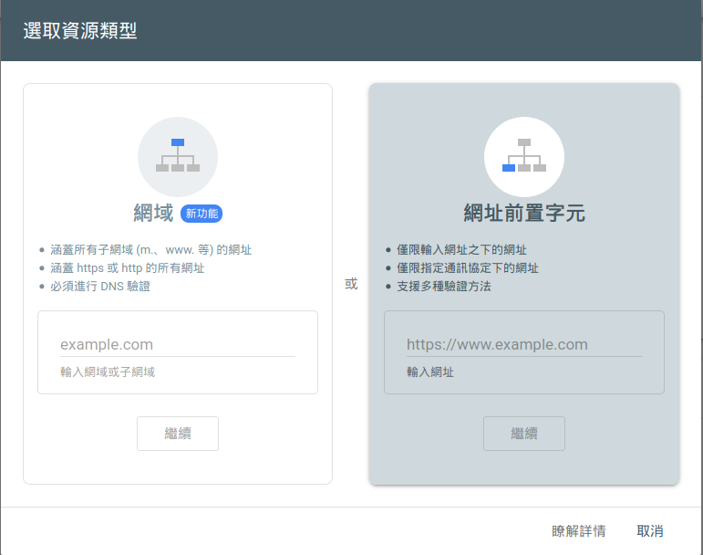
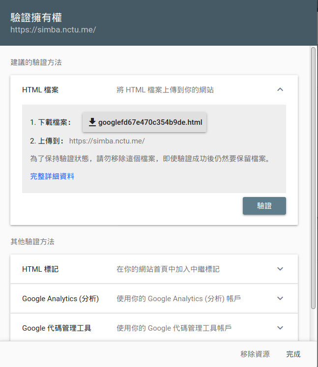
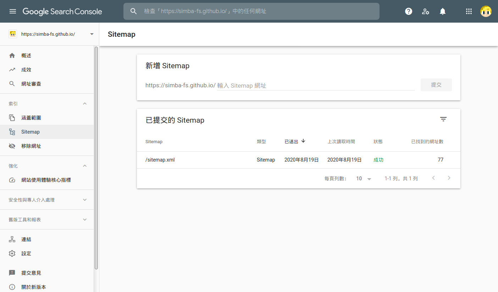

# 前置設定

## npm 安裝 `hexo-generator-sitemap`

```
npm i -S hexo-generator-sitemap
```

## 設定插件

將以下內容加到 `_config.yml`

> 注意空白

```yaml
# sitemap
sitemap:
    path: sitemap.xml
```

# 驗證網域

如果你的 hexo 是架在自己的網域可以跳過這步  
因為我的 hexo 是 託管在 GitHub page，在 Google Search Console 驗證的時候沒辦法用網域，所以要放一個特別的檔案到我們的網站根目錄

1. 首先到 [Google Search Console](https://search.google.com/search-console/) 新增一個網域
   選擇右邊，輸入你的網址
   
2. 下載提供的 html 並放到 `source/` 資料夾
   
3. 忽略
   接下來會遇到 hexo 在生成的時候把這個 html 也放到模板裡面，所以我們要把他加入忽略清單裡面  
   在 `_config.yml` 裡面找到 `skip_render`  
   把直接檔名寫在後面或是用清單都可以
    > 注意空白

```yaml
# 直接寫
skip_render: 'googlebabababababa.html'
# 或是用清單
skip_render:
  - 'googlebabababababa.html'
```

4. 按下驗證，完成

# Sitemap

驗證好了之後進入 Google Search Console，在側邊欄找到 `索引` -> `Sitemap`
輸入 `sitemap.xml` 按提交


# Google analytics

待新增
