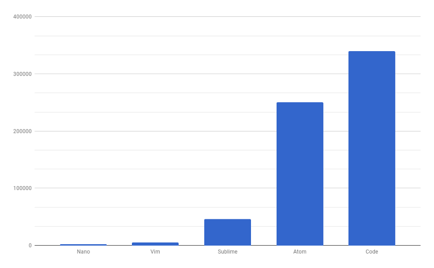

# Who Am I

我今年升大一，在此生最長的假期中寫寫文章打發時間。平常喜歡寫寫程式，研究新技術。是個 CLI 忠實擁護者，電腦通常只開瀏覽器和 terminal，terminal 就是我的開發環境。  
慣用網名是 **simbafs**、**simbafs** 或 **SimbaFs**。  
略懂 nodejs 和一點網頁技術，這一個月開始研究 Golang

# 關於這個系列

## 為什麼寫這個系列

現代化 IDE 提供的各種功能給我們很好的開發體驗，尤其是當程式碼數量逐漸增加時，IDE 可以提供像是自動補全、型態提示等等。當 [lsp(language server protocol)](https://docs.microsoft.com/zh-tw/visualstudio/extensibility/language-server-protocol?view=vs-2019) 開始流行之後，甚至不太需要查文件就能知道一個未知函數的用法。但是在這一切的方便的背後是犧牲有限的電腦資源換來的。這個時候資源需求少、發展越來越完善的的純文字界面就是解決這個問題的最佳方法了！不僅不會減少該有的**語法突顯**、**自動補全**，甚至可以借助 ssh 的力量，在**任何裝置**上開發（只要支援 ssh 都可以）。但是可惜的是網路上這方面的資源都很零散，於是我想說趁這次參賽將我所學整理起來。這個系列會帶領讀者一步一步建立一個好用、方便的 CLI 開發環境，如果有時間會講一下如何在任何裝置上開發（當然螢幕太小不適合啦）。

|  |
| :--------------------------------------------------------------------------: |
|         五種文字編輯器開啟一個約 60 byte 的文字檔所消耗的記憶體（KB)         |
|      From https://medium.com/commitlog/why-i-still-use-vim-67afd76b4db6      |

## 這個系列在講什麼

以下是預計的寫作進度，中途可能會更改，我也會每天在這裡更新連結

-   Day 01: 簡介
-   Day 02 ~ 05: zsh
-   Day 06 ~ 09: tmux
-   Day 10 ~ 21: nvim
-   Day 22 ~ 26: other tools
-   Day 29 ~ 30: coding everywhere

## ~~仙貝~~先備（軟體）

最重要的，一個支援至少 8 色的、你用的順手的終端機模擬器，最好是可以**自行安裝字體**的。

## 寫作慣例

### 問題

如果你看到這個
| ❓ > 這是一個問題 |
| :--- |
| 這邊是答案 |
這是你在閱讀文章時可能會遇到的問題，解答就在問題下面，如果還有其他問題可以**留言**或是**聯絡我**都可以

### 提示

| 💡 這是一個提示 |
| :-------------- |

### 程式碼區塊

程式碼區塊會長這樣

```
// some code
```

如果你看到有文字被 `這種背景` 包圍，那代表他是個專業術語、特殊符號、檔名或是路徑，例如 `zsh`、`$`、`~/.zshrc`  
無論是多行的程式碼區塊或是行內程式碼，只要是 `$` 開頭的後面整行都是命令，在下命令時不需要打 `$`，例如

```
$ ls *.txt
```

另外，如果你看到這樣的程式碼區塊

```diff
+ asdf
- asdd
```

代表有一個檔案要修改，從 `+` 的那行改成 `-` 的那行，加減號都不用寫進去，檔名會另外說明

# 同步更新

除了 [IThelp](https://ithelp.ithome.com.tw/users/20130473/ironman/3975)，我也會將這個系列的文章更新在 **[我的 blog](https://blog.simbafs.dev/categories/ithelp/pure-CLI-IDE)** 上

喔對了，這整個系列我都是在我的純 CLI 環境中寫作的喔！
