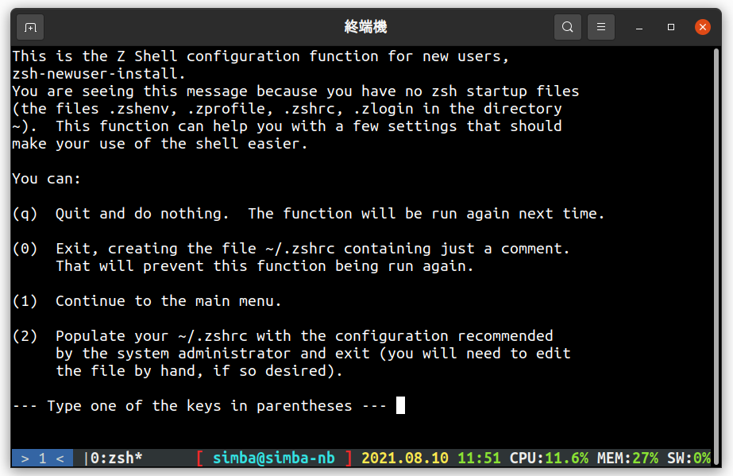

> 今天內容不小心寫太長了 ......

首先，在介紹其他軟體之前，先來看看與 CLI 操作習習相關的「shell」，我選擇的 shell 是 `zsh`，`zsh` 在 `bash` 的基礎上擴充了很多實用的功能，像是支援更好的**自動補全**，**各式各樣的主題**等等。

# zsh

## 安裝

如果你的作業系統是 **debian 系列**的話，可以直接用 **apt** 安裝 `apt install zsh`。其他的 linux 發行版可以到 [這個網頁](https://github.com/ohmyzsh/ohmyzsh/wiki/Installing-ZSH)找找你的發行版  
如果是 **mac**，理論上你的 shell 應該**已經是 zsh 了**（ mac 的 shell 從 2019 開始**預設是 zsh** ），如果不是的話你可以用 **homebrew** 安裝 `brew install zsh`。  
如果是 windows 的話，建議你開啟 **WSL2** 或是找一台有 linux/mac 的電腦

現在我們可以透過這個指令檢查是否安裝成功

```
zsh --version
```

如果沒有錯誤就是安裝成功了

| ❓ > 現在用的是什麼 shell？                              |
| :------------------------------------------------------- |
| 你可以使用 `echo $SHELL` 來看你現在使用的 shell 是那一個 |

## 更換 shell

如果你之前的 shell **不是 zsh** 那就要更換預設 shell，用以下指令可以**更換**

```
chsh -s $(which zsh)
或是
chsh -s $(where zsh)
```

## 初次使用 zsh

更換完 shell，**重新開啟終端機**，你應該會看到類似下面的畫面，我們選擇預設的 **(0)** 選項就可以了。如果沒有出現這個畫面的話就是預設的 shell **沒有切換成功**或是之前你**\*已經用過** zsh 了。

|  |
| :---------------------------------------------------------------: |
|                           zsh 安裝畫面                            |

# zplug

裝好 zsh 後，你會發現他和 bash 或是你原本的 shell 沒什麼差別，甚至更難用，那是因為我們**還沒設定**。zplug 是一個 zsh 的**套件管理器**，所有的設定都寫在 `.zshrc` 裡，因此如果以後要換電腦，只需要**搬走 `.zshrc` 一個檔案**，zplug 就會幫你把所有外掛裝起來。

## 安裝 zplug

官方建議的安裝方式是使用 installer，執行以下指令

```
$ curl -sL --proto-redir -all,https https://raw.githubusercontent.com/zplug/installer/master/installer.zsh | zsh
```

如果出現 `Enjoy zplug!` 就是安裝完成了，如果沒有的話可能是**版本不對**，他會告訴你有什麼沒裝

## zshrc

現在我們要來設定 `~/.zshrc` 了，這是 zsh 的設定檔，他其實就是一個 shell script，但是每次**啟動 zsh 他會先被執行**。  
首先隨便用一個編輯器打開 `~/.zshrc`，刪掉裡面所有內容（應改只有一行註解），貼上以下內容

```
source ~/.zplug/init.zsh

# plugins

if ! zplug check --verbose; then
	printf "Install? [y/N]: "
	if read -q; then
		echo; zplug install
	fi
fi

zplug load
```

第一行是**啟動** zplug
第五行開始是**檢查是否要更新/安裝套件**

**重新開啟終端機**，這樣環境才會載入

# 基本 shell sript

接下來，我們先來認識一下 shell script，這個東西不僅可以讓你操作更加順暢，也可以幫你實現各種**自動化操作**。

## 命令

一個普通的 shell 通常是以**一個命令開頭**，例如 `ls`、`cd`、`mv`，這個命令代表的是**電腦中一個可執行檔**，你可以用 `which <cmd>` 或 `where <cmd>` 來看執行檔的路徑。在這個命令後面的東西都是**參數**，和一般程式不一樣的是，這個參數因為是整個字串交給命令處理，所以通常可以**不管順序**，，例如 `ls -a -l` 和 `ls -l -a` 是一樣的（當然會有例外或是處理的不好的情況，但不多），更棒的是大部分成熟的指令都可以讓這種只有一個字元的「短選項」合起來寫，變成這樣 `ls -al`。

## Pipe

一個複雜的指令不太可能只憑幾個短短的選項運作，例如 `grep`（搜尋特定字串用的命令） 除了可以在選項指定檔名，也可以過「特殊的方式」傳一串字給他，這個方法就是我們熟悉的 **stdin**，也就是 `scanf`、`cin` 這類函數接受輸入的來源。  
接受 stdin 的方式有兩個，一個是使用者自己打，另一個是接受另一個命令的「輸出」。要接受另一個「輸出」的方式叫做 **pipe**，顧名思義就是「管線」，他可以把 A 指令的輸出接給 B 指令的輸入。例如以下的命令

```zsh
$ ps -ax | grep zsh
```

先用 `ps` 指令列出所有的 process，再交給 `grep` 找出含有字串 `zsh` 的行。

## Redirect

剛剛講了把輸出轉到另一個命令的輸入，那如果是要寫進檔案裡面呢？是不是個命令叫 `write`？其實 shell 已經有個東西可以寫檔案了，就是 **redirect**，直接來看範例

### 寫檔

```zsh
$ ls > ls_output.txt
```

就這麼簡單，用大於符號 `>` 就可以把**標準輸出**（ stdout ）丟到檔案裡面，但是要注意的是這樣寫的話是直接**「覆蓋」**，有就是說如果原本 `ls_output.txt` 有內容，會直接被 `ls` 指令的輸入覆蓋，如果你想保留，可以用 `>>` 來**「附加」**，這會讓他接在檔案最後面

### 讀檔

如果某個指令沒有讀檔案的選項，只接受 stdin，那你也可以用 **redirect** 將檔案讀進這個命令

```zsh
$ wc < .zshrc
```

`wc` 這個指令會**計算**輸入的行數/字數/字元數，上面的指令先把 `.zshrc` 讀出來，再交給 `wc` 計算字數

關於其他 pipe 和 redirect 的用法可以參考 [這篇文章](https://blog.gtwang.org/linux/linux-io-input-output-redirection-operators/)

> 嗯...我知道這有點蠢，因為你可以直接在 `wc` 後面接路徑，這裡只是示範一下

## 環境變數

改變命令行為的方式除了選項外，還有**環境變數**。環境變數就像 C++ 裡的**「全域變數」**，不管是哪個命令（函數）都可以**讀、寫**。通常環境變數的功能是**設定某個選項**，好讓每一次執行時**不用加一堆選項**（當然這個功能要命令有支援才行），或是儲存某個**命令的資訊**，像是 `$SHELL` 紀錄著你現在使用的 shell。

### 讀取

讀取環境變數很簡單，只需要加上錢號 `$` 就可以了，例如 `$PATH`（通常環境變數會**全大寫**，但其實沒有什麼規範）， shell 會在讀到這個的時候用他的值去替代這個字串。例如以下範例

```zsh
ls $HOME
```

$HOME 的值是你的家目錄路徑，shell 解釋出來的命令就會是 `ls /home/username`  
如果你想要**看這個環境變數的值**，可以根據上面的原理，用 `echo` 命令印輸出來

```zsh
echo $HOME
```

### 寫入

寫入環境變數只有一個要點——不要加空白，用 `=` 指定環境變數時**千萬不要**在 `=` 左右加上空白，看範例

```zsh
A='a string'   # O
B= 'a string'  # X
C ='a string'  # X
D = 'a string' # X
```

其實 shell script 中的錢號 `$` 還有超多用法，可以參考 [這裡](https://stackoverflow.com/questions/5163144/what-are-the-special-dollar-sign-shell-variables)

# 結尾

今天介紹了 zsh 和外掛管理器 zplug 還有一點點的 shell script，明天開始會用 zplug 裝各種外掛來豐富我們的純‧ CLI 整合式開發環境
