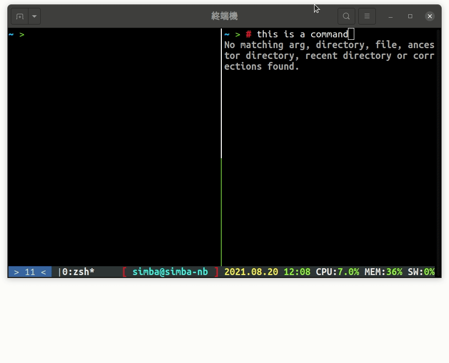

tmux 本身已經是個非常**完善**的軟體了，因此我只選了一個外掛，[tmux-resurrect](https://github.com/tmux-plugins/tmux-resurrect) 這個外掛讓你可以**儲存目前的 tmux 版面配置**（分頁、螢幕切割、名稱等等），在下次啟動時復原，這個功能在開發專案要切分編輯、編譯、測試版面時很好用，**不需要每次開機都重新切版面**

# 安裝

我們之前已經[安裝過 tmp]() 了，現在我們只需要在 `~/.tmux.conf` 中新增一行

```diff
+ set -g @plugin 'tmux-plugins/tmux-resurrect'
```

接下來執行 `tmux source ~/.tmux.conf` 載入最新的設定檔，再來用快捷鍵 <kbd>CTRL</kbd><kbd>a</kbd> + <kbd>i</kbd> 安裝

# 使用

切好版面後，按 <kbd>CTRL</kbd><kbd>a</kbd> + <kbd>s</kbd> （save）**儲存**目前狀態，除了版面配置，每個 session 的工作路徑也會儲存，vim 開啟的檔案下次開啟有機會會幫你開，但是可能會遇到**暫存檔**的問題，所以我建議是儲存狀態時把 vim 關掉  
下次要使用時，用 <kbd>CTRL</kbd><kbd>a</kbd> + <kbd>r</kbd> （restore）恢復

# 更多外掛

在 [https://github.com/tmux-plugins/list](https://github.com/tmux-plugins/list) 有**更多外掛**，主要內容包括**系統資訊顯示**、**複製貼上**、**搜尋**，我個人覺得沒有重要到須要特別提出來介紹，就不一一介紹

---

# 更多 tmux

寫完今天的內容後我發現，內容好像有點少，於是就補充了一些 tmux 的東西

## 列出所有快捷鍵

tmux 的快捷非常方便，但是有時候真的想不起來某個功能怎麼按，這時候你可以用 `tmux list-kyes` 或是比較短的 `tmux lsk` 看看什麼按鍵對應到什麼功能。  
有時候進來看看有什麼方便的快捷鍵自己還不知道也挺好玩的

## 滑鼠控制

不知道昨天的各種 tmux 移動、調整大小的快捷鍵有沒有嚇到你。tmux 其實還有提供一個更簡單的操作方式，如果你的終端機有**支援滑鼠**的話（像是我用的 gnome-terminal 就有提供）你可以在 `~/.tmux.conf` 中加上一行

```diff
+ set -g mouse on
```

然後重新開啟 tmux，這時候你就可以用**滑鼠換頁**、**切換分割畫面**、**調整大小**等等操作，在不同的地方按右鍵還會有不同的功能呦！  
但是要注意，如果打開這個功能，在 vim 裡面就不能用滾輪捲動文件，因為滾輪捲動這個事件被 tmux「劫持」了（除非你在 vim 也開啟滑鼠功能）

## 複製

如果你有開啟滑鼠功能的話，你可以快速的操作一個平常不太用的功能——**剪貼簿**  
tmux 有自己內部的剪貼簿，不和 vim、作業系統共用  
如果你要從終端機複製文字，只需要**按住左鍵**、**拖移**、**放開**，就會自動複製了  
而貼上的快捷鍵是 <kbd>CTRL</kbd><kbd>a</kbd> + <kbd>]</kbd>

|  |
| :-----------------------------------------------------------------------: |
|                                 複製貼上                                  |

這個剪貼簿和 vim 的剪貼簿（到 vim 的章節會介紹）你可以交替使用，在命令模式（NORMAL）時用 vim 就不用切回編輯模式，在編輯模式（INSERT、REPLACE）時用 tmux 可以用用切到命令模式（這裡看不懂沒關係，我們會在講到 vim 剪貼簿時再講一次）

## 系統剪貼簿

如果你開啟了滑鼠功能，可是你又想要用系統剪貼簿，你只需要在選取文字時壓著 <kbd>SHIFT</kbd> 就可以**暫時抑制** tmux 的滑鼠功能，把文字複製到系統剪貼簿

# 結尾

tmux 是一個**功能簡單**但是強大的軟體，因此他的外掛明顯比 zsh 少很多（和 vim 相比可以說一個外掛都沒裝 XD），但是有一些延伸自 tmux 的軟體，例如 [tmate](https://tmate.io/)，堪稱 terminal 中的 teamviewer，而且是免費的！  
明天開始會進入純‧ CLI 整合式開發環境的核心—— **nvim**，敬請期待
