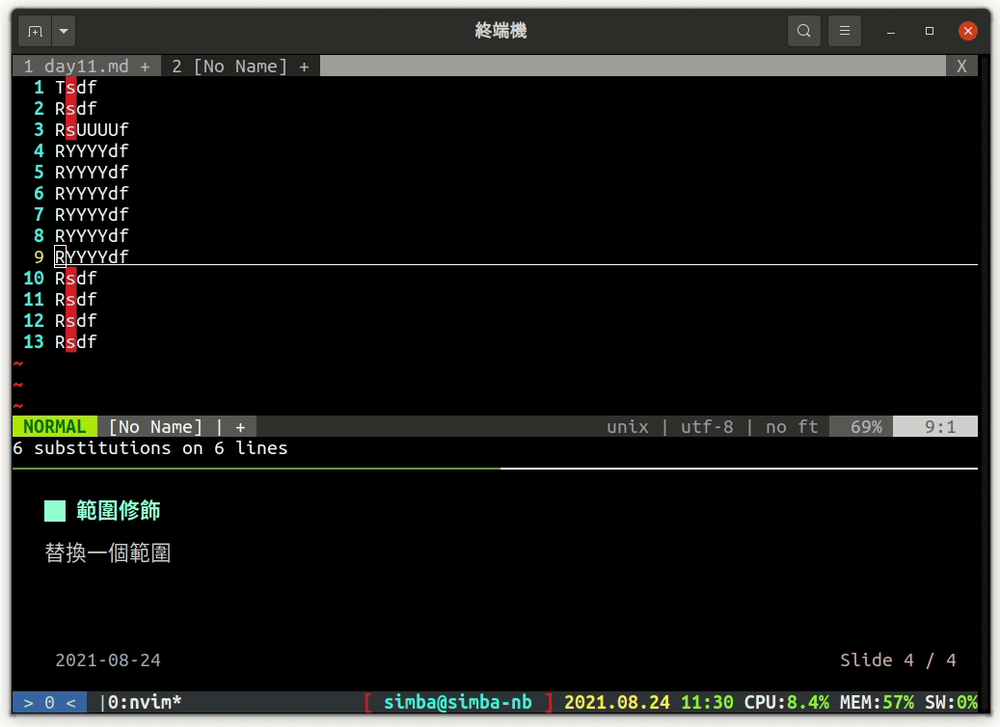

昨天體驗了一些快捷鍵和命令，今天要講的是在 vim 中也很常用的**搜尋與取代**

# 搜尋與取代

vim 的搜尋與取代是由命令 `s` 達成的，命令格式長這樣

```
:[範圍修飾字]s/abcd/efgh/[旗標]
```

其中 `abcd` 是 [正規表達式](https://developer.mozilla.org/zh-TW/docs/Web/JavaScript/Guide/Regular_Expressions)（regular expression，縮寫 regex，在中國常寫成「正則」），regex 除了在 vim 可以用之外，幾乎所有程式語言都可以用，還有 `grep`、`sed` 等 linux 指令也都是使用 regex，關於 regex 的用法在這裡就不多提了，[MDN](https://developer.mozilla.org/zh-TW/docs/Web/JavaScript/Guide/Regular_Expressions) 上有很完整的解釋  
你應該有注意到上面的命令格式裡面除了正規表達式之外還有「範圍修飾字」和「旗標」，這就是接下來這段的重點啦！

## 範圍修飾字

這個東西也不只是搜尋與取代可以用，只要你覺得需要**限制某個指令的作用範圍**都可以用樣的邏輯接下去  
範圍修飾**可寫可不寫**，如果不寫的話搜尋與取代就只會**在游標在的那一行起作用**，加上百分比符號 `%` 代表作用範圍是**整份文件**，也可以**加上行號**代表只作用在某一行，如果是兩個行號中間以**逗號**隔開，代表是作用在這兩個行號之間

|  |
| :---------------------------------------------------------------: |
|                          範圍修飾字範例                           |

### 範圍選取

剛剛的範例中有出現用行號作範圍選取，其實範圍選取還有一個**更簡單**的方式 ——「選取模式」。選取模式和編輯模式、命令模式是同等地位的東西，進入選取模式的快捷鍵有下列幾個（一樣要進到命令模式才能進選取模式）  
| 快捷鍵 | 說明 |
| :--- | :--- |
| v | 一般選取，以「字」為單位 |
| S-v(大寫 v ) | 一般選取，以「行」為單位 |
| C-v | 垂直選取，這個比較不常用，但是需要的時候蠻好用的 |

選取後一樣可以打指令和快捷鍵，但是這些就只會作用在選取的範圍內，常常搭配的有 `d`（剪下）、`y`（複製）、`:s`（搜尋與取代）  
再把一個範圍選取起來後，如果是快捷鍵就直接按，如果是命令的話按下冒號 `:`，平常只有冒號的命令行會先出現 `:'<,'>`，這串東東代表的就是**這一個範圍的範圍修飾字**，不用刪掉，直打指令就可以了

|  |
| :-----------------------------------------: |
|            選取結合指令與快捷鍵             |

## 旗標

旗標這個東西主要是在控制搜尋的行為，例如**全部取代**、**取代前先問一下**之類的，多個旗標可以組合，**不管順序**，下面是幾個可能會用到的旗標  
| 旗標 | 說明 |
| :--- | :--- |
| g | 整行搜尋，如果不加的話只會取代第一個 |
| c | 在取代前先確認 |
| i | 忽略大小寫 |

|  |
| :----------------------------------------------------: |
|                        旗標範例                        |

# 結尾

這兩天講的大部份是操作性質的東西，**不需要一次全部記起來**，用的多了自然會記得，現在只需要**先有個印象就可以了**。其實 vim 很多操作、快捷鍵都很直覺，不妨自己多試試看加了 <kbd>Shift</kbd>、<kbd>CTRL</kbd> 之後原本的快捷鍵會有什麼變化  
vim 的操作還有很多技巧，如果有興趣不妨去看看 vim 的文件（用命令 `:help` ）中相關章節（大概是 usr_03~04 左右）的介紹，你會對 vim 有非常全面的認識。雖然文件是英文寫的，但是並沒有太難的單字，大概國中程度就可以看了
