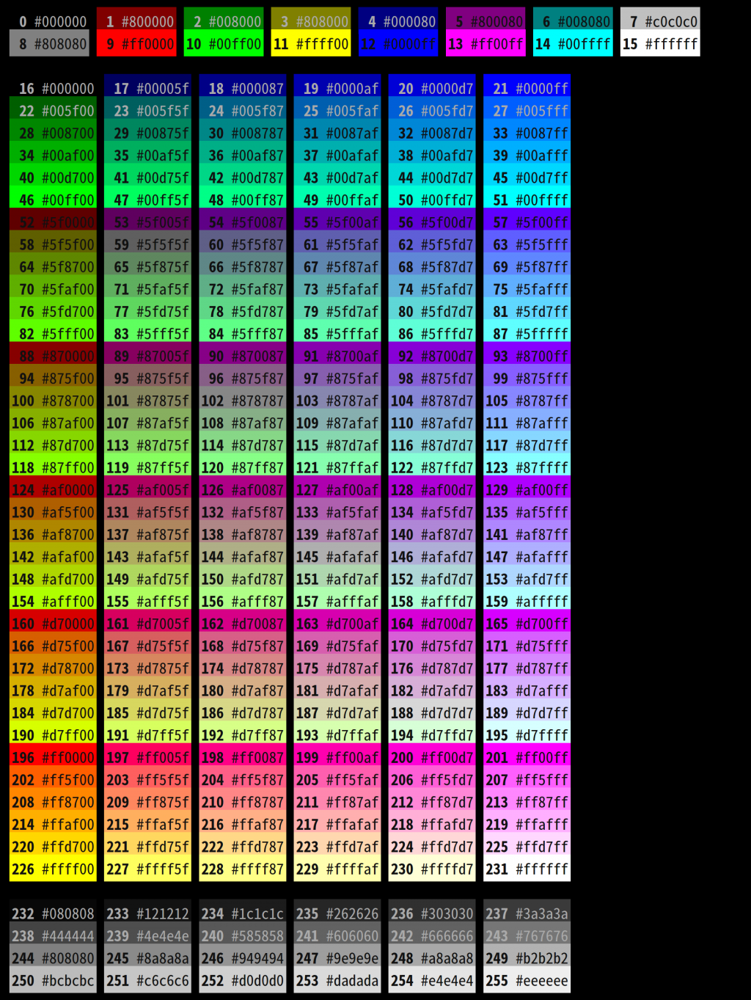

俗話說人要衣裝，佛要金裝，我們的 vim 也得要有**漂亮的外觀**。今天就讓我們來看看如何~~調教~~調整 vim 的外觀吧！

# Highlight group

highlight group（以下簡稱 hg ）是 vim 中的一個概念，他會對應到 vim 畫面中的**一段區塊**，可能是**一段文字**，也可能是底下的 status bar 或是左側的行號。每一個 hg 都可以**設定樣式**，包括**前景色**、**背景色**、**反白**、**加底線**等等，你可以用 `:so $VIMRUNTIME/syntax/hitest.vim` 命令查看**所有的 hg 名字**，他們的樣式也會直接顯示出來。  
如果想看某個 hg 的**說明**的話（必須是內建的才有），可以用 `:help hl-hgName` 來**查詢說明**，例如 `CursorLine` 就可以用 `:help hl-CursorLine` 來看說明

# Highlight

用 `:highlight` 或是縮寫 `:hi` 可以設定特定 hg 的樣式

```vim
hi hgName arg=value arg=value......
```

hgName 就是你用 `:so $VIMRUNTIME/syntax/hitest.vim` 查出來的名字，而 arg 常見的有前景色 `ctermfg`、背景色 `ctermbg` 和 樣式 `cterm`

## Color

`ctermbg` 和 `ctermfg` 後面接的值會**根據你的終端機支援的顏色不同**而有變化，其中 8 色和 16 色的終端機都可以用 0 ~ 8 / 0 ~ 16 這樣的方式來表示顏色（數字代表的顏色要看終端機設定），vim help 提供了一個對照表可以參考各個數字代表的顏色

```
NR-16   NR-8    COLOR NAME ~
0	    0	    Black
1	    4	    DarkBlue
2	    2	    DarkGreen
3	    6	    DarkCyan
4	    1	    DarkRed
5	    5	    DarkMagenta
6	    3	    Brown, DarkYellow
7	    7	    LightGray, LightGrey, Gray, Grey
8	    0*	    DarkGray, DarkGrey
9	    4*	    Blue, LightBlue
10	    2*	    Green, LightGreen
11	    6*	    Cyan, LightCyan
12	    1*	    Red, LightRed
13	    5*	    Magenta, LightMagenta
14	    3*	    Yellow, LightYellow
15	    7*	    White
```

第一欄是 16 色，第二欄是 8 色，第三欄是顏色名字，你也可以不用數字用顏色名字（不分大小寫）

如果你的終端機支援 256 色（通常現在的終端機都會有），那就更好玩了，因為你可以用這麼多種顏色！

|  |
| :-----------------------------------------------------------: |
|       256 色表（填的是前面的數字（0-255）不是 hex 色碼        |

## cterm

通常文字不會只有顏色，還可以有加粗、底線等等樣式，vim 總共提供了這些**樣式**

| 樣式名稱      | 說明                                                                             |
| :------------ | :------------------------------------------------------------------------------- |
| bold          | 粗體                                                                             |
| underline     | 底線                                                                             |
| undercurl     | 捲捲的底線，如果你的終端機不支援的話會改用底線代替                               |
| reverse       | 反白                                                                             |
| inverse       | 反白                                                                             |
| italic        | 斜體（要字型有支援）                                                             |
| standout      | 翻譯是「突出」，但是我用起來和 `reverse`、`inverse` 效果一樣，有人知道差在哪嗎？ |
| strikethrough | 翻譯是「刪除線」但是我試不出來，也許是字體的關係                                 |
| NONE          | 清除樣式設定                                                                     |

如果你需要多種樣式混合，例如底線 + 反白，你可以用逗號 `,` 來串起多的樣式，`cterm=underline,reverse`，注意不能有空白，不然會跳錯誤。

有了這些，你就可以自訂 vim 中任何一個部份的樣式了，例如 hg CursorLine 代表的**是游標所在行**，我可以用以下命令改變他的樣式

```vim
:hi CursorLine ctermbg=240 ctermfg=195
```

|  |
| :---------------------------------------------------------------------------------: |
|                                    自訂的游標行                                     |

# colorschema

所謂的 colorschema 其實就是一堆的 `hi` 指令寫在一個檔案裡面，然後給他一個名字，vim 內建了很多 colorschema，放在 `$VIMRUNTIME/colors` 目錄下。你可以用命令 `:echo $VIMRUNTIME` 來取得 `$VIMRUNTIME` 的值，因為**系統環境變數可能不會有他**（我的就沒有）。
除了去網路上下載別人設計好的 colorschema， 你也可以參考 `$VIMRUNTIME/colors` 下的檔案形式來製作自己的 colorschema，或是 Google 搜尋 `vim colorschemes generator` 就可以在網路上找到很多方便你製作 colorschemes 的工具
