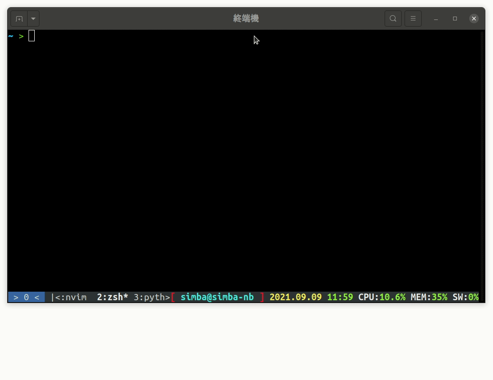
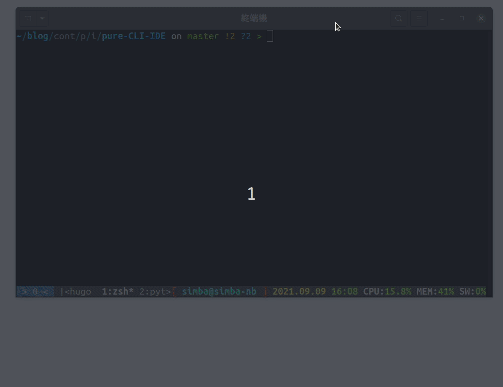

# 分割螢幕

記的 tmux 可以切螢幕嗎？vim 也可以喔！

## 命令

我們快速用表格帶過命令

|         快捷鍵          | 命令             | 效果               |
| :---------------------: | :--------------- | :----------------- |
|         <C-w>s          | :sp[lit] {file}  | 水平分割           |
|         <C-w>v          | :vs[plit] {file} | 垂直分割           |
|         <c-w>+          |                  | 把目前視窗放大一點 |
|         <c-w>-          |                  | 把目前視窗縮小一點 |
|         <c-w>=          |                  | 等大               |
|         <C-w>c          | :q               | 關掉目前視窗       |
|         <C-w>o          |                  | 關掉其他視窗       |
| <C-w>方向鍵/h/j/k/l/tag |                  | 在視窗間移動       |

如果你在 [day 13](../day13) 有開啟滑鼠模式，那你可以直接用滑鼠拉動邊框調整大小

## vim 分割視窗的優點

與 tmux 比起來，我更常用 tmux 分割視窗，因為快捷鍵比較直覺好用，但是 vim 有個 tmux 做不到的優點  
如果你用 tmux 分割視窗並開啟同一個檔案，對於系統來說你其實是開了兩次，兩個的更改互相不相關。  
但是 vim 不一樣，他是「同一份檔案」，也就是說左邊的改動會立刻同步到右邊

|  |
| :---------------------------------------------------------------------: |
|              如果開啟一個檔案，左邊的更改會立刻同步到右邊               |

這個特性有個好處，如果檔案太長，你要主要要編輯了兩個區域沒辦法在同一個螢幕顯示，就可以用 vim 的分割畫面，左邊編輯上面，右邊編輯下面。

# 分頁

比起切割螢幕，我更常用分頁功能。vim 每個分頁都和 tmux 一樣，可以隨便你亂切，不會互相影響。

## 快捷鍵

一樣快速看過命令

| 快捷鍵 | 命令         | 效果                                                   |
| :----: | :----------- | :----------------------------------------------------- |
|        | :tabe {file} | 開啟新分頁並開啟檔案，如果不指定檔名會開啟一個空白檔案 |
|   gt   |              | 下一個分頁                                             |
|   gT   |              | 上一個分頁                                             |

一樣，如果你開啟了滑鼠模式，你可以用滑鼠點擊切換分頁（最上面）

## Nerdtree

nerdtree 是我面在 [day 15 #現代化-ide-必裝模組](../day15#現代化-ide-必裝模組) 中列出了第三個模組。為什麼提到他呢？因為當你用 nerdtree 瀏覽檔案時，你可以用命令（快捷鍵）`t` 在新分頁中開啟檔案

|           |
| :----------------------------------------------------------------: |
| 用 nerdtree 在新分頁開心檔案，注意看最上面，深灰色底的是現在的 tab |
