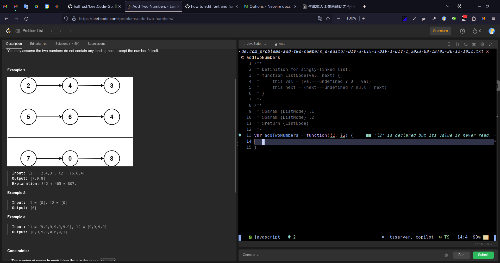

# Firenvim

[firenvim](https://github.com/glacambre/firenvim) 是一個可以把 nvim 嵌入瀏覽器的插件，像是這樣  


> 我的 nvim 現在是用 [astronvim](https://github.com/AstroNvim/AstroNvim) 設定檔，所以以下內容都是放在 `~/.config/nvim/lua/user/init.lua` 裡面

## 預設關閉 firenvim

如果不關的話他會在所有你想打字的地方跳出來，像是 google 搜尋、messenger 輸入框，等等你不希望他出來的地方

```lua
{
  options = {
    g = {
      firenvim_config = {
        localSettings = {
          [".*"] = {
            priority = 0,
            takeover = "never",
          },
        },
      },
    }
  }
}
```

## 在特定網站開啟

預設關閉後我們還是可以用 `<C-e>` 開啟，不過某些網站還是自動開會方便一點，所以再加上

```lua
{
  options = {
    g = {
      firenvim_config = {
        localSettings = {
          [".*"] = {
            priority = 0,
            takeover = "never",
          },
          ["https://leetcode.com/"] = {
            priority = 1,
            takeover = "always",
          },
        },
      },
    }
  }
}
```

## filetype

因為 firenvim 開啟時的 filetype 預設是 `txt`，不會有語法提示、LSP 自動捕全等等功能，所以我們加上一點設定讓他會自動給 filetype

```lua
{
  options = {
    g = {
      firenvim_config = {
        localSettings = {
          [".*"] = {
            priority = 0,
            takeover = "never",
          },
          ["https://leetcode.com/"] = {
            priority = 1,
            takeover = "always",
          },
        },
      },
    }
  },
  polish = function()
    -- modified from https://github.com/RRethy/dotfiles/blob/195d7c9bb7be0198e522d05fd528c9fb48121fba/nvim/init.lua#L546
    local function autocmd(event, pattern, callback)
      vim.api.nvim_create_autocmd(event, {
        pattern = pattern,
        callback = callback,
      })
    end
    autocmd("BufEnter", { "leetcode.com_*.txt" }, function() vim.o.filetype = "javascript" end)
  end,
}
```

## 字體

因為我的 terminal 和 nvim 有用到 [nerd 字體](https://www.nerdfonts.com/)，可以顯示一些奇奇怪怪的符號，但是瀏覽器沒有，所以要指定字體給 firenvim 使用，我用的 nerd 字體是 `BitstromWera Nerd Font Mono`，你可以換成你喜歡的

> ref: https://github.com/glacambre/firenvim/issues/1275

```lua
{
  options = {
    opt = {
      guifont = "BitstromWera Nerd Font Mono",
    },
    g = {
      firenvim_config = {
        localSettings = {
          [".*"] = {
            priority = 0,
            takeover = "never",
          },
          ["https://leetcode.com/"] = {
            priority = 1,
            takeover = "always",
          },
        },
      },
    }
  },
  polish = function()
    -- modified from https://github.com/RRethy/dotfiles/blob/195d7c9bb7be0198e522d05fd528c9fb48121fba/nvim/init.lua#L546
    local function autocmd(event, pattern, callback)
      vim.api.nvim_create_autocmd(event, {
        pattern = pattern,
        callback = callback,
      })
    end
    autocmd("BufEnter", { "leetcode.com_*.txt" }, function() vim.o.filetype = "javascript" end)
  end,
}
```
