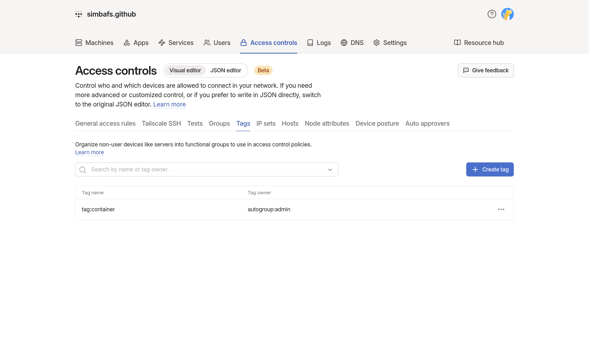
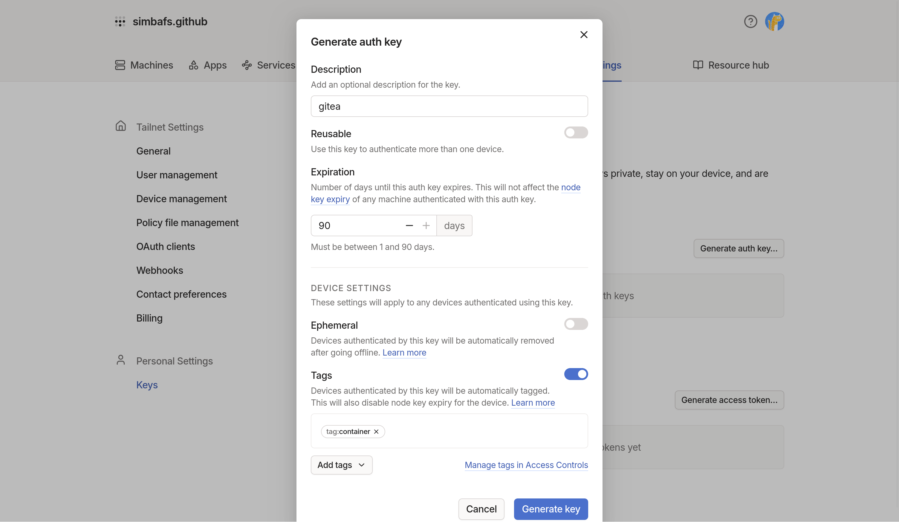
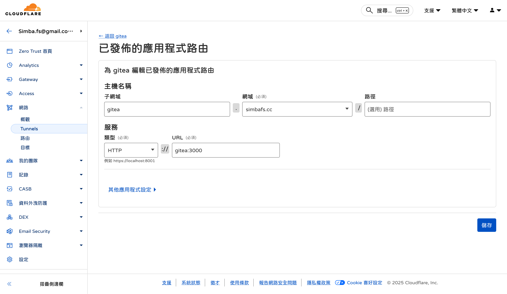

## services

### gitea and database

首先，先選定要使用的資料庫，這次決定直接用 postgres，反正都在 docker 裡面了，不需要省一個部屬流程

### tailscale

因為我希望可以用 `git clone git@xxx:user/repo` 直接 clone 不要再加上 port，所以有兩個選項，一是在 router 上開 port forward 把 22 開出去，但是這會同時讓 ssh 暴露，有點危險。另一個選項是透過 tailscale 這類的 VPN 軟體，讓只有在 VPN 內的裝置可以直接連線。

tailscale 還需要一點設定，後面會說

### cloudflared

這個比較單純，就是把本來的 :3000 轉發到某個 domain 上，幾乎不需要任何設定

## docker-compose.yml

```yml
services:
  gitea:
    image: docker.gitea.com/gitea:latest
    container_name: gitea
    restart: unless-stopped
    environment:
      - USER_UID=1000
      - USER_GID=1000
      - GITEA__database__DB_TYPE=postgres
      - GITEA__database__HOST=db:5432
      - GITEA__database__NAME=gitea
      - GITEA__database__USER=gitea
      - GITEA__database__PASSWD=gitea
    volumes:
      - ./gitea:/data
      - /etc/localtime:/etc/localtime:ro
    depends_on:
      - db

  db:
    image: docker.io/library/postgres:14
    container_name: gitea_db
    restart: unless-stopped
    environment:
      - POSTGRES_USER=gitea
      - POSTGRES_PASSWORD=gitea
      - POSTGRES_DB=gitea
    volumes:
      - ./postgres:/var/lib/postgresql/data

  tailscale:
    image: tailscale/tailscale:latest
    container_name: gitea_ts
    restart: unless-stopped
    network_mode: service:gitea
    cap_add:
      - net_admin
      - sys_module
    volumes:
      - ./tailscale:/var/lib/tailscale
    devices:
      - /dev/net/tun:/dev/net/tun
    environment:
      - TS_AUTHKEY=tskey-auth-xxxx
      - TS_HOSTNAME=gitea
      - TS_STATE_DIR=/var/lib/tailscale

  cloudflared:
    image: cloudflare/cloudflared:latest
    container_name: gitea_cloudflared
    restart: unless-stopped
    command: tunnel --no-autoupdate run --token xxxx
```

## tailscale 設定

tailscale 第一次登入需要設定 AUTHKEY，首先要去 https://login.tailscale.com/admin/acls/visual/tags 設定一個 tag



然後建立 AUTHKEY https://login.tailscale.com/admin/settings/keys，如果沒有選「Reusable」的話，這個 key 只能用一次。然後下面 tag 記的選，有 tag 的機器不會過期，就不用 90 天後再來驗證一次。



tailscale 第一次用這個 auth key 啟動後就會永久登入，登入狀態會被寫入 `/var/lib/tailscale` 下，所以這個要用 volumes 持久化。

### network mode

我們需要讓 tailscale 跟 gitea 跑在同一個網路命名空間下，這樣對於外面來看，gitea:22 才會是 gitea 開的 22 port。docker compose 中可以透過

```yml
network_mode: service:<service_name>
```

來把這個 service 跟指定的 service 的網路命名空間合併起來。這算是一個比較少用的設定，我也是這次設定才知道。

## cloudflared

cloudflared 只須要把 container 掛起來，然後去設定頁面 https://one.dash.cloudflare.com > 網路 > Tunnels > 你選的通道 > 已發布的應用程式路由（這個好像最近改名字？）新增一條路由，URL 直接用 `<service_name>:3000` 就可以了，docker compose 會為每個 service 建立一個這樣的域名對應（超方便，讚）



---

這套設定理論上可以用在任何使用 http、ssh（任何 tcp） 的服務上，例如 syncthing，只須要把 `gitea`、`db` 兩個服務修改就行了。
