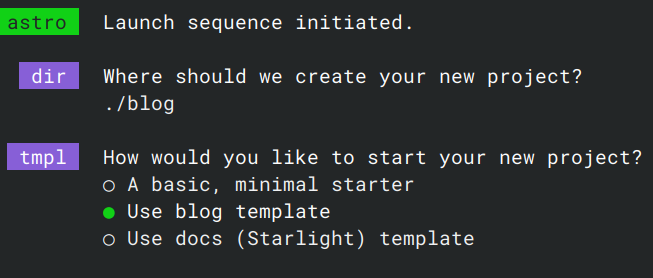

---  
title: Migrate from Hugo to Astro  
publishDate: 2025-04-02 02:10  
description: '從 Hugo 搬家到 Astro 的歷程'  
tags:  
  - blog  
  - astro  
  - hugo  
---  
  
## 沒事幹麻搬家  
  
沒是誰會想搬部落格阿，而且累積了一百多偏廢文（大多數真的都很廢，廢到我都不敢打開），真的就是因為我的 hugo 站不知道從什麼時候開始就無法編譯，部落格更新了也沒辦法展現出來。這個問題拖了很久了，直到最近真的閒到不知道要幹麻了才來處理。  
  
## 預選方案  
  
### static  
  
本來想說用原本的 Hugo theme 開一個新的網站，舊的就直接把他編譯成靜態 HTML 然後放在 static 裡，但是那時候他也無法編譯阿！！！  
  
### 人生重來槍  
  
  
  
也有想過要不要乾脆把之前的全部放棄，直接開始新的部落格，但想想後覺得好~~浪費~~不甘心，所以才作罷  
  
### 自製 Astro  
  
後來決定要整個搬家了，既然都要搬，那就換換新的系統好了，於是看上了 Astro。我覺得我是被 `create-astro` 騙了，他有個 `blog` 選項，於是我就想說「欸，來做一個如何？」  
  
  
  
但是我太高估我自己的前端能力了，寫寫工具網頁還可以，這種需要設計美感的完全不行（除非我就想讓部落格走工業風）。  
  
### 找別人做的主題  
  
放棄自製後，我在 [Astro 官方的主題頁面](https://astro.build/themes/) 找了幾個，原本看上了一個 [充滿動畫、非常炫炮的主題](https://yukina-blog.vercel.app)，但是後來發現他在手機上會很卡，於是放棄。  
最後我挑了 [pure](https://github.com/cworld1/astro-theme-pure)，這個主題各方面看起來都很棒。  
  
## 開始搬家  
  
搬家前，要先整理新房子  
  
### 裝修  
  
pure 這個主題感覺用的人不多，所以他們在讓使用者修改設定這方面做得不如之前 [hugo 那個主題](https://github.com/CaiJimmy/hugo-theme-stack) 好（看 GitHub 星星數可以略知一二，pure 只有 155，stack 有 5.5k），很多地方甚至要直接改程式碼。  
首先第一個改動是修改 `astro-pure` 這個相依，這個庫其實就是指到 `packages/pure` 這個目錄，不知道為什麼他們要分開，改完後我就可以盡情修改所有 pure 的程式碼了。  
然後把一堆不需要的東西移除，像是微信 QRcode、ICP 番號這些中國人才需要的東西，然有留言、瀏覽次數統計等等。  

> Updated:   
> 
> 我看動為什麼 pure 要把一部分東西塞進 `packages/pure`，然後弄成一個 npm package 了，他想要做成一個「[元件庫](https://astro.build/integrations)」，這樣就算你不用他的 pages、layout，也可以使用他定義的一系列元件。但有個問題，他的 `packages/pure` 些的有點爛，有些東西不能關掉，像是只有中國人在用的 ICP 番號、某些 UI 設計等等。簡單來說就是通用性不足。  
> 
> 如果他可以改善這個問題，分離成 `packages/pure` 就會變得比較合理。但我還是需要修改 `packages/pure` 裡的東西，所以還是得把 `astro-pure` 指向本地套件（`packages/pure` 目錄）  
  
### 入厝  
  
Hugo 和 astro pure 的 markdown frontmatter 欄位是不同的，當然不能直接搬，所以我叫 ChatGPT 幫我寫了一個 script，後來陸陸續續又加上了搬遷圖片、整理目錄結構等等一堆功能，最後長這樣  
用這個腳本搬家就很輕鬆啦，只是跟 ChatGPT 來回的路上有點邊跛而已。另外有些 gif 要用 gimp 重新輸出（我也不知道為什麼 astro 會抱怨他們）  
  
```js  
import fs from 'fs/promises'  
import path from 'path'  
import { fileURLToPath } from 'url'  
import fg from 'fast-glob'  
import matter from 'gray-matter'  
  
const args = process.argv.slice(2)  
function getArgValue(flag, defaultValue) {  
  const index = args.indexOf(flag)  
  return index !== -1 && args[index + 1] ? args[index + 1] : defaultValue  
}  
  
const __filename = fileURLToPath(import.meta.url)  
const __dirname = path.dirname(__filename)  
const INPUT_DIR = path.resolve(__dirname, getArgValue('--input', 'articles'))  
const OUTPUT_BASE = path.resolve(__dirname, getArgValue('--output', 'output'))  
const TASK_FILE = path.resolve(__dirname, 'tasks.json')  
  
function transformFrontmatter(data) {  
  data.categories.length--  
  return {  
    title: data.title || '',  
    publishDate: data.date ? data.date.split('T')[0] : '',  
    description: '',  
    tags: [...new Set([data.tags, data.categories].flat())] || [],  
    legacy: true  
  }  
}  
  
function getOutputDir(slug, filePath) {  
  const dirName = (slug != 'index' && slug) || path.basename(path.dirname(filePath)) // 取得 .md 所在資料夾名稱  
  let safeName = slugify(dirName)  
  
  // 🚫 如果 slugify 後仍為空或是 "output"，則 fallback 用隨機值  
  if (!safeName || safeName.toLowerCase() === 'output') {  
    const uniqueId = Math.random().toString(36).substring(2, 8)  
    safeName = `untitled-${uniqueId}`  
  }  
  
  return path.join(OUTPUT_BASE, safeName)  
}  
  
function slugify(text) {  
  return text  
    .toString()  
    .normalize('NFKD')  
    .replace(/[^\w\- ]+/g, '')  
    .trim()  
    .replace(/\s+/g, '-')  
    .toLowerCase()  
}  
  
// 讀取任務檔案並執行  
async function runTasksFromFile() {  
  const taskJson = await fs.readFile(TASK_FILE, 'utf8')  
  const tasks = JSON.parse(taskJson)  
  
  for (const task of tasks) {  
    await processMarkdownAndAssets(task)  
  }  
  
  console.log('\n✅ 所有任務已完成')  
}  
  
// 執行 Markdown 處理與複製資源  
async function processMarkdownAndAssets(task) {  
  const content = await fs.readFile(task.filePath, 'utf8')  
  const parsed = matter(content)  
  const frontmatter = transformFrontmatter(parsed.data)  
  const newContent = matter.stringify(parsed.content, frontmatter, { lineWidth: -1 })  
  
  await fs.mkdir(task.outDir, { recursive: true })  
  const outPath = path.join(task.outDir, task.fileName)  
  await fs.writeFile(outPath, newContent, 'utf8')  
  console.log(`✅ 轉換：${task.filePath} → ${outPath}`)  
  
  const entries = await fs.readdir(task.srcDir, { withFileTypes: true })  
  for (const entry of entries) {  
    const srcPath = path.join(task.srcDir, entry.name)  
    const destPath = path.join(task.outDir, entry.name)  
    if (entry.isFile() && entry.name !== task.fileName && !entry.name.endsWith('.md')) {  
      await fs.copyFile(srcPath, destPath)  
      console.log(`📎 複製：${srcPath} → ${destPath}`)  
    }  
  }  
}  
  
// 產生 tasks.json  
async function generateTaskFile() {  
  const mdFiles = await fg(`${INPUT_DIR}/**/*.md`)  
  const filteredFiles = mdFiles.filter((filePath) => path.basename(filePath) !== '_index.md')  
  
  const tasks = await Promise.all(  
    filteredFiles.map(async (filePath) => {  
      const content = await fs.readFile(filePath, 'utf8')  
      const parsed = matter(content)  
      const outDir = getOutputDir(parsed.data.slug, filePath)  
  
      return {  
        filePath,  
        fileName: path.basename(filePath),  
        srcDir: path.dirname(filePath),  
        outDir  
      }  
    })  
  )  
  
  await fs.writeFile(TASK_FILE, JSON.stringify(tasks, null, 2), 'utf8')  
  console.log(  
    `📦 任務已產生，共 ${tasks.length} 筆，請確認 ${TASK_FILE} 後再執行：\n\n👉 node script.js --run\n`  
  )  
}  
  
// 主程式  
const isRun = args.includes('--run')  
if (isRun) {  
  await runTasksFromFile()  
} else {  
  await generateTaskFile()  
}  
```  
  
## 部屬  
  
全部搞定後，又弄好了 github workflows，會自動編譯、部屬了，套上快取，整個編譯過程大概只要一分鐘，恨滿意。這套 action yaml 是 github 推薦的再修改一點點來的。  
  
```yaml  
# Sample workflow for building and deploying an Astro site to GitHub Pages  
#  
# To get started with Astro see: https://docs.astro.build/en/getting-started/  
#  
name: Deploy Astro site to Pages  
  
on:  
  # Runs on pushes targeting the default branch  
  push:  
    branches: ['blog']  
  
  # Allows you to run this workflow manually from the Actions tab  
  workflow_dispatch:  
  
# Sets permissions of the GITHUB_TOKEN to allow deployment to GitHub Pages  
permissions:  
  contents: read  
  pages: write  
  id-token: write  
  
# Allow only one concurrent deployment, skipping runs queued between the run in-progress and latest queued.  
# However, do NOT cancel in-progress runs as we want to allow these production deployments to complete.  
concurrency:  
  group: 'pages'  
  cancel-in-progress: false  
  
env:  
  BUILD_PATH: '.' # default value when not using subfolders  
  # BUILD_PATH: subfolder  
  
jobs:  
  build:  
    name: Build  
    runs-on: ubuntu-latest  
    steps:  
      - name: Checkout  
        uses: actions/checkout@v4  
      - uses: pnpm/action-setup@v4.1.0  
        with:  
          version: 10  
      - name: Setup Node  
        uses: actions/setup-node@v4  
        with:  
          node-version: '20'  
          cache: pnpm  
          cache-dependency-path: ${{ env.BUILD_PATH }}/pnpm-lock.yaml  
      - name: Setup Pages  
        id: pages  
        uses: actions/configure-pages@v5  
      - name: Install dependencies  
        run: pnpm install  
        working-directory: ${{ env.BUILD_PATH }}  
      - name: Build with Astro  
        run: |  
          pnpm run build \  
            --site "${{ steps.pages.outputs.origin }}" \  
            --base "${{ steps.pages.outputs.base_path }}"  
        working-directory: ${{ env.BUILD_PATH }}  
      - name: Upload artifact  
        uses: actions/upload-pages-artifact@v3  
        with:  
          path: ${{ env.BUILD_PATH }}/dist  
  
  deploy:  
    environment:  
      name: github-pages  
      url: ${{ steps.deployment.outputs.page_url }}  
    needs: build  
    runs-on: ubuntu-latest  
    name: Deploy  
    steps:  
      - name: Deploy to GitHub Pages  
        id: deployment  
        uses: actions/deploy-pages@v4  
```  
  
## Hugo 與 Astro 差異  
  
這段算是經歷了三個部落格的心得吧，hexo 和 hugo 算是比較像，他們都是「部落格系統」，而 Astro 不一樣，他是「架站系統」，而衍生出來的各個主題才是「部落格系統」。  
最明顯的差異是 hugo 各個主題之間，frontmatter 的定義幾乎都一樣，都是基本 hugo 定義的超集，但是 Astro 就不同了，每個主題都會定義自己的 frontmatter 欄位。  
簡單來說 hugo 換主題理論上會比 astro 容易，在 astro 換主題基本上跟 hugo 換到 astro 差不多。  
不過，astro 的模板明顯比 hugo 友善很多，熟悉的 js，還有型別，DX 碾壓 hexo 和 hugo。  
