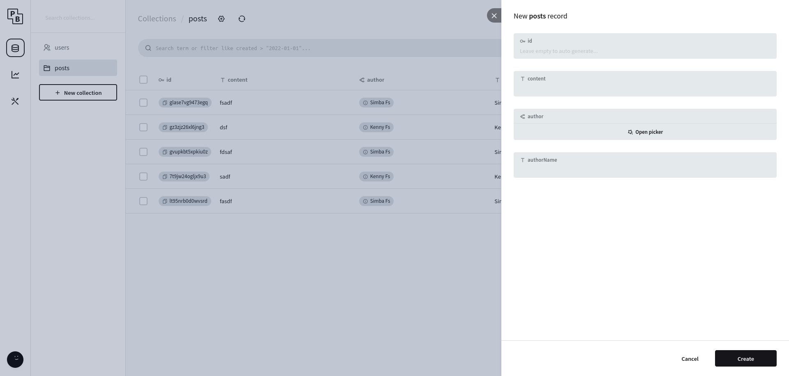
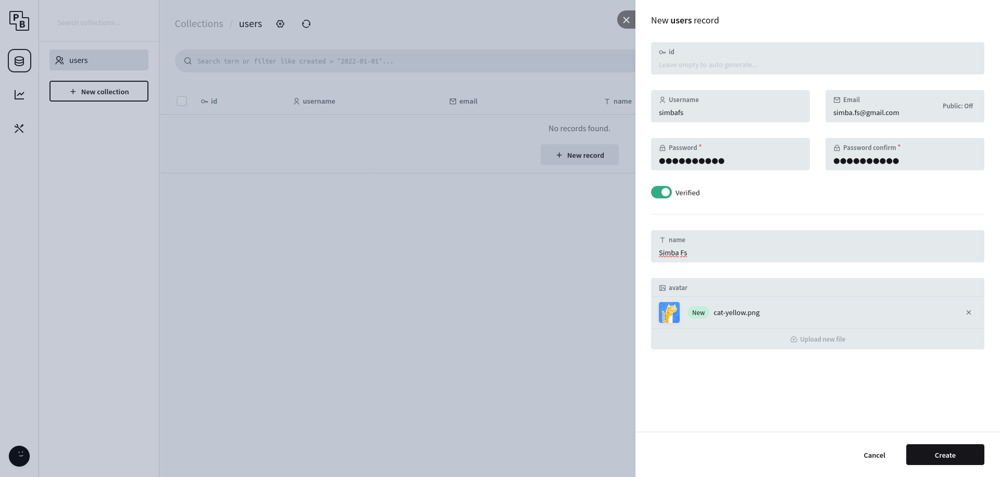
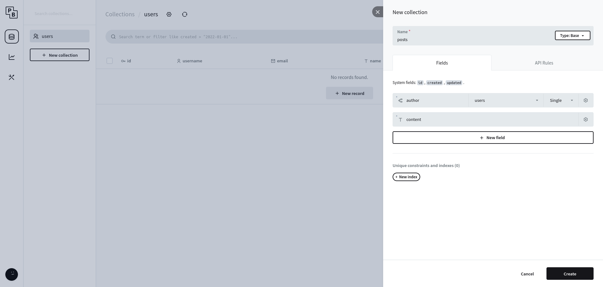
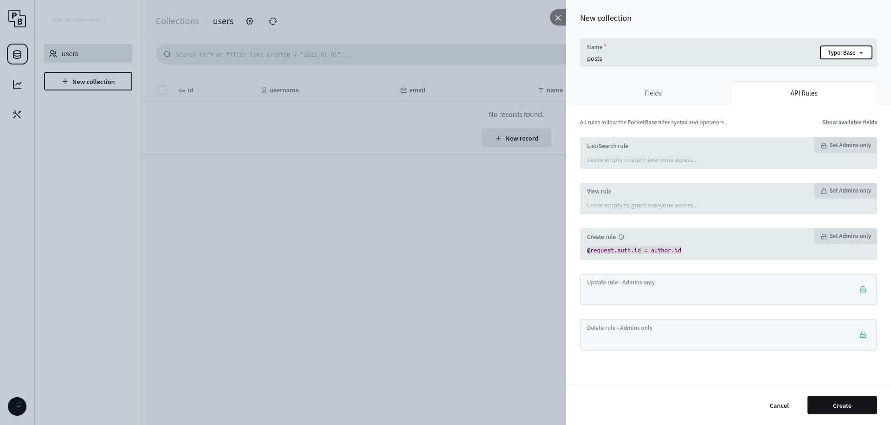
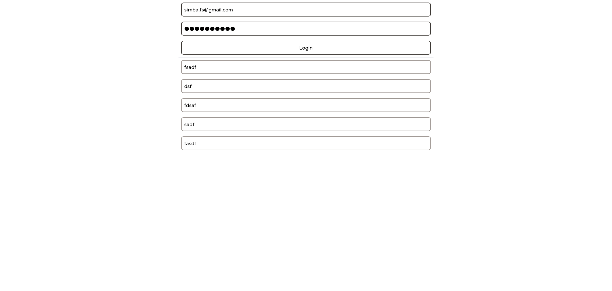
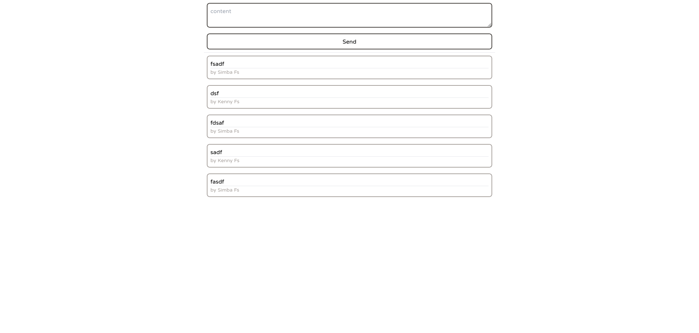
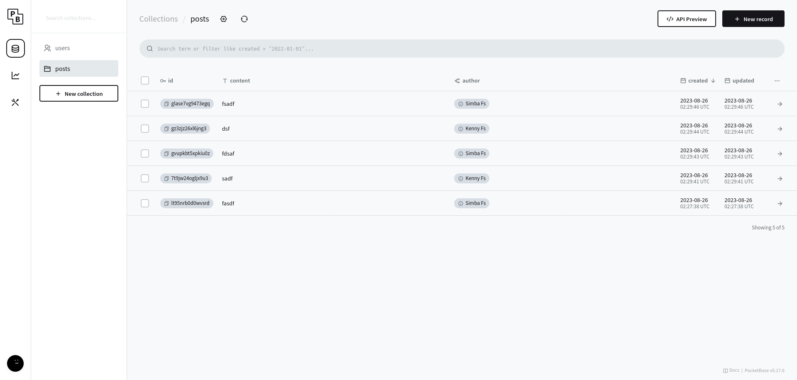

# PocketBase

[PocketBase](https://pocketbase.io/) 是一個方便快速部屬後端資料庫的工具，他用 golang 寫的，因此可以編譯成一個單一執行檔，下載就能使用，內建一個很好看的管理界面，滑鼠點一點就設定好資料庫結構、關聯、使用者驗證和權限控管等功能了



接下來是我用 pocketbase 寫一個貼文佈告欄系統的過程

## 安裝

安裝很簡單，去 [https://pocketbase.io/docs/](https://pocketbase.io/docs/) 找到你的作業系統對應的檔案，下載下來後放到 `$PATH` 裡面，在你的專案目錄就執行就可以了

### 專案結構

執行 `pocketbase serve` 後會啟動 pocketbase 伺服器，並自動初始化兩個資料夾 `pb_data` 和 `pb_migrations`，前者是存放你的資料庫設定、資料、log 的地方，後者是每次更動資料庫（新增刪改表格、欄位等等）時的操作，方便你在不同環境下同步資料庫設定而不損壞資料，還有一個資料夾是 `pb_public`，你可以把前端程式放在這裡他會幫你放在 `/` 路徑下

## 設定 Collection

啟動伺服器後開啟管理頁面 [http://localhost:8090/_](http://localhost:8090/_)，他會叫你設定第一個管理員帳號密碼，進入後會發現已經預設一個 users Collection（以下沿用 sqlite 稱呼，稱之為表格），那麼我們就保留他吧。

### 表格種類

pocketbase 中表格有三種，第一種是一般的 base 基礎表格，就是拿來存資料的，第二種是 auth 驗證表格，對登入驗證有專門的設定，第三種是 view 表格，這個我還沒用過，更多範例可以看官方的 [文件](https://pocketbase.io/docs/collections/#view-collection)

### users

這裡 users 應該不用多做調整，先新增一個使用者吧，這裡的使用者是沒有管理員權限的，要設定管理員要到 [http://127.0.0.1:8090/\_/#/settings/admins](http://127.0.0.1:8090/_/#/settings/admins)


### posts

接著建立新的 base collection，有 `auther`、`content` 兩個欄位，其中 `author` 是關聯到 `users` 表格，表示這邊文章是哪個使用者寫的，並且都設為非空。

接著我們設定存取權限，預設全部都是只開放管理員，但這太沒意思了，點 `list`、`view` 和 `create` 的框框一下變成所有人都能存取，再來設定 `create` 的條件是 `@request.auth.id = author.id`，意思是發出請求的人跟 `author` 欄位的人必須是同一個人才行。剩下的有點麻煩我就先不做了


那麼我們的後端大致完成，可以去寫前端了

## 前端 JS SDK

pocketbase 官方有提供一個 [JS SDK](https://github.com/pocketbase/js-sdk) 可以使用，裝好後我們開一個 nextjs 專案，開啟 `src/` 目錄、`typescript` 跟 tailwindcss。把預設的雜七雜八的東西刪掉後，我們從一個乾淨的 `src/pages/index.tsx` 開始。

### 登入

我們需要兩個框框一個按鈕來登入使用者帳號，`input()` 是 tailwindcss vairant，反正就是設定按鈕樣式而已

```tsx
export default function Home() {
  const [pb] = useState(new Pocketbase('http://localhost:8090'))
  const [email, setEmail] = useState('')
  const [password, setPassword] = useState('')

  const handleLogin = () => {
    pb.collection('users')
      .authWithPassword(email, password)
      .then(console.log, console.error)
  }

  return (
    <div className="h-screen max-w-[800px] mx-auto flex flex-col">
      <input
        className={input()}
        type="email"
        value={email}
        onChange={e => setEmail(e.target.value)}
        placeholder="email"
      />
      <input
        className={input()}
        type="password"
        value={password}
        onChange={e => setPassword(e.target.value)}
        placeholder="password"
      />
      <button className={input()} type="button" onClick={handleLogin}>
        Login
      </button>
    </div>
  )
}
```

pocketbase 會自動維護 `authStore`，預設是存在 localStorage 裡面，因此我們只有第一次要登入，第二次他其實會自動把 token 什麼的從 localStorage 抓出來，省了我們不少力氣

### typescript

在開始抓資料前，我們來處理一下 typescript 的部份，如果這裡設定好，後面開發會輕鬆很多，有個工具叫做 [pocketbase-typegen](https://github.com/patmood/pocketbase-typegen) 可以自動根據 pocketbase 設定產生型別定義檔案，用指令 `npx pocketbase-typegen --db ../pb_data/data.db --out src/pocketbase-type.ts` 就會產生好我們要的檔案了。  
裡面有幾種型別，第一類是 `xxxRecord`，這類是根據資料庫設定直接產出來的，再來是 `xxxResponse`，這個是 js-sdk 會吐給我們的，我們要用的也是這個

### 列出 post

我們寫一個 hook 來處理抓資料的工作

```tsx
function usePosts(pb: Pocketbase) {
  type Post = PostResponse
  const [post, setPost] = useState<Post[]>([])

  useEffect(() => {
    pb.collection('posts')
      .getList<Post>()
      .then(result => setPost(result.items.reverse()))
  }, [pb])

  return posts
}
```

#### Subscribe

這個 hook 會在一開始就抓取全部的 posts，但是後續更新怎麼辦？pocketbase 提供 Subscribe，他會透過 websocket 或是 SSE 的方式把資料庫的更新即時通知前端，我們就修改一下上面的程式碼

```tsx
function usePosts(pb: Pocketbase) {
  type Post = PostsResponse
  const [posts, updatePosts] = useReducer(
    (state: Post[], action: Post | Post[]) => {
      if (Array.isArray(action)) {
        return action
      }
      return [action, ...state]
    },
    []
  )

  useEffect(() => {
    pb.collection('posts')
      .getList<Post>()
      .then(result => updatePosts(result.items.reverse()))
      .then(() =>
        pb.realtime.subscribe('posts', e => {
          switch (e.action) {
            case 'create':
              updatePosts(e.record)
              break
            default:
              console.log(e)
          }
        })
      )
    return () => {
      pb.realtime.unsubscribe()
    }
  }, [pb])

  return posts
}
```

這裡還有一個地方要注意，因為 nextjs 預設開啟嚴格模式，會導致 useEffect 在開發時會被執行兩次，也就是說你會 subscribe 兩次，而且似乎沒辦法關掉，唯一的方式是去 `next.config.js` 把 `reactStrictMode` 設成 `false`

#### 顯示 posts

那麼，現在我們就有一個一開始會抓取所有 posts、會即時更新的 hook 啦，把他加進畫面裡吧

```tsx
export default function Home() {
  const [pb] = useState(new Pocketbase('http://localhost:8090'))
  const [email, setEmail] = useState('')
  const [password, setPassword] = useState('')
  const posts = usePosts(pb)

  const handleLogin = () => {
    pb.collection('users')
      .authWithPassword(email, password)
      .then(console.log, console.error)
  }

  return (
    <div className="h-screen max-w-[800px] mx-auto flex flex-col">
      <input
        className={input()}
        type="email"
        value={email}
        onChange={e => setEmail(e.target.value)}
        placeholder="email"
      />
      <input
        className={input()}
        type="password"
        value={password}
        onChange={e => setPassword(e.target.value)}
        placeholder="password"
      />
      <button className={input()} type="button" onClick={handleLogin}>
        Login
      </button>

      <hr />

      {posts.map(item => (
        <div className="m-2 p-2 border-2 border-stone-400 rounded-lg">
          <p>{item.content}</p>
        </div>
      ))}
    </div>
  )
}
```

目前畫面長這樣  


### 發文

發文就是去戳 post 的 create API，這部份也很簡單，加入一個 `<textarea>`，按下後把內容送出去就好，這部份長這樣

```tsx
const [content, setContent] = useState('')

const handleSend = () => {
  pb.collection('posts')
    .create({
      author: pb.authStore.model?.id,
      content,
    })
    .then(() => setContent(''))
    .then(console.log, console.error)
}

return (
  <>
    <textarea
      className={input()}
      value={content}
      onChange={e => setContent(e.target.value)}
      placeholder="content"
    />
    <button className={input()} onClick={handleSend} type="button">
      Send
    </button>
  </>
)
```

### 登入後隱藏

現在畫面上會有登入的兩個輸入框和一個按鈕，然後還有發文的框框和按鈕，問題是這兩個部份一個是未登入的時候才需要顯示，一個是已登入才能顯示，所以我們需要一個判斷有沒有登入的方法，最簡單就是判斷 `pb.authStore.token !== ''`，但這會遇到一個問題，就是 nextjs 會做 hydration，伺服器看起來沒有登入（一定不會有 token），所以顯示登入框框，但是在瀏覽器一開始 pocketbase 就會很好心幫我們載入 `authStore`，所以顯示發文框框，這樣會跳 hydration error，所以需要動點手腳

```tsx
const [isLogin, setIsLogin] = useState(false)

// prevent dom tree not the same in server and client, which will cause hydration error
useEffect(() => setIsLogin(pb.authStore.token !== ''), [pb.authStore.token])

return {
  isLogin ? (
    <>
      <textarea
        className={input()}
        value={content}
        onChange={e => setContent(e.target.value)}
        placeholder="content"
      />
      <button className={input()} onClick={handleSend} type="button">
        Send
      </button>
    </>
  ) : (
    <>
      <input
        className={input()}
        type="email"
        value={email}
        onChange={e => setEmail(e.target.value)}
        placeholder="email"
      />
      <input
        className={input()}
        type="password"
        value={password}
        onChange={e => setPassword(e.target.value)}
        placeholder="password"
      />
      <button className={input()} type="button" onClick={handleLogin}>
        Login
      </button>
    </>
  )
}
```

### 加上作者

基本上已經完成了，但是我還想加上顯示這篇文章的作者是誰，會用到 js-sdk 的 `expand` 功能，修改 `usePosts` 函數，這裡因為 subscribe 好像沒有 `expand` 選項可以加，所以再額外發一個 api call 去抓有 `expand` 的資料

```tsx
function usePosts(pb: Pocketbase) {
  type Post = PostsResponse<{
    author: UsersResponse
  }>
  const [posts, updatePosts] = useReducer(
    (state: Post[], action: Post | Post[]) => {
      if (Array.isArray(action)) {
        return action
      }
      return [action, ...state]
    },
    []
  )

  useEffect(() => {
    pb.collection('posts')
      .getList<Post>(1, 50, {
        expand: 'author',
      })
      .then(result => updatePosts(result.items.reverse()))
      .then(() =>
        pb.realtime.subscribe('posts', e => {
          switch (e.action) {
            case 'create':
              // updatePosts(e.record)
              pb.collection('posts')
                .getOne<Post>(e.record.id, {
                  expand: 'author',
                })
                .then(e => updatePosts(e))
              break
            default:
              console.log(e)
          }
        })
      )
    return () => {
      pb.realtime.unsubscribe()
    }
  }, [pb])

  return posts
}
```

顯示文章的地方就改成這樣

```tsx
{
  posts.map(item => (
    <div className="m-2 p-2 border-2 border-stone-400 rounded-lg">
      <p>{item.content}</p>
      <hr />
      <p className="text-sm text-stone-400">
        by {item.expand?.author.name}
      </p>
    </div>
  ))
}
```

### 權限
目前看起來很棒，但是你會發現用其他帳號登入的話就會 `expand` 就會失敗，是因為預設的 users collection `list` 和 `view` 都是只有自己才能看，所以我們需要把他刪掉變成空字串，這樣才可以讓其他人也抓到 `expand` 

## 最後成果

程式碼可以在 [這裡](https://github.com/simbafs/pocketbase-experinment/tree/d720bc52b00485ceebb1f6ced4429a30000bee8c) 找到



