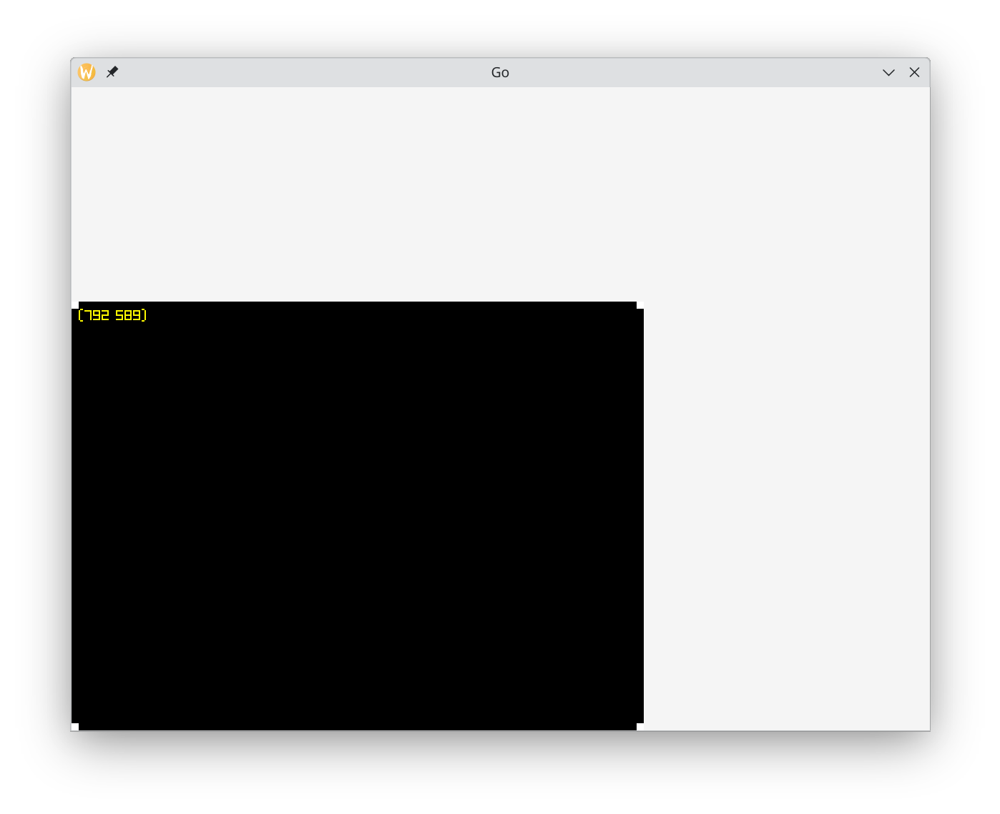
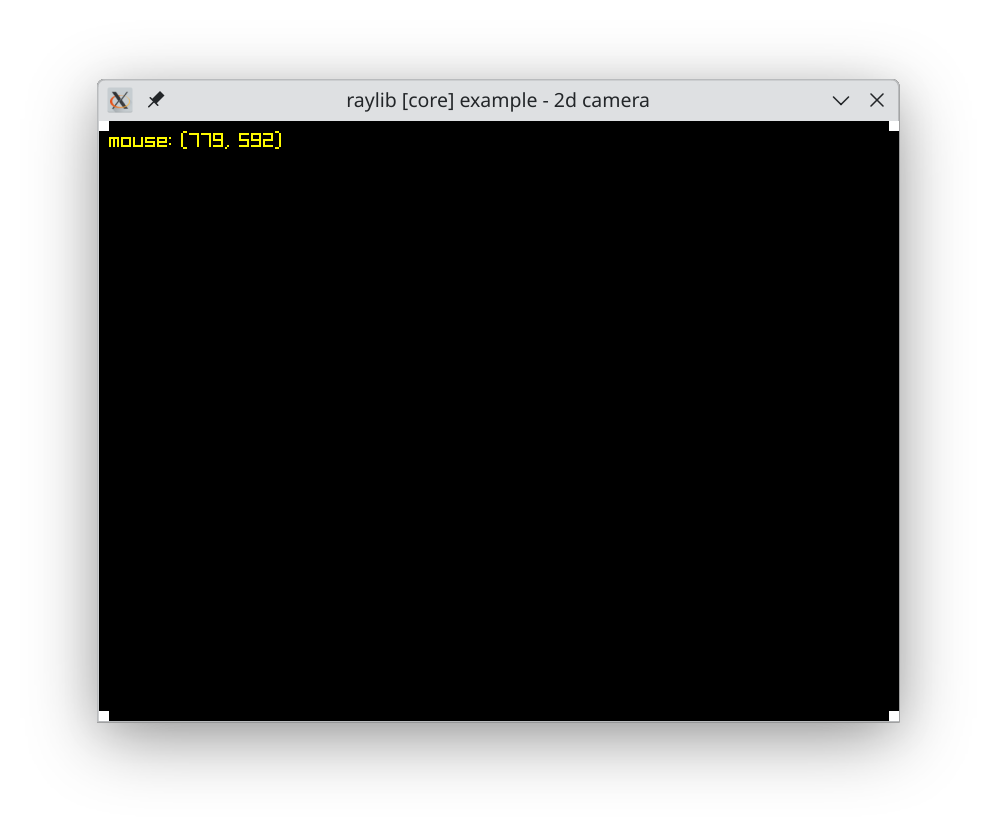

# Raylib at Linux

[raylib](https://www.raylib.com/) 是一個極簡遊戲函式庫，僅提供必要的函式呼叫。他是用 C99 撰寫，有個 go 的 binding [raylib-go](https://github.com/gen2brain/raylib-go)。這幾天我在試著用 raylib-go 寫一個簡單的程式時發現，我的視窗很怪。舉例來說，我寫了以下程式，在背景畫一個黑色矩形當背景，四角畫上四個白色矩形，最後左上角顯示游標位置。

```go
package main

import (
	"fmt"

	rl "github.com/gen2brain/raylib-go/raylib"
)

func main() {
	var w int32 = 800
	var h int32 = 600
	rl.InitWindow(w, h, "Go")

	rl.SetTargetFPS(60)

	for !rl.WindowShouldClose() {
		text := fmt.Sprintf("(%d %d)", rl.GetMouseX(), rl.GetMouseY())

		rl.BeginDrawing()

		rl.ClearBackground(rl.RayWhite)

		rl.DrawRectangle(0, 0, 1000, 1000, rl.Black)
		rl.DrawRectangle(0, 0, 10, 10, rl.White)
		rl.DrawRectangle(0, h-10, 10, 10, rl.White)
		rl.DrawRectangle(w-10, 0, 10, 10, rl.White)
		rl.DrawRectangle(w-10, h-10, 10, 10, rl.White)
		rl.DrawText(text, 10, 10, 20, rl.Yellow)

		rl.EndDrawing()

	}

	rl.CloseWindow()
}
```

很簡單的程式，但是使用 `go run .` 執行時長這樣



我期待他應該長這樣



很顯然 go 的版本除了 800x600 的區域又凸出了一大塊。

幾番研究之後，我發現又是 wayland 的鍋，只要編譯時加上 `-tags x11` 強制使用 x11 就可以了，所以執行的命令變成

```bash
go run -tags x11 .
```

# 結論
wayland 真的處處是陷阱
