# 大學修課紀錄

我碩一都過完了才想到來寫大學修課紀錄兼四年心得，有些東西已經看不到了像是 Moodle 交的作業，然後有些真的沒印象的課也可能記憶模糊，所以有些內容可能不太準。

## 110 上

這學期一開學好像因為疫情線上上課了一陣子，可能是一個月？就在宿舍開 Cisco webex，然後下課騎腳踏車去育樂街買飯。

### 創意產業英文

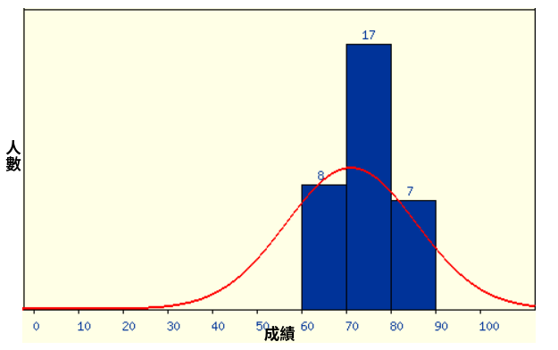

老師：曾惠鈴

一個一看就知道是英文老師的老師，教室是在光復校區中文系館（吧），一個類似全民英檢複試的教室，每個人前面有個麥克風跟耳機，偶爾會讓我們練口說，我記得有兩兩一組聊天討論。

### 體育（一）

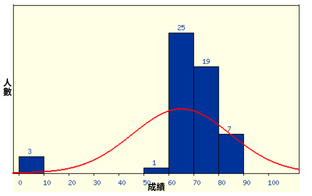

老師：王苓華

選課系統強制分配全班一起上，我記得打過幾次網球，要去很遠的自強校區所以印象比較深刻，其他都忘了，好像有跑步？

### 普通化學實驗（一）

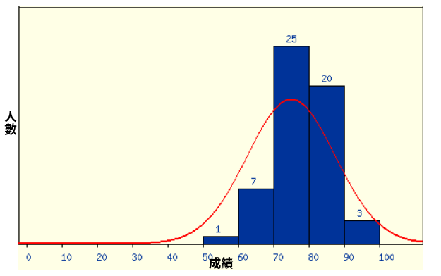

老師： 蘇世剛，但他不重要，都助教上課

要穿實驗袍、實驗紀錄從一個本本上撕下來，和數據釘在一起下星期交。組員就是按照學號兩兩一組，我和陳敬元一組。主要是熟悉實驗器材操作與一些手法，沒什麼太神奇的實驗。然後好像期末要交報告，挑一個實驗寫，期中要不要忘了，但好像有期中考（？這不是很確定）

上課前要寫預報，把要用到的藥品的特性查清楚，步驟抄一遍（還要畫圖，死人）

### 普通化學（一）

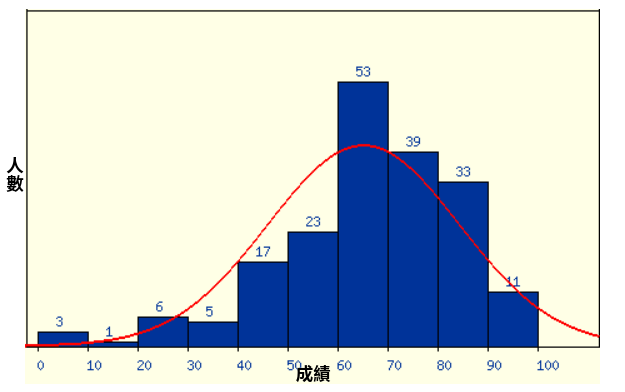

老師： 蔡惠蓮、林弘萍、周鶴軒

對，有三個老師，因為是物理、化學和地科三系合開，本來他們各自要上一學期的課，一起開只要上 1/3，真聰明。人超多所以在格致廳大講堂上課，人超多的後果就是後面的都在玩手機，我個人認為上課效果超差，還不如線上課，還能看回放、調速度跳過廢話。他們一人教一次段考範圍。

蔡惠蓮：我只記得他有一次期中考沒考到（大概是颱風之類的，反正意外沒考到），然後突然要求期末補考，後來當然被抗議，我也忘記怎麼處理了。  
林弘萍：只記得他很討厭物理系把腳踏車停在圖書館側邊的路上，很常上課到一半開始閒聊，好像講過什麼他拒絕台積電還是哪個大公司的高薪來當教授之類的。
周鶴軒：唯一的正常人

### 普通物理學實驗（一）

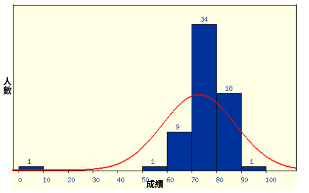

老師：楊毅，也不太重要，也是助教上課

兩個助要，一個戴眼鏡瘦瘦的，後來好像去台大物理所（？聽說的），比較兇，另一個一看就很會運動，八成是系隊，都很帥。實驗以力學為主，分組是每週隨機。我發現實驗項目在學校 [課程資料](https://class-qry.acad.ncku.edu.tw/syllabus/online_display.php?syear=0110&sem=1&co_no=C215810&class_code=) 查捯到，就不列舉了。比較有印象的是
- 重力加速度的測量：超級不準
- 游標尺、螺旋測微器與球徑計：整個學期最重要的實驗，教你怎麼看游標尺，後面到大三超過一半實驗跑不掉。

實驗前一樣要寫預報（後來好像都比較不在意，沒怎麼在看），結束要寫結報，我記得我是用 LaTeX 打，數據要用 Excel 算、畫圖，絕對是大一最麻煩得課之一，每週八個小時吧。

### 微積分（一）

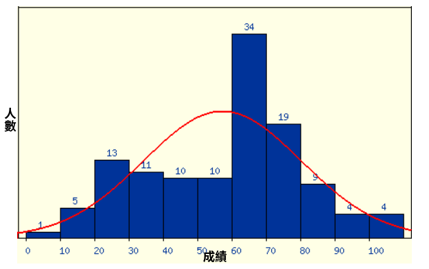

老師：賴青瑞

老師人很好，但是數學不好，微積分好難。這可能是物理系四年最重要的課，如果再來一次這個課我絕對好好上。每週有一天（好像是二）下午有個小考。

### 普通物理學（一）

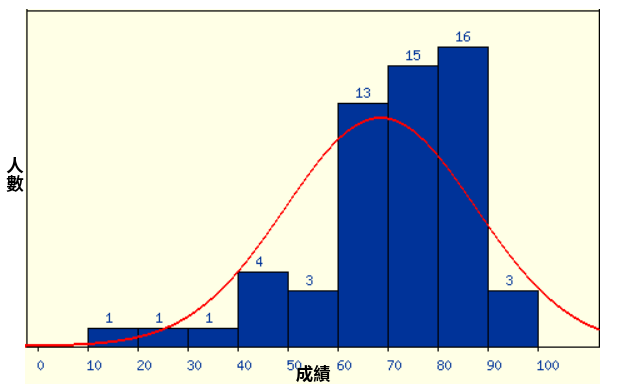

老師：陳則銘

也是人很好的老師，沒記錯應該是系上量子中心的主任還是副主任，普物實驗的助助教好像是他的學生。因為微積分教太慢（他從級數開始教），所以還兼職教了簡單的積分和微分。有 python 寫模擬的作業，只記得科氏擺。

### 大學國文-民間故事與傳說

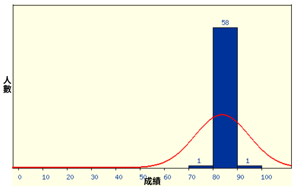

老師：林和君

人也是很好的老師，上課地點在軍訓室 aka 光二（我住的宿舍，光復第二宿舍）隔壁，所以可以上課前十分鐘再下床走路去上課。上課差不多是講各種臺灣故事，印象深刻的都是鬼故事，像是紅衣小女孩、玉山小飛俠之類的起源、演變。有個報告是找學校的鬼故事，我和陳羽飛和其他不認識的人一組，我們的主題是管院小童。

## 110 下

### 餐旅英文

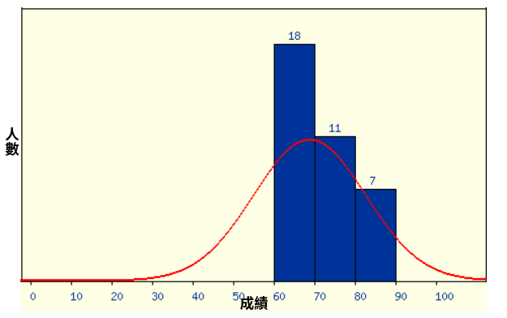

老師：曾惠鈴

上學期覺得這個老師還可以就繼續上他的課了，前面忘記說成大英文都要買成大出的課本，但是上課只會用到裡面 12 章的兩三章的幾頁，超虧，買二手就好。

### 扯鈴

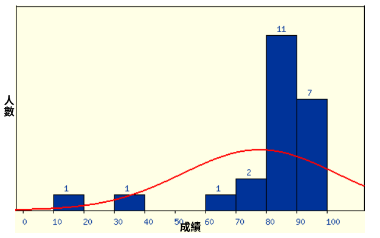

老師：蔡佳良

因為我沒選到大一下體育，所以選了一個大二體育。扯鈴我記得期末會一定數量（好像是三個）招式算過關。同學有些根本神，可以兩個三個鈴同時轉來轉去，他們是來虐菜的，我就國小玩過一個暑假。

### 物理數學（一）

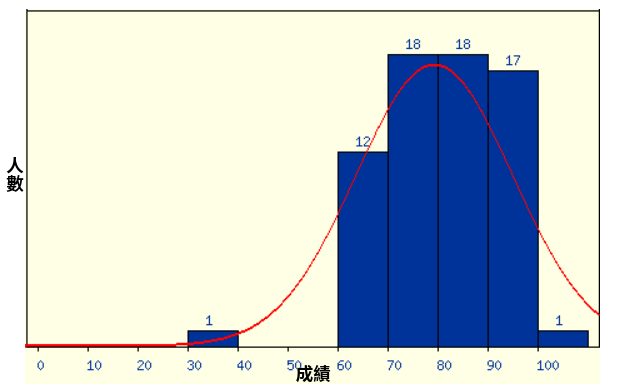

老師：張書全

物理系副系主任，超級好人。上課方式是拿著課本寫板書講解，確認大家都抄完了才會擦掉。時間快到了就會提早下課，期中期末考會問大家哪一周比較沒有考試，跟其他課錯開。用一個很奇怪的平台 zovio 點名，他先幫我們創好帳號，但是 mail 是用 @mail.ncku.edu.tw，我們真的收得到的其實是 @gs.ncku.edu.tw XD

### 普通化學實驗（二）

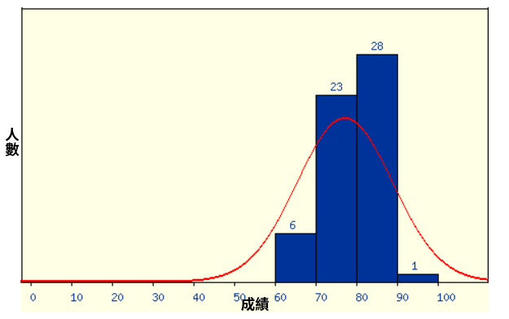

跟上學期一樣，我甚至沒印象哪個實驗是哪學期做的。

### 普通化學（二）

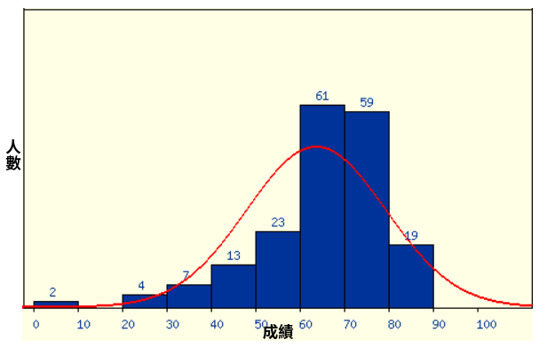

跟上學期一樣，不過這學期林弘萍有天突然在我們上普化實驗時衝進來罵了我們一頓又走掉了，忘記什麼事情，後面就換一個老師上課。好像是他的課堂上跟哪個人起衝突？

然後我這學期這門課被當，大學四年只有這個被當 QQ。

### 普通物理學實驗（二）

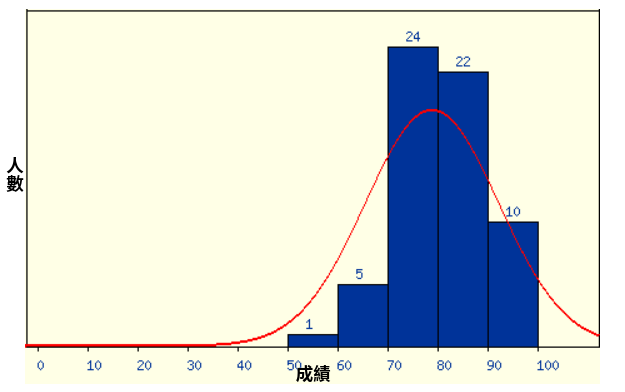

這學期以電學實驗為主，有一點光學，印象最深刻的是密立根油滴實驗，這實驗結算麻煩到要集合很多組的數據然後自己寫程式跑，我記得成果還很爛。

### 微積分（二）

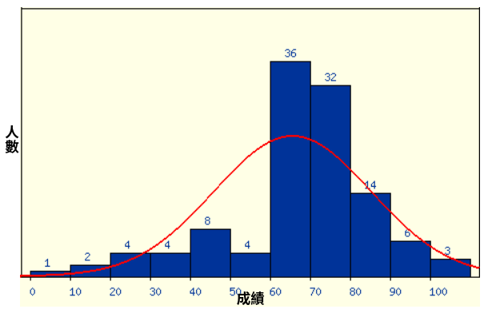

the same

### 普通物理學（二）

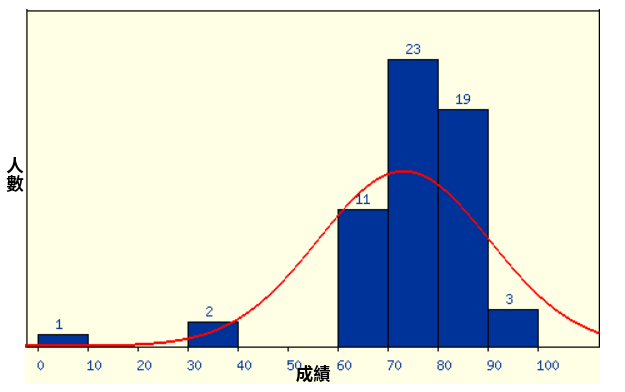

the same

### 政治學概論

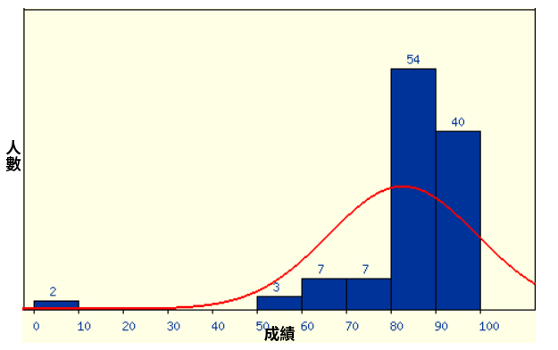

老師： 莊輝濤

我記得是全線上，很酷的課，要每週寫上課重點，期末交，我寫在 hackmd 上的 book mode，最後怎麼匯出成 PDF 的忘了。那時候剛好香港反送中，然後老師說這場抗爭一定不會成功，因為現代的國家掌握的軍事力量已經不是非國家等級能夠抗衡的了，那時候我很生氣，覺得他胡說八道，你看中共不是攻不下某某大學嗎？後來才發現他是對的。然後還有個什麼國家民主化的發展曲線，分三類，大概分兩個軸，大概是集權與某個東西，忘記了，印象最深刻的是他說大部分國家包含臺灣都屬於先發展一個再發展一個，只有日本因為被美國監督（或是說控制），所以是走中間，兩邊平衡的發展。
這個課我覺得蠻有料的，應該認真上的才對。

### 踏溯台南

所有成大學生都要上的課，有人覺得很爛我覺得還不錯。我走的路線是繞育樂街一圈，看了 228 的遺址和育樂街發展，還有去烏山頭水庫。

## 111 上

### 自由車

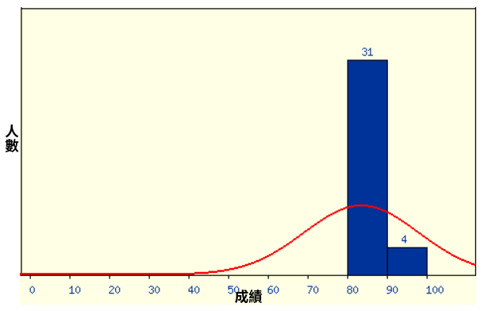

老師：施光隆

在臺南運動公園自行車場上課，要自己騎過去。每次上課前就是上油、保養一下車子、調個煞車坐墊。有一次騎出去，從學校出發，應該是走台一線到奇美博物館，然後繞虎山林場不知道怎麼就回到學校，好像是走監理站附近，在這門課認識 Vincent55。

### 倫理學

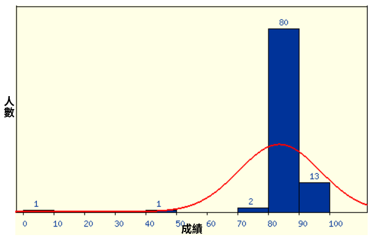

老師：葉海煙

忘了，看課程資訊提到桑得爾的「正義：一場思辨之旅」，好像要用這個寫報告？

### 資訊安全

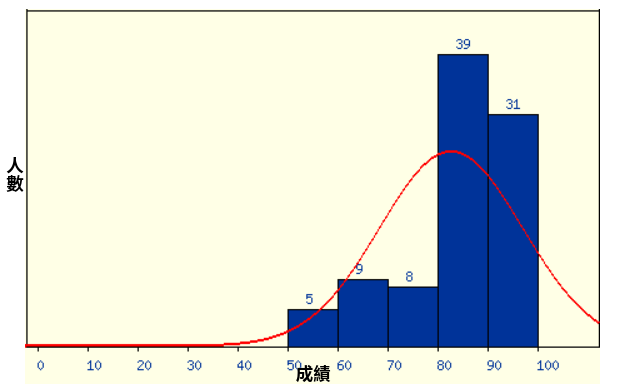

老師：李南逸

這個老師好像是成大畢業去南台教課，剛回成大，所以上課風格跟成大差比較多（可能吧，我是這樣猜）。整個課程比較偏密碼學，講了對稱式加密 ASE 細節（對，每一步列出來，段考還考這個，誰他媽會去記）、非對稱加密 RSA 數學細節。好像有講到 GPG, S/MIME 的步驟（段考也考了這個...）。

總之是個取錯名字課，然後考卷出的很爛。

### 程式設計（一）

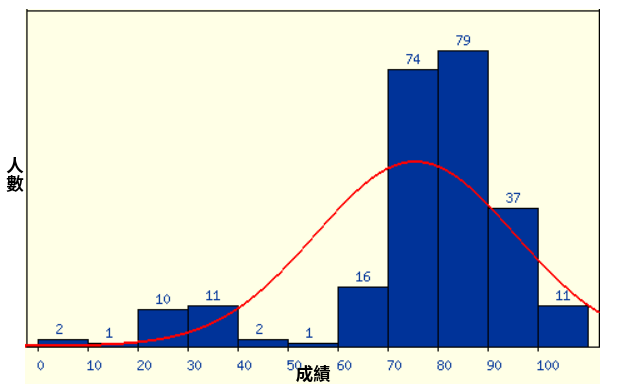

老師：蔡孟勳

我終於選到這個課，申請資工雙主修要用的。我記得也是在一間很大的教室上課，也是格致廳大講堂吧？考試是用一個 OJ，作業是不是忘了。老師後來比我早幾年來交大，也成為我的碩士指導教授，這門課其中一個助教是腳踏車同組的同學。

這也是資工系和物理系的差別，資工系好像是修過這門課，成績不錯就可以明年來當助教，物理系基本上都是碩士班在當助教。

### 物理實驗（一） 	

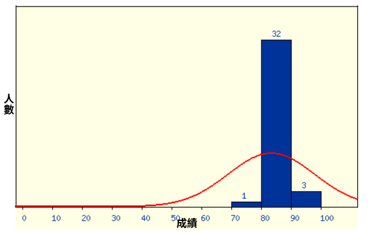

老師：羅光耀

我記得分兩班上課，時段也不一樣，陳敬元被分到另外一天，我和張育誠一組。這學期不知道為什麼都是一些電子學實驗，上半學期是類比電路下半學期是數位電路。老師是系主任，很愛親自上課，但是旁邊的助教偶爾會看不下去再講一次，助教不是研究生了，是系上聘的，專門負責物理實驗這門課的助教，我記得是一個高高瘦瘦的男生。這門課唯一的印象是 labview 超他媽難用。期末有個操作考，好像是要接個電路，會亮算通過。

### 天文學（二） 	

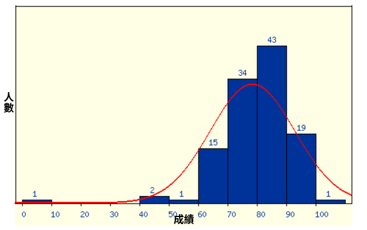

老師：李君樂

系上不知道在想什麼天文學是下學期、上學期一組，所以我們一坨人先修了二再修一，所以老師也換了一個。這個老師是香港人，人很好。

### 電磁學（一）

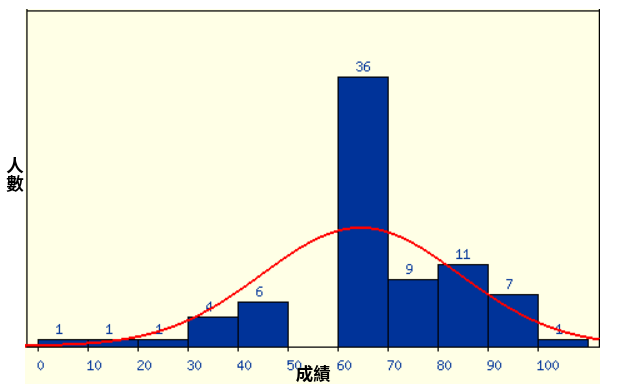

老師：游輝樟

物理系大二必修課，這個老師好像是研究相對論的，老老的，助教禿頭所以看起來也老老的。老師上課都用 PPT，用念的，很少寫板書。助教人很好，考試前某個晚上會有個複習的助教課，會押幾個可能考的題目。

我覺得電磁學是個連貫起來會讓人覺得哇嗚的學科，因為他被人類從 19 世紀以來研究的太透徹，這門課用到大量的矩陣、向量，所以向量、矩陣要學好。

微積分、電磁學、力學、物數這些物理系基礎課程都會溝課本習題當作業，大學生涯有一半在趕作業和上網找作業答案中度過，但這是一段安穩、令人懷念的時光。

### 力學（一）

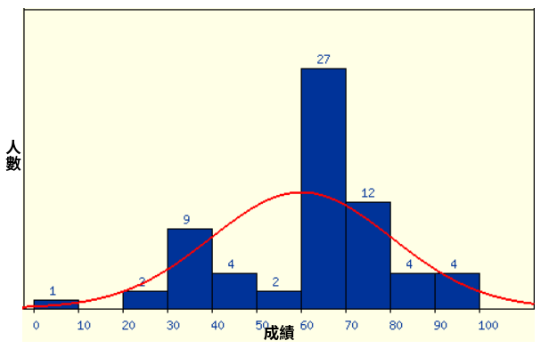

老師：周忠憲

一個看起來很厲害的老師，和游輝樟不同他超愛板書，他會拿著課本夾著一疊自己寫的講義（沒有要給你看得意思，那是他的筆記），開始寫板書。他上的很好，但是考試很難，然後助教改分數又很嚴格，去要分很常要不到，要去找老師要，比較容易要分。定期會有小考，剛上課的時候會寫在黑板左上角。

難得一見的好老師，大推。

### 物理數學（二）

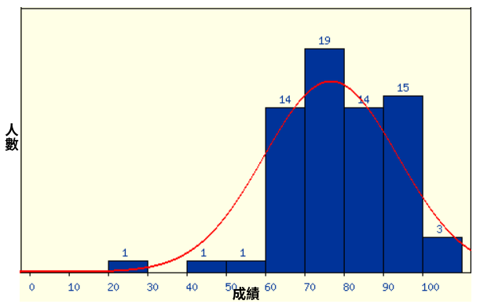

跟上學期差不多，但是這學期開始有點小抱怨，力學、電磁學開始用到一堆向量、矩陣之類的數學工具，物數應該要先教這幾個章節才對，但是老師是按照課本順序上，還有同學說這本課本是公認的爛，但我不確定，沒看過其他物數課本。

## 111 下

### 從創意發明到專利保護

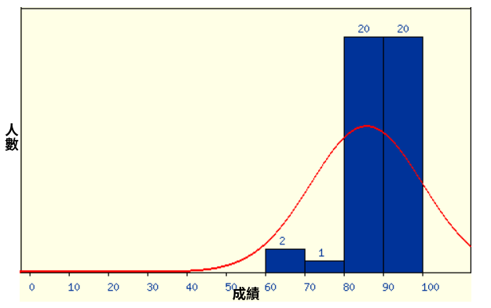

老師：張桂豪

只記得要寫一個專利申請，用一些很奇怪的語法來描述，什麼「有一個某某東西由什麼什麼組成...」，然後專利的寫法分成兩種，忘記了。

### 普通化學（二）

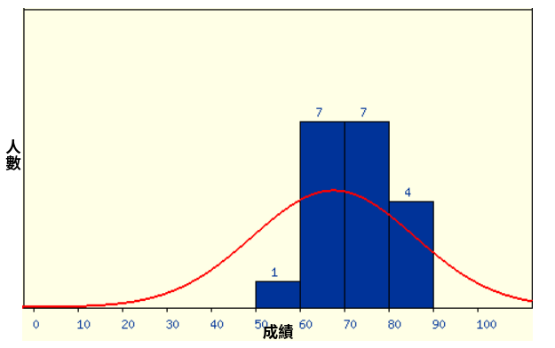

老師：劉詠熙 Lau, Wing-Hei, Vincent

因為我大一被當掉，所以和林柏宇一起重修，他找到聽說英文的比較好過我們就去了。這個課人相對少很多，有沒有比較簡單我不知道，但因為他剛好和中文的課進度顛倒，所以上的是我比較熟得部分，就過了，好像是勒沙特列原理那段？反正跟量子理論沒關係，那段我看不懂。
老師好像也是香港人所以有中文名字，但我印象中他簡報好像是寫 Vincent Lau。

### 數值分析

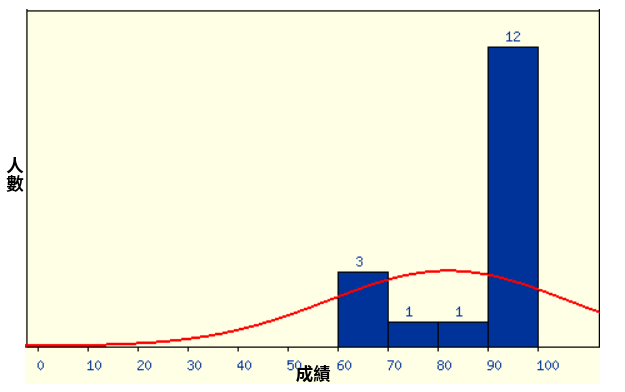

老師：游輝樟

同一個老師同一個助教，一樣是 PTT 上課，風格一樣。就是教你怎麼用程式（python）算數學，尤其是幾百、幾千的元素的矩陣、向量之類的運算，離散的積分、微分。有一堆近似之類的方法，課程算輕鬆。我記得每週有個作業，怎麼交忘記了。

### 物理實驗（二）

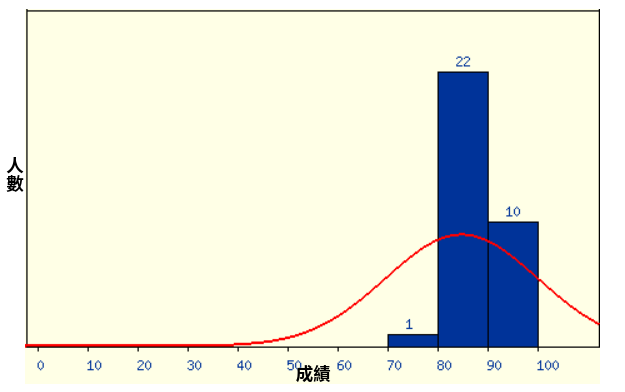

電磁學和更多 LabView，破爛垃圾軟體。

### 天文學（一）

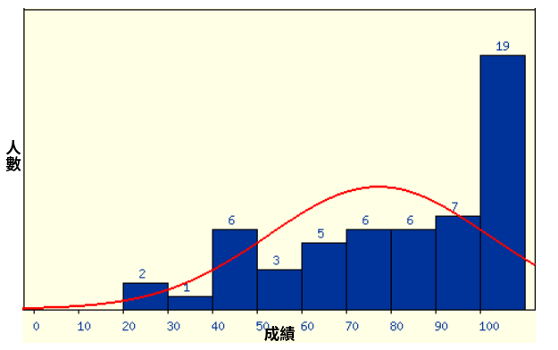

老師：邱奕儂

剛從德國回來的老師，系網照片是爆炸頭，結果走進教室的是一個光頭（WTF）。上課很有趣，天文學本身也很有趣。所以後來我就去找他做專題了，BTW 我的專題同學互評還是第一名，感謝大家厚愛。他上課好像會小考，是發一張大概比名片大一點的紙，隨機出一題，簡單回答，很輕鬆。

### 物理數學（三）

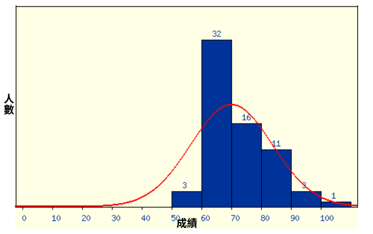

這學期開始物數是選修，但大多數人還是會修。然後一樣按照課本章節寫板書。可能是這學期也可能是下學期，講到一堆奇怪的繞著複平面上奇點積分的問題很酷，但不知道什麼時候會用到。

### 電磁學（二）

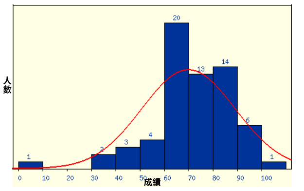

跟上學期差不多。有次段考考了一個 6x6 的矩陣，我記得是把電場磁場全部塞進去，這個東西是前幾天晚上助教課助教講的，沒來上課的根本不會這題，賺到。

### 力學（二）

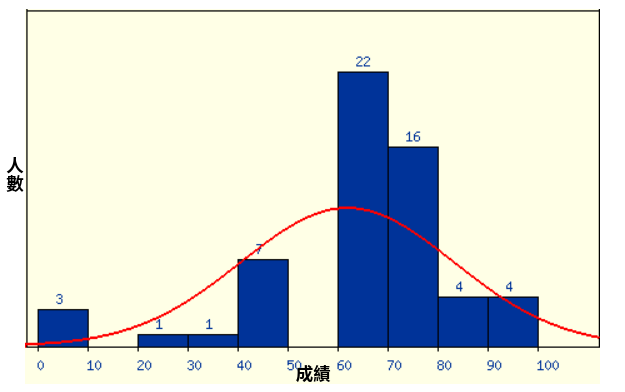

跟上學期差不多。

### 前沿物理發展介紹

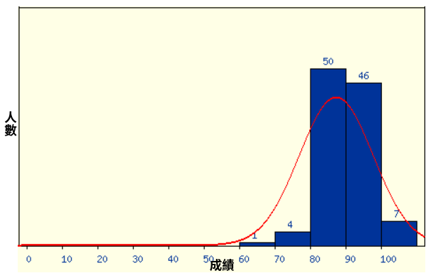

老師：黃建龍

每週會有一個老師來分享他們正在研究的主題，寫心得交回去。同一時段（嗎？）還有一個現代物理概論之類的課，聽說很硬。

## 112 上

### 大學國文-現代文學與文化

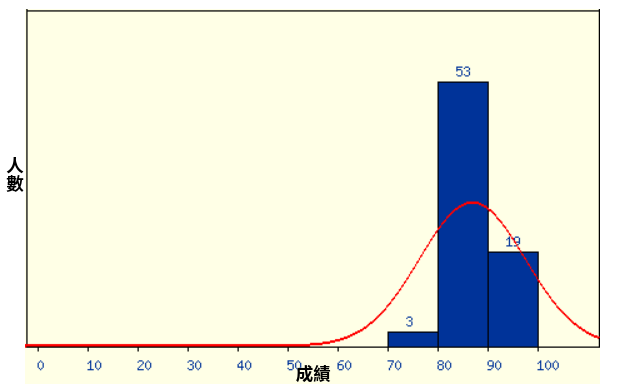

老師：李京珮

傳說中很甜好好過的老師的課，老師是個年輕女老師，上課主題是各種小說，我記得張愛玲，沒了，他的文字確實都蠻美的，難過是知名作家。

### 生活經濟學

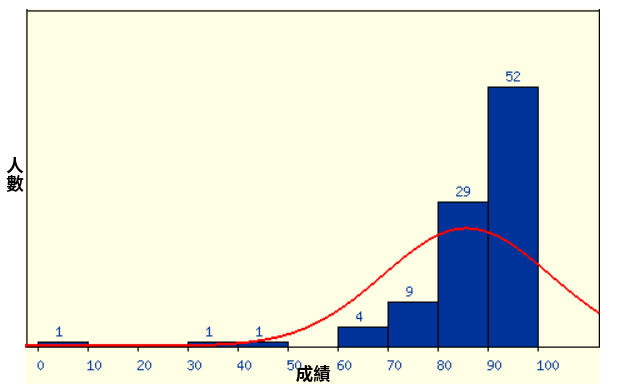

老師：宋皇叡

這個課好像是我最後階段不知道怎麼加選到的，結果是英文授課，在醫院旁邊的社科院上課。我只記得大概是一些供需理論之類的，高中公民中經濟的部分，但是改成英文。

某天下課遇到腳踏車、程設一認識的同學兼助教，他勸我要不要重考用特招上資工系，他那時候負責這個 XD。

### 賽局論

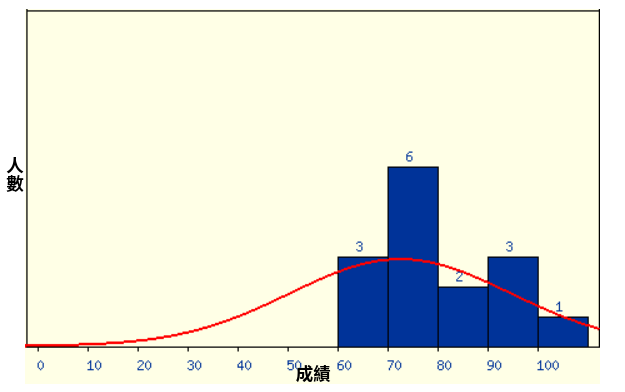

老師：黃基志

這是暑假理學院模組化課程，老師是外國人，我不知道學校課程資訊系統上這個人是誰，可能是負責開課的？課程內容是我沒學過的，很有趣，也不難。高中機率的延伸，是個蠻有趣

### 生成式人工智慧輔助之Python程式設計

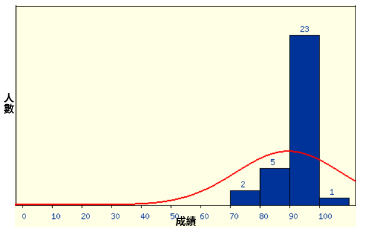

老師： 舒宇宸

一樣是模組化課程的課，我以為是教用 python 操控人工智慧（這時候 ChatGPT 差不多剛出來），結果是我沒看清楚，人工智慧「輔助」，還是教 python 但是用 AI 輔助，怎麼輔助的我忘了，都是很入門的語法教學。然後我發推特被老師還是助教看到，上課問「橘色長條貓是誰？」嚇死，那篇推文好像跟 COSCUP 有關？暑假剛去 COSCUP 回來的樣子。結束的專題我記得是做破解學校選課系統的反爬蟲，我記得是每個 request 會帶一個隨機 token，每次不一樣，沒有 token 就拿不到課程查詢資料。不過成大天天改選課系統，大概這個也失效了。

### 從量子物理到 IBM 雲端量子電腦

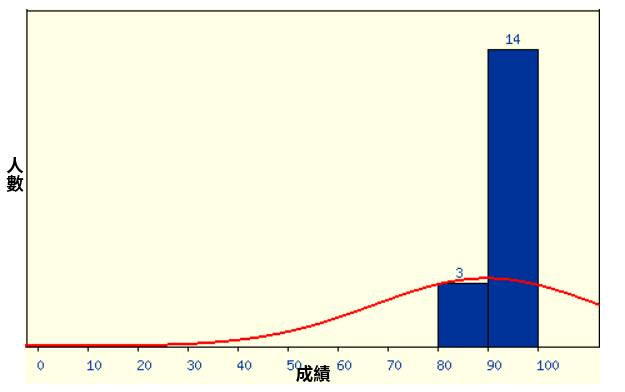

老師：陳岳男

這個據說是量子中心開給非物理系的人的課，但我們（和張育誠吧，還有其他人）去上了，前半段講的和接下的量物一要講的一樣，後半段在教我們使用 IBM 的量子電腦模擬器，IBM 好像有贊助我們學校。輕鬆簡單的一門課。

### 固態物理導論

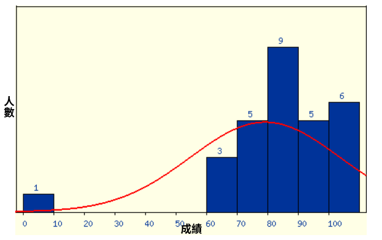

老師：張泰榕

上課風格很有趣的老師，固態物理也叫凝態物理，就是研究一大堆原子組成像是晶體這種有規律的時候會怎麼運動，上課內容就是講一堆不同的模型。這門課難在你要把老師分開講的每個模型串起來，串起來這門課就通了。，我在期末考前幾天作筆記複習時通的，期末考意外的高分，很爽。

### 熱力學

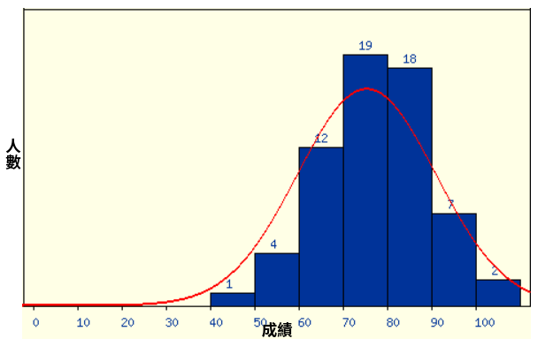

老師：苗舜培

聽說是做理論天文學的教授，熱力學我認為也可以叫「多變數微分」、「怎麼用變數搞暈你」。這東西基本上就是圍繞著溫度、熵轉來轉去，轉一個學期，然後頭就暈了。是我覺得這學期最難的課。

### 光學

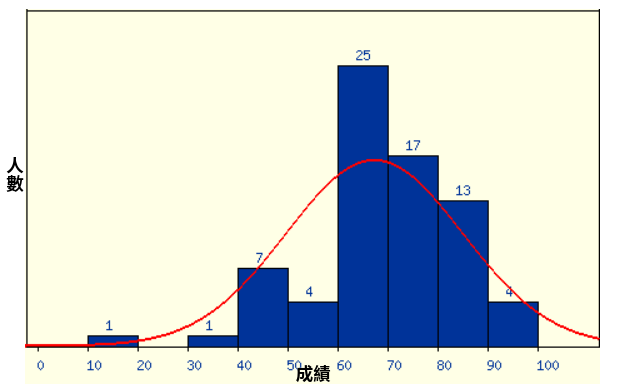

老師：朱淑君

老師是個看起來帥帥的你老師，最後我只記得等厚干涉、等傾干涉。因為這學期物理實驗剛好這週實驗用到的理論下一週光學就上，氣死，這樣結報很難寫原理，你實驗慢兩週我就輕鬆了。

### 量子物理（一）

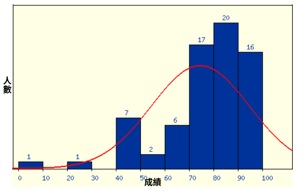

老師：陳岳男

aka 積分、向量、複數、線性代數之應用，請先學好積分再來上課。這門課有趣得地方在於當你真的計算出電子可以穿透屏障、兩個相干的量子可以無視距離感應對方這些本來只知道定性的結果時，會很驚訝、有趣。非常推薦的一門課，但是記得 sin cos 的積分先學好。

### 物理實驗（三）

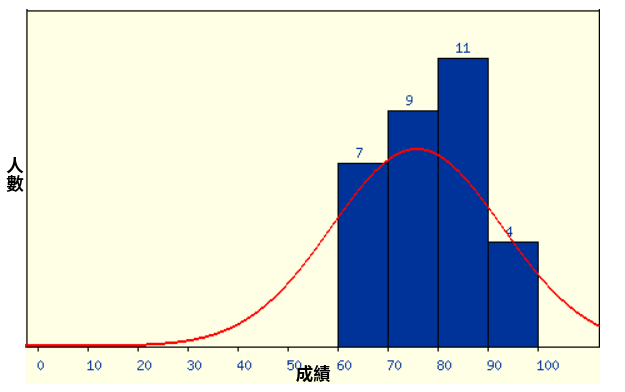

老師：朱淑君，他不重要，都是助教上課

助教也是系上聘的，是個有點胖胖但是超級強的女生。他不用看講義就知道每個實驗的所以細節，摸兩下本來壞掉的儀器就好了。不過他也蠻嚴格的，但最後大家都很喜歡他。上課方式是用輪的，器材之有一套，分兩間教室，光學和其他，光學的實驗室開始後就會全關燈，超黑，看望遠鏡看到眼睛快瞎掉。其他實驗就比較五花八門，最有趣的大概是 STM，要自己做針頭裝上去，真的看到結果後很開心。

我忘記要不要寫預報，實驗做完後要回答問題，助教很嚴格，沒答對不會放人，下週交報告。

再說一次，助教超強，雖然有點兇但最後你一定會喜歡他，他超讚。

### 物理數學（四）

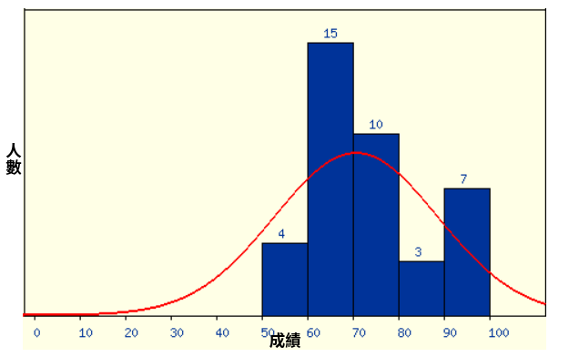

同上學期

## 112 下

### 獨木舟與專項體能

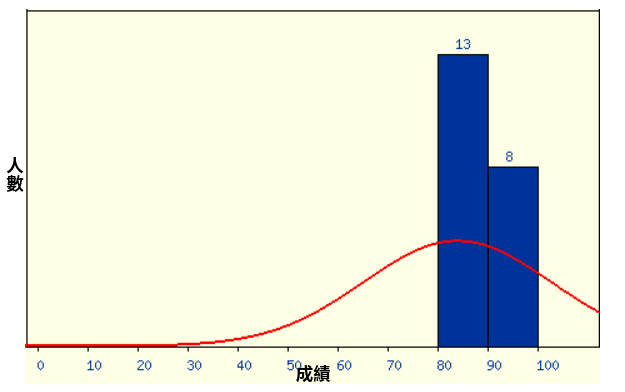

老師：龔泰源

遲來的大一下體育，很好玩，主要滑獨木舟，也有 SUP，還有一節課是跳下泳池學自救。泳池是超深的那種，一個學期下來我沒成功踩到池底。有上午和下午的，建議選下午，因為上午的課下課是午休，午休游泳池關閉，所以要提早下課，下午班就可以多玩一點。我記得老師有要求（還是有加分？忘了）學校運動會要組隊去，但好像疫情還是颱風的運動會不見了。

大推，我大四的時候還以想選選不到了。

### 心理學

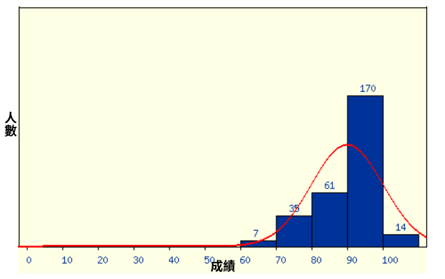

老師：林君昱

我記得是非同步線上課（讚），其他忘了，小考可以全部丟給 GPT，會有 70 分。

### 計算機組織

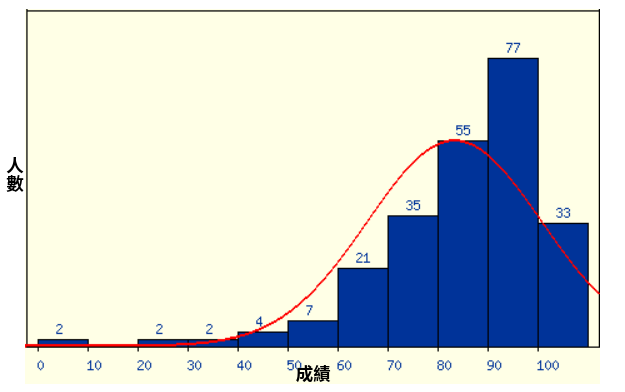

老師：涂嘉恒

我終於有空選到資工系的課，資工系的課都超難選，第一階段後幾乎沒有餘額。這門課是用 RSICV，好像有叫我們實作一個什麼東西？忘記了，反正是有實作的課。對考資工所有幫助，像是 CPU pipeline、cache 什麼的都有提到。

### 計算機演算法

老師：李昆忠

我記得是電機系的課，後來退掉了，應該是這學期作業太多。

### 資料結構緒論

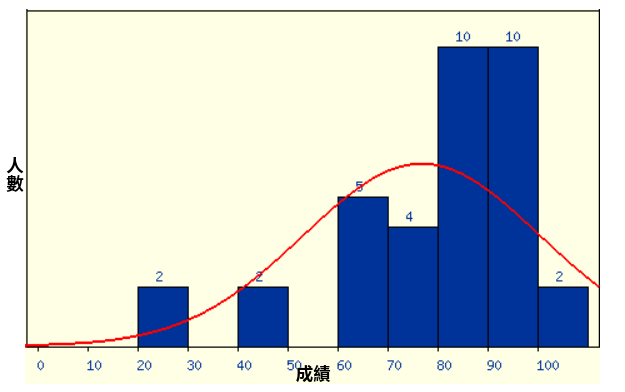

老師：林家民

也是電機系的課，就拿經典的那本課本，然後好像資工系不認這個課，名字不一樣。

### 大數據天文學

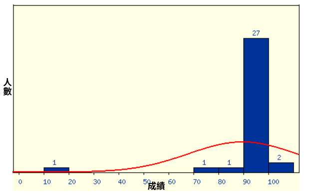

老師：李君樂

不是他上課，這是 coursera 的課，只是李君樂有出考題（嗎？）

### 量子物理（二）

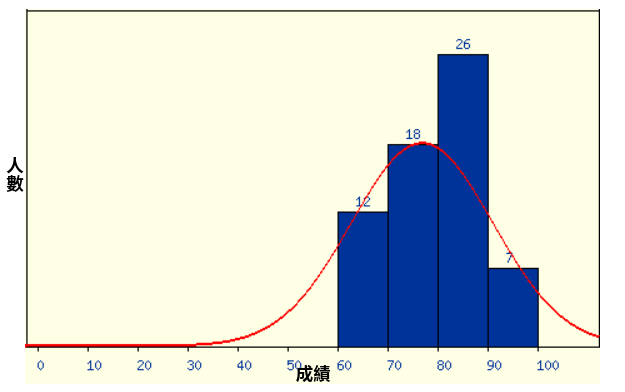

同上學期，很讚的課，但是理論開始變難了，世界變得沒那麼美好，開始一堆近似。

### 物理實驗（四）

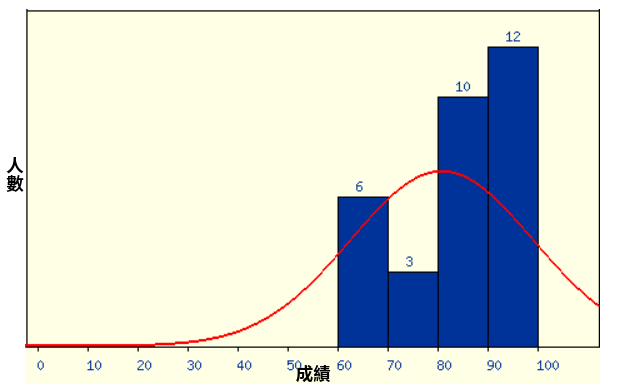

幾個簡單的實驗和連續三週做 YBCO 超導體，很有趣得實驗，最後有稍微浮起來，理論我只知道是電子形成什麼 copper pair 然後不知道為什麼就超導了。不過那好像是低溫超導，反正超導的理論人類還沒解決，講的出 copper pair 助教就給過。這學期實驗比較少，其他的時間給你做專題。

專題 aka 碩班預備，就是找個教授，然後就看那個教授要叫你做什麼，我是找邱奕儂，做出了什麼我也不知道，反正最後同學互評我拿最高分（還是前三啊？反正有拿到系主任贊助的獎學金），謝謝大家。

## 113 上

### 全民國防教育軍事訓練－國防科技

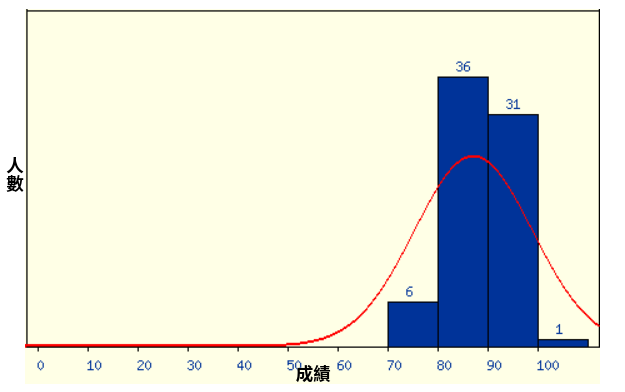

老師：郭蘋萱

一個人很好上課也很認真的教官，印象中是中校？但這好像是他退休前最後一年，所以理論上他現在應該不在學校了。沒記錯的話這門課應該是會把陸海空三軍的主要裝備介紹一遍，像是坦克、裝甲車、飛彈、戰機、各種鑑，是很棒的一門課。

### 數位音樂創作

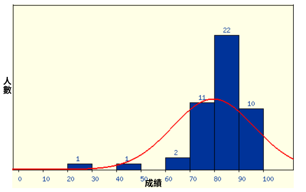

老師：張介凡

主要教一個 DAW（Digit Audio Workstation），我忘記哪一個了。然後期末要做一首歌。如果是對音樂有興趣的人應該會喜歡這門課，像是辛祥均對這門課就有蠻高的評價，我還好。

### 數位系統導論

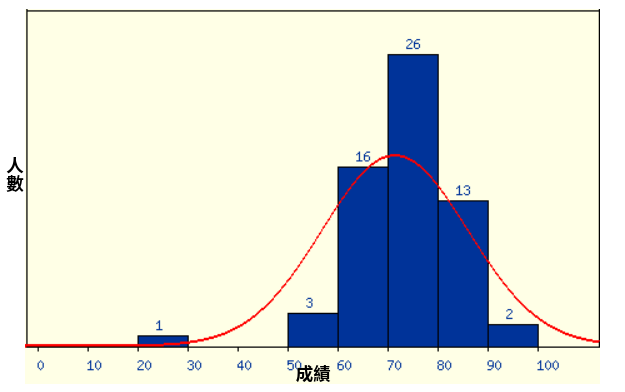

老師：林英超

英文上課，我只記得 Combinational Logic、Synchronous Sequential Logic 還有 AND gate, OR gate 這些邏輯閘的三極體等級構造。前面好像還講過什麼 k-map，是用來簡化電路用的，最近玩 Create 做 quarry 時用過，但沒用上（嘿嘿）。

### 離散數學

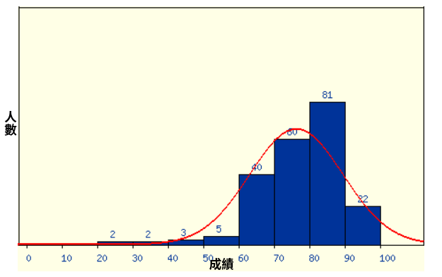

老師：謝孫源

好像也是人很多在格致廳大講堂上課，就數學，所有邏輯都嚴絲合縫，完美沒有奇怪近似的世界，讚。我記得這學期修這些課都是把他們當作考研補習班。

### 資訊科技下的信任溝通之轉移

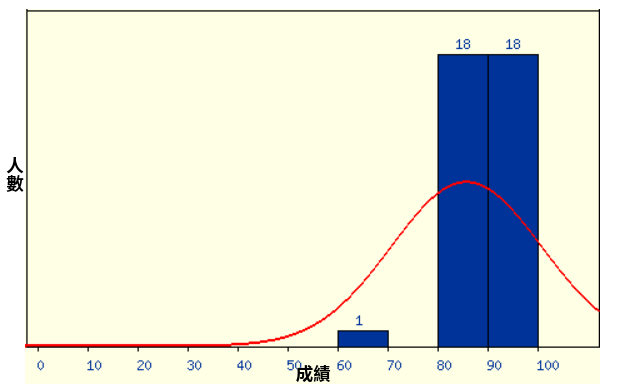

老師：蔣麗君

大爛課，不推，浪費我時間。

## 113 下

### 全民國防教育軍事訓練－國際情勢

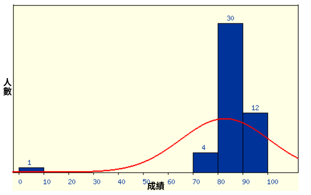

老師：楊太源

我記得是一個很強的老師，對中國、國際的情勢是很有研究的，隨口就可以舉例某某年誰誰誰幹了什麼，有什麼影響。不過他上課太平，會讓人想睡覺。推薦可以選，睡飽再去上課。

### Linux核心設計

老師：jserv 黃敬群

我從大一就想上的課，大四終於有空選他了，但好像太晚了，這門課真的要修通可能要上兩三次，或是整學期啥事都不幹就專門上這門課。後來退選了。

### 編譯系統

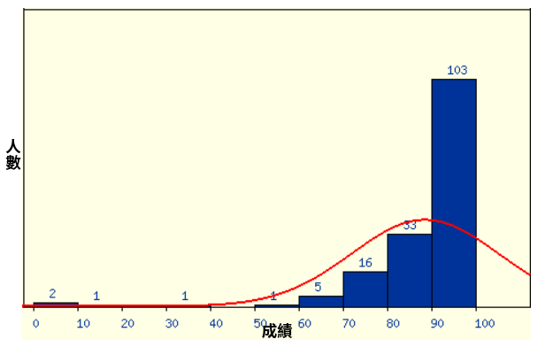

老師：陳奇業

我記得作業好像是圍繞一個自製編譯器？蠻有趣的，會講到很多語法分析、語意分析的方法和他們的限制，我覺得跟固態物理一樣是要自己把所有概念串起來才會通的課，最主要是要搞懂每一個方法無法處理什麼語法，這個語法又被什麼方法解決。學完跟量子物理一樣會有哇嗚的感覺。推。

### 臺灣閩南語曲謠之詞曲賞析與實務

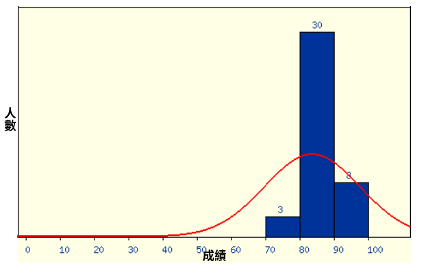

老師：楊金峯

一個看起來就很會唱歌的老師，主要內容是講各種過去在國文課本出現的詩詞什麼的。像是詩經、將進酒、般若波羅蜜心經、歌仔戲、好像還有兩首絕句還是律詩的。然後都可以唱，學台語沒什麼幫助（都是文言，日常對話的白話不是這門課要教的），會講到一些字的音的演變，對於「這個字古時候怎麼念」有興趣的人很適合。還有整個東南亞閩南語的差異。還有臺灣各種腔調的差異。也是一門很有趣的課，推。

### 拖延心理學：理論篇

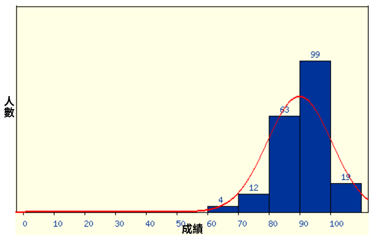

老師：林君昱

一樣非同步線上課，讚。

### 全民國防教育軍事訓練－防衛動員

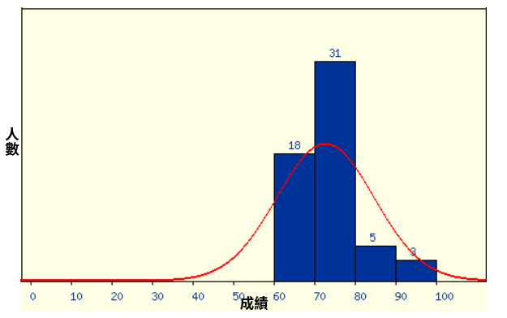

老師：吳智泰

我不知道學校是多缺人，連這種人都可以來上課，更何況他上課上的極爛，一點料都沒有。節錄直接搜尋他的名字會出現的前幾篇新聞標題：

- 【教官土皇帝4】上校督導好享受 辦公室搞得像五星級健身房 還有 4 ，這是連續劇嗎？
- 【全文】縱容部屬詐領津貼、保薦中校妻　軍訓高官扮土皇帝橫行
- 雲林處教官涉貪瀆 潘文忠下令專案嚴處 貪瀆、偽造文書
- 【教官土皇帝3】內舉不避妻他不聽勸阻硬推老婆升上校| 鏡週刊

### 全民國防教育軍事訓練－國防政策

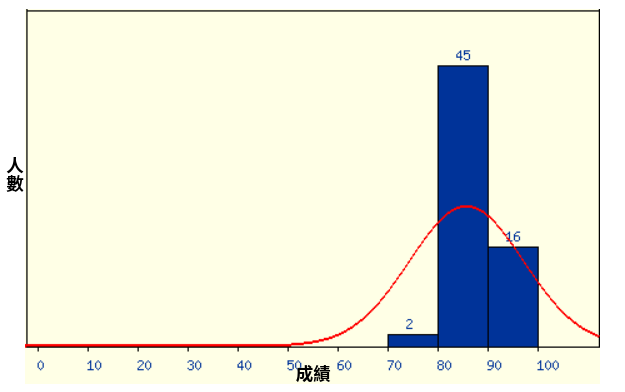

老師：楊太源

反正很推這個老師，上課內容忘了，和同學期另一門課印象混在一起了。
