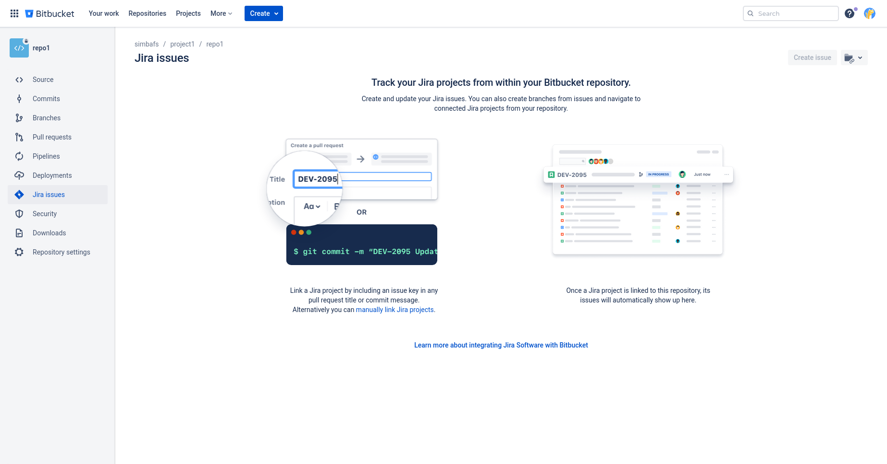
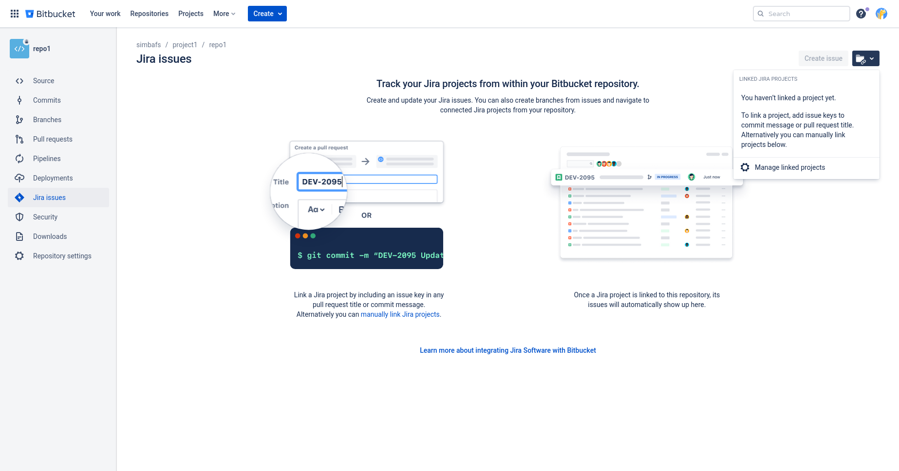
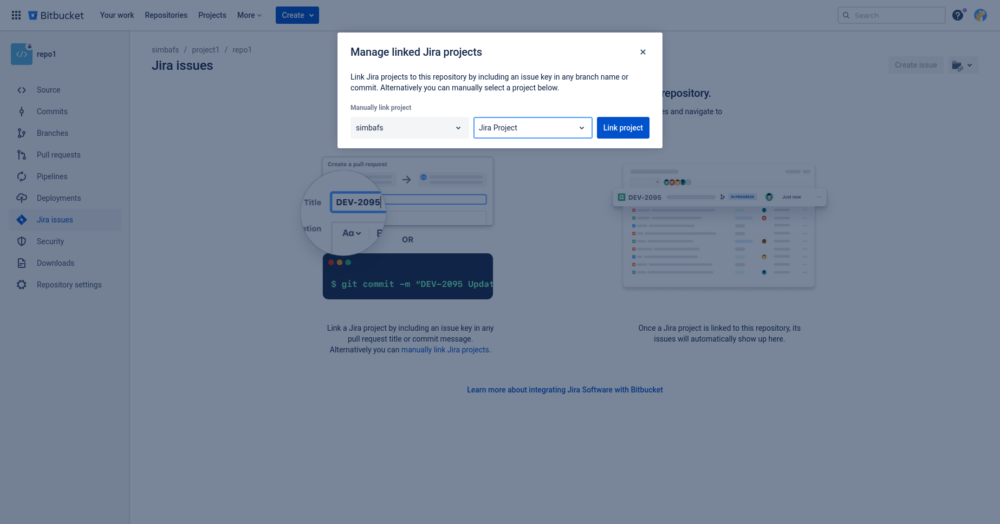
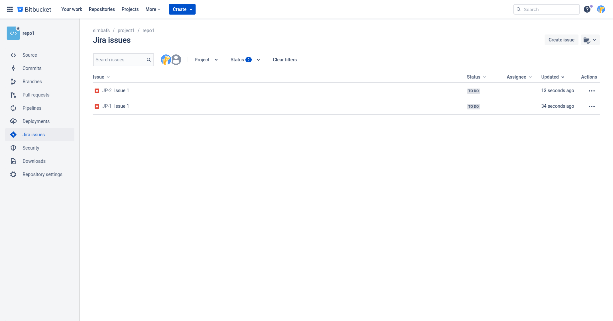
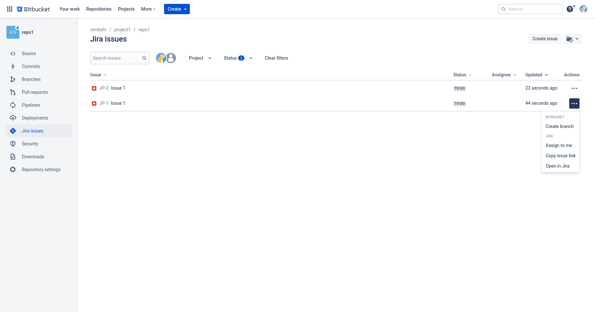
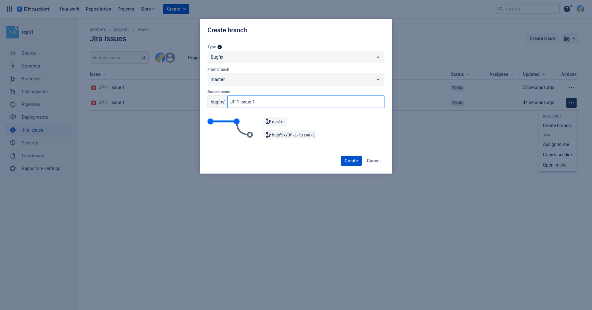

# Bitbucket Connect Jira

## Bitbucket 連接 Jira

先到 Bitbucket 的 repo 的 Jira issue 頁面

點擊左上方資料夾圖示按鈕，然後點擊「Manage linked projects」

選好 Jira 專案後，按下「Link project」

等載入完成就可以看到 Jira issue 了


## Jira issue 連結 Bitbucket branch

Bitbucket 的 repo 的 Jira issue 頁面，點擊要處理的 Jira issue 最右側的三個點點

選第一個按鈕「Create Brench」

填好 type、name 等等訊息，按下「Create」就建立好並對應了


## 將遠端 Git brench 拉到本地

```sh
$ git pull
$ git switch <branch name>
```

## 合併分支

目標：將 A 分支合併到 main 分支

```
$ git switch main
$ git merge A
```

這裡可能會產生衝突（conflict），解決後就可以繼續合併了
