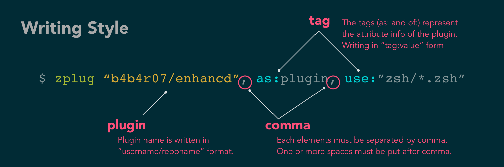
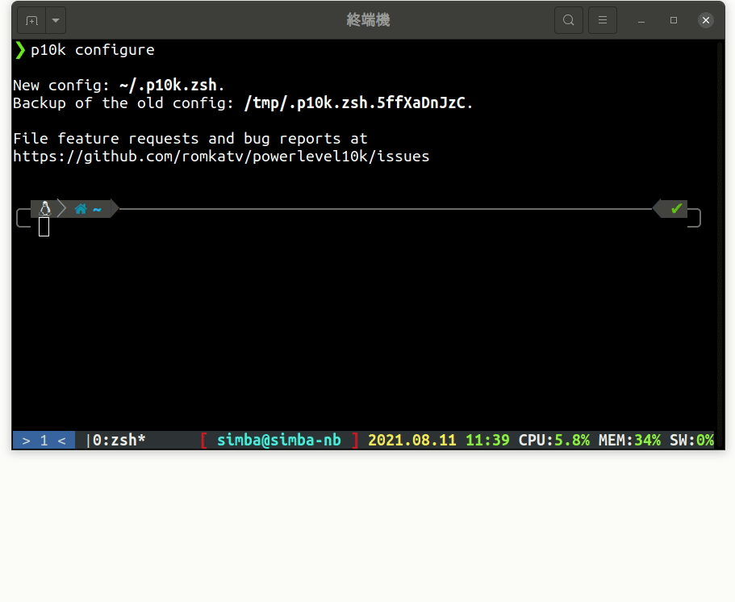

昨天裝好外掛管理器了，接下來我們要用 zplug 來裝一些好玩的外掛囉！

# p10k

p10k 是 powerlevel10k 的縮寫，這是一套 zsh 的 prompt 主題，是我用過**設定最簡單效果也很好**的，重點是不論有**沒有裝特殊字型**，他都可以用！

## 安裝字型（可跳過）

p10k 官方推薦 [nerd font](https://github.com/ryanoasis/nerd-fonts)，這是一個給開發者的字型集，包括各種**程式語言**、**網路服務**的 icon 等等。p10k 官方也有提供修改過[專門給 p10k 的字型檔](https://github.com/romkatv/powerlevel10k#manual-font-installation)連結裡有各種終端機模擬器的字型安裝教學（英文）。  
其實如果你只想要部份 icon，只要把 ttf 檔放在 `~/.fonts` 下就可以了，不需要改終端機字型，他找不到時會去抓（我自己試是可以的，系統 ubuntu 20.04、terminal: gnome-terminal ）  
如果你想要在 CLI 有各種 icon 的話你才需要安裝上述字型，如果不需要可以跳到下一小節

## 安裝 p10k

p10k 說到底只是一個**外掛**，所以我們可以透過 **zplug** 安裝，打開 `~/.zshrc`，在 `# plugins` 那行下面加上以下設定

```diff
# plugins
+ zplug 'romkatv/powerlevel10k', as:theme, depth:1
```

關於這段是什麼意思呢，zplug 提供了一張精美的圖來幫助我們理解  
首先，以 `zplug` 開頭，然後接 github 的 `username/reponame`，再來可以用 tag 做修飾，例如我們安裝 p10k 時就用了 `as:theme` 和 `depth:1`
，兩個 tag 之間以逗號加上**一個以上的空白**隔開  


修改好 `~/.zshrc` 之後，為了新載入設定，最間單的方式是**關掉終端機再打開**，這時候他應該會問你要不要安裝 p10k，按 <kbd>y</kbd>。接下來 p10k 的設定畫面就會跳出來，我們可以進入下一節了！

## 設定 p10k

p10k 的設定界面做得很好，按幾個按鍵就結束了，然後你就會得到一個漂亮的 zsh。  
整個設定流程分成三個部份。第一部份是**字型確認**，他會舉出幾個字給你看，分別是菱形、鎖、debian icon 和 python icon，最後是測試 icon 會不會擠在一起。你就根據他的提示確認你的字型就可以了。  
再來第二部份是**設定 prompt**，p10k 可以讓你設定幾乎每一個小細節，按照說明把他按完就好了，這裡都憑個人喜好。
最後是一部份是設定，像是要不要啟用 `Instant Prompt Mode`，要不要使用設定。  
在設定過程中的每一步你都可以按 <kbd>r</kbd> 重來、<kbd>q</kbd> 離開。

| ❓ > 為什麼設定完 p10k 之後進到某些目錄（像是 git ）會一直跳出錯誤 |
| :----------------------------------------------------------------- |
| 這是因為 zplug 的關係，重開終端機就可以解決了                      |

| 💡 重新設定                                            |
| :----------------------------------------------------- |
| 你可以用 `p10k configure` 指令重新設定，流程都一模一樣 |

|  |
| :---------------------------------------------------------------------- |
| 設定過程（樣式設定是參考用）                                            |

| ❓ > 在終端機下面那行彩色的是什麼 |
| :-------------------------------- |
| 這是 tmux，大概下星期會介紹       |
