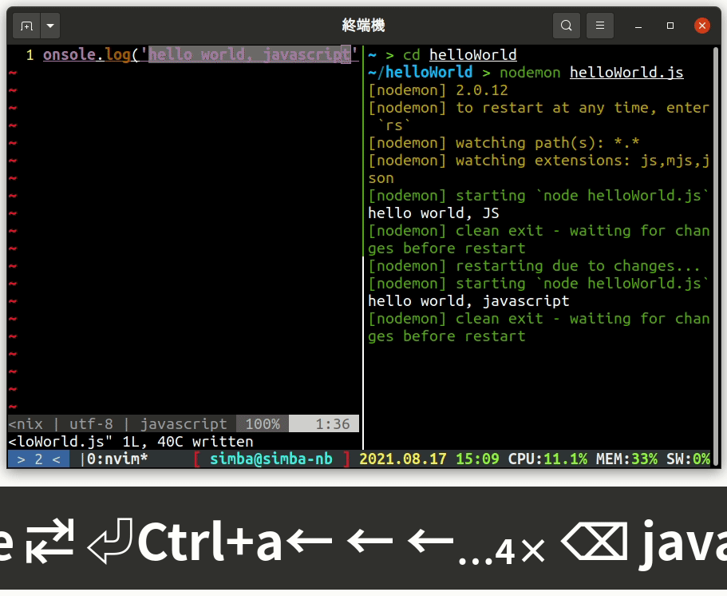

今天起要介紹的是 tmux，這是一個終端機的 **session 管理器**，什麼是 session 呢？你可以把 session 理解為一個**終端機**（畫面）和**主機** （你的電腦）的連線，tmux 做的事就是把一個終端機**切分成多個終端機**，白話說就是**多開神器**啦！這樣你就可以左邊編輯程式、右邊看執行結果（如圖）。而且一切操作都在**一個**終端機視窗裡面，這意味著即使你在**沒有圖形界面**的純文字模式（像是 single user mode、ssh 連線）也可以享受如同圖形界面的便利！

|  |
| :----------------------------------------------------------: |
|                          tmux demo                           |

# 安裝

## debian/ubuntu

```
$ apt install tmux
```

## macOS

```
$ brew install tmux
```

## 其他 or 自己編譯

其他可以參考 [https://github.com/tmux/tmux/wiki/Installing](https://github.com/tmux/tmux/wiki/Installing) 的說明

# config

tmux 啟動時會去讀取 `~/.tmux.conf` 這個檔案，所以的設定檔都放在這，在這裡，我推薦一個我用很多年的設定檔，[點擊這裡下載](https://gist.github.com/simbafs/e06a1763c1967ce3f4b5ef643db5e0b3)，或是執行以下命令

```zsh
curl https://gist.githubusercontent.com/simbafs/e06a1763c1967ce3f4b5ef643db5e0b3/raw/2f28c62d01f419a390bfc0e66a974985bacdefa5/.tmux.conf > ~/.tmux.conf
```

這個檔案是我從**網路**上找到的，後來有加一些自己的東西，把檔案下載下來並存到 `~/.tmux.conf` 裡面，關於每一行的用途都有用註解標示，主要幾個改變有以下幾點：

-   把前置按鍵（prefix）從 <kbd>Ctrl</kbd><kbd>b</kbd> 改成 <kbd>Ctrl</kbd><kbd>a</kbd> (第 16 ~ 19 行，不喜歡的話可以拿掉)，你也可以改成其他按鍵
-   底部 status bar 變成彩色，不再是單調的綠色
-   一些快捷鍵綁定

# 啟動

暫時我們不加入開啟終端機自動啟動 tmux，手動啟動方式是在終端機執行命令

```zsh
tmux
```

這時候你會看到終端機最上面跳出一個錯誤訊息

```
~/.tmux/plugins/tpm/tpm' returned 127
```

這是因為我們還沒裝 tmux 的外掛管理器 [tmp](https://github.com/tmux-plugins/tpm) (是 tmux plugins mamager，不是最近 win 11 的 tpm 2.0)  
tpm 安裝很簡單，只要**一行指令**就可以了

```
$ git clone https://github.com/tmux-plugins/tpm ~/.tmux/plugins/tpm
```

要安裝外掛只要在 `run '~/.tmux/plugins/tpm/tpm'` 之後加上 `set -g @plugin <repo>` 就行了，在我給的 config 檔中註解有說明 repo 格式  
這時候啟動 tmux 就不會有錯誤了

# 預告

今天安裝好了 tmux 和外掛管理 tpm，明天會介紹如何在開啟終端機時**自動開啟** tmux，你以為是直接在 `~/.zshrc` 中執行 tmux 嗎？嘿嘿嘿，你可以試試就知道為什麼沒這麼簡單了，明天的文章會好好介紹如何**完美整合 zsh 和 tmux**
