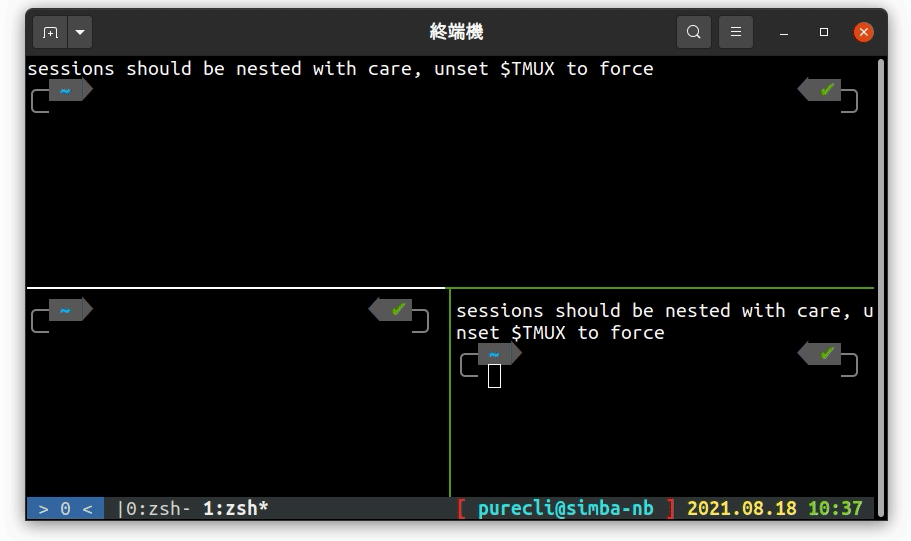
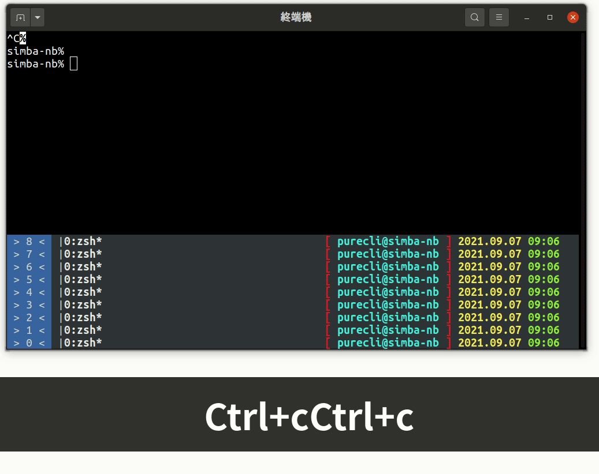
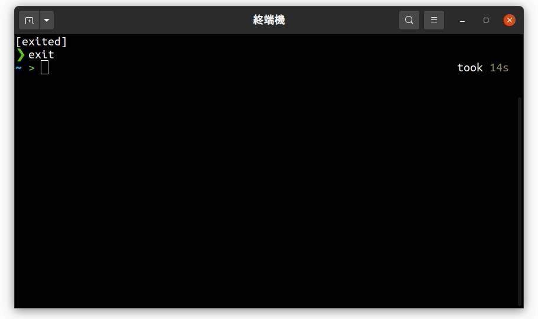

昨天的結尾提到要整合 tmux 和 zsh 不是在 `~/.zshrc` 結尾執行 `tmux` 這麼簡單，今天就讓我們看看會遇到什麼問題吧！

# 直接執行 tmux

在正式開始前，先讓我們看看**直接**在 `~/.zshrc` 後面執行 `tmux` 會發生什麼錯誤

|  |
| :-------------------: |
|    直接執行 `tmux`    |

嗯，錯誤訊息說要 unset $TMUX 那我們就照作吧！

|  |
| :-----------------------------------: |
|     加上 unset TMUX，嗯，爆炸了！     |

# 分析問題

可以看到，如果直接執行 `tmux` 的話總是會跳出一個錯誤 `sessions should be nested with care, unset $TMUX to force`，這段訊息告訴我們，不能建立**巢狀** tmux，除非將 $TMUX 環境變數移除。欸？我們不是只執行一次 tmux 嗎？為什麼會他說我們建立巢狀 tmux？我們來看看登入之後發生了什麼事：

1. 執行 zsh（因為我們的 **default shell** 是 zsh）
2. zsh 執行 `~/.zshrc`，初始化終端機後執行 `tmux`
3. tmux 開啟了**新的 session**，**執行 default shell**
4. `~/.zshrc` 又被執行一次，`tmux` 被執行**第二次**
5. 如果你沒有 unset TMUX，那 tmux 就會**停下來並印出錯誤訊息**，你總共得到兩層 tmux  
   如果你 unset TMUX，就是告訴 tmux 不管巢狀限制，就會回到第三步，**你等越久會得到越多 tmux**

看來問題在於 tmux 和 zsh 執行的迴圈停不下來，那我們就在執行 tmux 之前作個**條件判斷**，$TMUX 為空再執行 `tmux` 好了

| ❓ > $TMUX 是什麼                                                                                                                                                                                                                                             |
| :------------------------------------------------------------------------------------------------------------------------------------------------------------------------------------------------------------------------------------------------------------ |
| $TMUX 是一個環境變數，是一個由三個部份串起來、以逗號分開的字串，第一部份是 tmux 的 unix socket 路徑，第二部份是 tmux 的 pid，最後是目前 tmux window 的編號（左下角那個數字）。這個環境變數只有在 tmux 裡面的 session 會設定，所以可以當作 tmux 是否啟動的檢查 |

# 初步修改

我們在 `~/.zshrc` 中執行 `tmux` 的那行做一些修改

```diff
+ if [[ -z $TMUX ]];then
tmux
+ fi
```

> 提示：`-z $TMUX` 和 `$TMUX == ""` 效果是一樣的

接下來我們看看這樣修改效果如何  
|  |
| :---: |
| 先檢查 $TMUX 再執行 `tmux` |

可以看到，巢狀 tmux 的算是問題解決了，但是你會發現離開 tmux 之後還是一個完整的 zsh，但是這時候你已經結束工作了，**不需要再一個 shell**，你希望關掉 tmux 之後應改關掉終端機視窗的，這又要怎麼辦呢？

# 關掉多餘的 zsh

> 題外話，從這裡開始就是個人龜毛，想要把使用體驗調整到最好

這裡介紹一個內建指令 `exec`，這個指令會把當作的 shell **用後面的執行檔替換掉**。例如我們現在的 shell 是 zsh，執行 `exec ssh bbsu@ptt.cc` 之後，我們的 shell 就會換成 ssh 了。這有什麼好處？簡單來說就是**離開這個指令後就會離開終端機**，不會再回到原本的 shell。這個效果剛好和我們的需求是一樣的，所以要解決多餘的 zsh，就只需要在 `tmux` 前面加上 `exec`

```diff
if [[ -z $TMUX ]];then
- tmux
+ exec tmux
fi
```

| ❓ > `exec cmd` 和 `cmd; exit` 有什麼不一樣                                                                                                                                                                         |
| :------------------------------------------------------------------------------------------------------------------------------------------------------------------------------------------------------------------ |
| 這兩個寫法都會有一樣的效果 —— 結束 cmd 後離開，但是他們達成的原因不同，詳細敘述在 [stackover flow](https://stackoverflow.com/questions/8874596/difference-between-exec-and-exit-in-bash) 有相關討論，有興趣可以看看 |
| 你有可以用 `htop` 之類的工具看看 process 的結構，你就會知道 `exec` 和 `exit` 差別在哪了                                                                                                                             |

# 改進 `~/.zshrc`

我們回頭看看目前的 shell 啟動流程，你會發現雖然我們不會回到最初的 zsh，但是他卻做了一堆**無意義的**初始化、外掛載入，我們可以將這段設定**納入 if** 裡面，需要時才執行，如果只是要啟動 tmux 就不必走一遍設定 plugin 之類的流程，改進後的 `~/.zshrc` 大概長這樣

```zsh
if [[ -z $$TMUX ]]; then
    exec tmux
else
    # init zsh ......
fi
```

如此一來載入速度和記憶體用量都會有一咪咪的減少

# 選擇性執行 tmux

有時候你可能會**不想啟動 tmux**，例如 ssh 到遠端主機，在遠端主機上啟動 tmux 而不是在本機上啟動（在本機上啟動的話要開很多 ssh 連線，在遠端啟動只要連線一次），這時候就要有**一個機制可以把主機上的 tmux 關掉**，回到原本的 shell，達成方法有很多，這裡我介紹一個我覺得最優雅的方法，在 `~/.zshrc` 中 tmux 啟動判斷上加上以下條件

```diff
- if [[ -z $TMUX ]]; then
+ if [[ -z $TMUX ]] && [[ ! -f $HOME/.notmux  ]]; then
```

這時候 tmux 啟動條件就變成「tmux 還沒啟動」且「`~/.notmux` 不存在」，在這裡我們把 `~/.notmux` 這個檔案當作一個開關，如果這個檔案存在 tmux 就不會啟動。

如果你想啟動一個沒有 tmux 的終端機，先建立 `~/.notmux` 檔案 `touch ~/.notmux`，然後開啟新的終端機

# 結尾

今天的內容比較雜，修改的部份也比較零散，下面是目前 `~/.zshrc` 的內容

```zsh
if [[ -z $TMUX ]] && [[ ! -f $HOME/.notmux  ]]; then
    exec tmux
else
    source ~/.zplug/init.zsh

    # plugins
    zplug 'romkatv/powerlevel10k', as:theme, depth:1
    zplug 'zsh-users/zsh-autosuggestions'
    zplug 'marlonrichert/zsh-autocomplete'
    zplug 'hlissner/zsh-autopair'

    if ! zplug check --verbose; then
        printf "Install? [y/N]: "
        if read -q; then
            echo; zplug install
        fi
    fi

    zplug load

    # Enable Powerlevel10k instant prompt. Should stay close to the top of ~/.zshrc.
    # Initialization code that may require console input (password prompts, [y/n]
    # confirmations, etc.) must go above this block; everything else may go below.
    if [[ -r "${XDG_CACHE_HOME:-$HOME/.cache}/p10k-instant-prompt-${(%):-%n}.zsh" ]]; then
      source "${XDG_CACHE_HOME:-$HOME/.cache}/p10k-instant-prompt-${(%):-%n}.zsh"
    fi
    # To customize prompt, run `p10k configure` or edit ~/.p10k.zsh.
    [[ ! -f ~/.p10k.zsh ]] || source ~/.p10k.zsh

    if [[ -z $TMUX ]]; then
        tmux
        exit
    fi
fi
```
