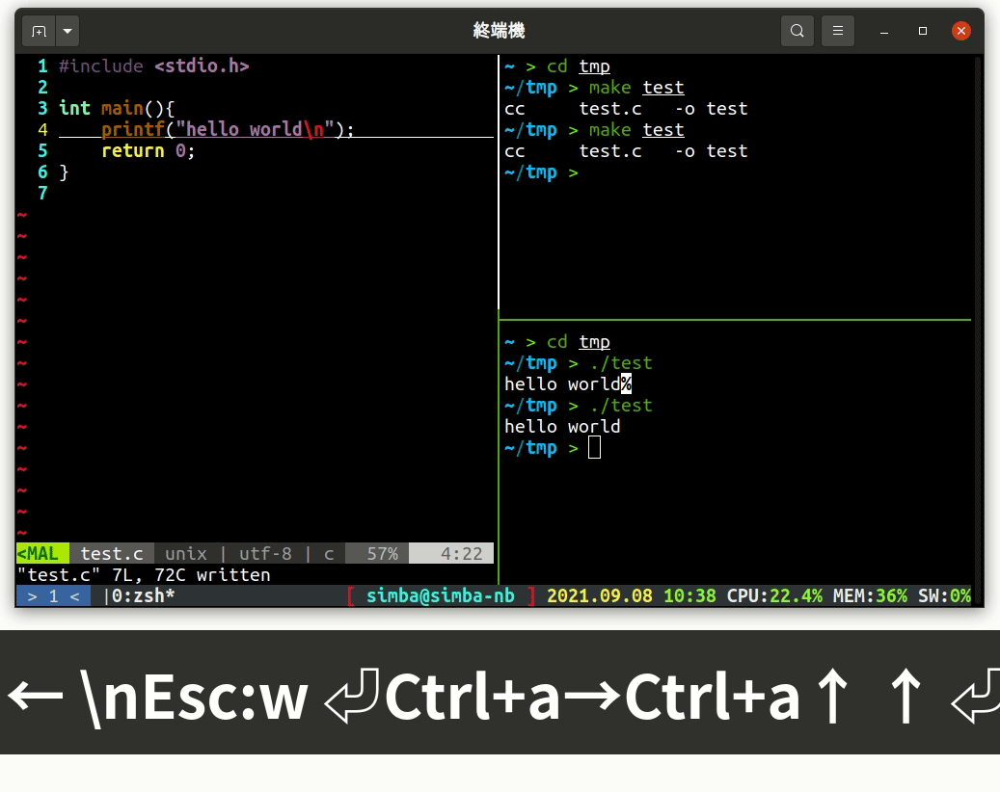
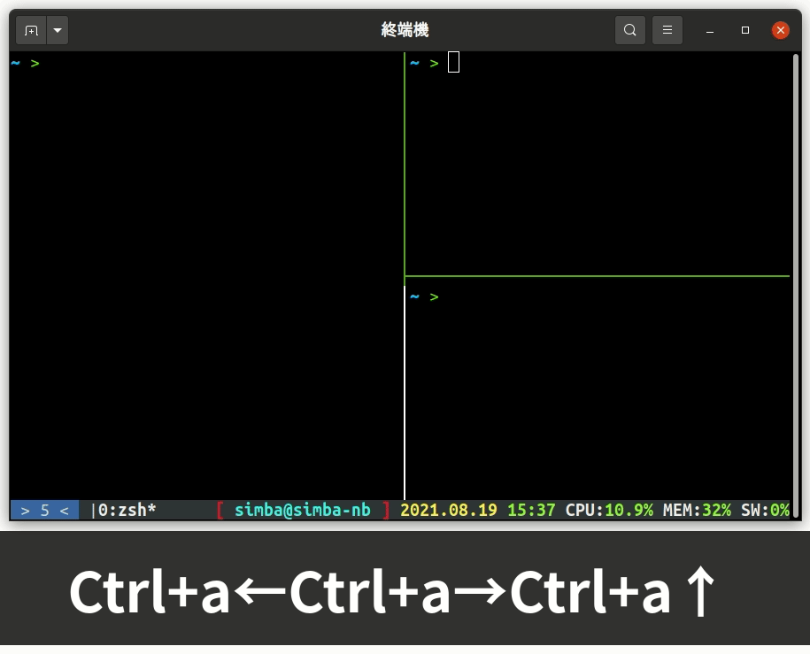
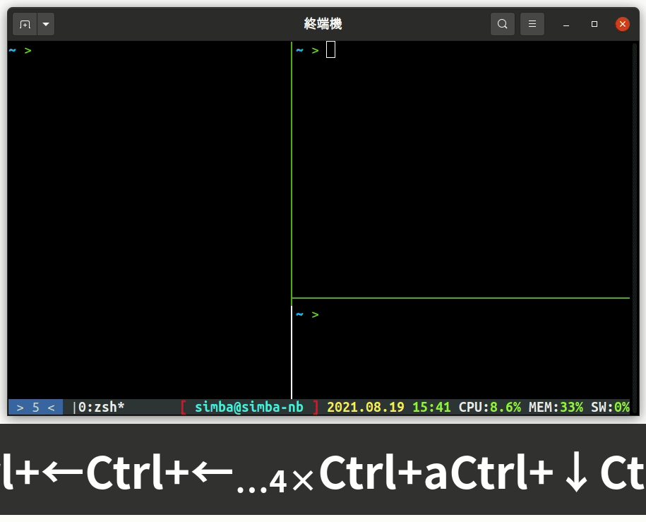
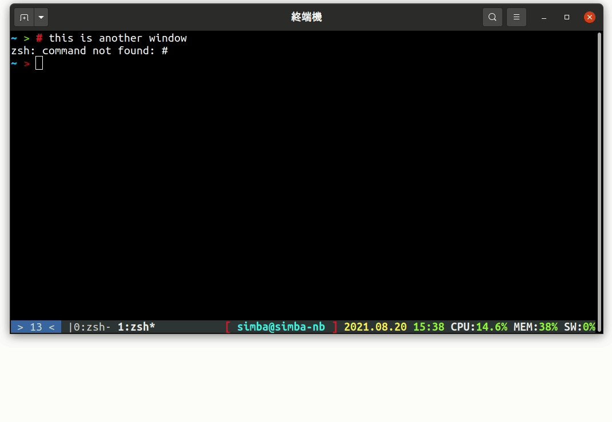

tmux 有許多的**快捷鍵**來控制螢幕，不論是分割、移動都可以輕鬆完成

# 分割畫面

**垂直分割畫面**的快捷鍵是 <kbd>CTRL</kbd><kbd>a</kbd> + <kbd>%</kbd>，**水平分割**的快捷鍵是 <kbd>CTRL</kbd><kbd>a</kbd> + <kbd>|</kbd>(pipe，shift + enter 上面那個)。按下去畫面就會以中間分開，兩邊都是**獨立的**，即使一邊在編譯卡住了，另一邊的編輯器還是可以正常操作的  
|  |
| :---: |
| 分割畫面，一邊編輯，一邊編譯，另一邊執行 |

# 在分割畫面中移動

現在你畫面分割好了，要怎麼移動呢？非常直覺，**往上就是上，往右就是右**。<kbd>CTRL</kbd><kbd>a</kbd> + <kbd>方向鍵</kbd>  
你也可以用 <kbd>CTRL</kbd><kbd>a</kbd> + <kbd>tab</kbd> 按照順序移動，<kbd>CTRL</kbd><kbd>a</kbd> + <kbd>SHIFT</kbd><kbd>tab</kbd> 反向移動  
記得，按方向鍵時 <kbd>CTRL</kbd> 要放開，不然就會變接下來要介紹的快捷鍵
|  |
| :---: |
| 在分割畫面中移動 |

# 調整分割大小

有時候我們不一定是要分成一半，例如下面五行，上面滿版。這時候你可以用 <kbd>CTRL</kbd><kbd>a</kbd> + <kbd>CTRL</kbd><kbd>方向鍵</kbd> 調整大小  
|  |
| :---: |
| 調整大小 |

# 新增分頁

你有沒有發現終端機最下面那行？那個是 tmux 的**分頁**，用 <kbd>CTRL</kbd><kbd>a</kbd> + <kbd>c</kbd> 就可以新增一個分頁，新增順序會**從 0 開始找空的補**上  
範例和分頁移動一起

# 分頁移動

在多個分頁中，你可以用 <kbd>CTRL</kbd><kbd>a</kbd> + <kbd>CTRL</kbd><kbd>a</kbd> 移動到上一次使用的分頁，或是用 <kbd>CTRL</kbd><kbd>a</kbd> + <kbd>數字鍵</kbd> 移動到特定 ID 的分頁。

|  |
| :---------------------------------: |
|       新增分頁、在分頁間移動        |

# 結論

今天的內容比較偏操作，自己多試試就會熟悉了。掌握 tmux 之後你會發現你根本不需要開一堆終端機視窗，**一個**就夠用了。
