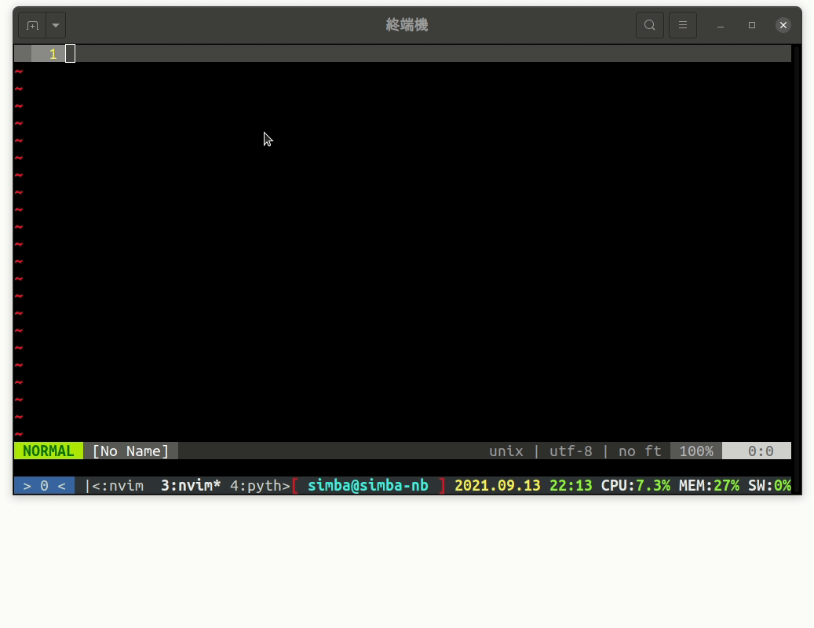

<!-- |                                           | -->
<!-- | :----------------------------------------------------------------------------------------------------------------------: | -->
<!-- | from: https://stackoverflow.blog/2021/04/19/how-often-do-people-actually-copy-and-paste-from-stack-overflow-now-we-know/ | -->
<!---->
<!-- 這個是一個 梗圖，大意是你寫程式一定會用到 CTRL-C 和 CTRL-V。我們今天就來看看 vim 的剪貼簿吧！   -->
<!-- 在用剪貼簿時，複製的來源可能會有很多種，以我們的環境為例，可能會用系統剪貼簿、tmux 和 vim 本身的剪貼簿 -->
<!---->
<!-- # 系統剪貼簿 -->
<!---->
<!-- 基本上對 vim 來說系統剪貼簿和 tmux 在複製貼上是差不多的，在輸入模式貼上就可以了   -->
<!-- 但是要注意多行的程式碼貼上時 vim 會把縮排搞亂，所以你要嘛用 `<leader>f` 重新整理程式碼，或是用命令 `:r!cat`，貼上後再按 `C-d` 貼到程式裡面。   -->
<!-- `:r!cat` 這個命令在 [Day 13](../day13) 時有把他寫成快捷鍵 `<F3>` 了，所以你也可以直接按 `<F3> ` 會有一樣的效果 -->
<!---->
<!-- 另外，下面會講到用 vim 命令存取系統剪貼簿 -->
<!---->
<!-- | ❓ `:r!cat` 是什麼意思？                                                                                                                                                                                                                                                                                   | -->
<!-- | :--------------------------------------------------------------------------------------------------------------------------------------------------------------------------------------------------------------------------------------------------------------------------------------------------------- | -->
<!-- | `r` 這個命令是「載入某個檔案並貼到游標行下面」，用法是 `:r {file}`。但是我們這裡不用檔名，`!cat` 在這裡的意思是「shell 命令 `cat` 的 stdout 這個檔案」，而執行 `cat` 時需要 stdin，也就是你剛剛貼上程式碼的地方（在 status bar 下面）。這個方法可以繞過自動縮排，就不會出現程式碼貼上被 vim 弄亂的情形了。 | -->
<!---->
<!-- ## 從 vim 複製 -->
<!---->
<!-- 複製到系統剪貼簿很簡單，在選取時記的按住 `<SHIFT>` 就行了，但是因為我們有開啟 vim 滑鼠模式，所以 tmux 剪貼簿就不能複製了（滑鼠被 vim 搶走）（關於 tmux 剪貼簿請看 [Day 09#複製](../day09#複製)。 -->
<!---->
<!-- # vim 基礎剪貼簿 -->
<!---->
<!-- 在 vim 裡面，你可用基礎的 `yy`、`dd`、`x` 等指令將文字放進剪貼簿，或是更進階的 `d4w`、`y5l` 等等。   -->
<!-- 貼上的話比較單純，就只有 `p` 一個（還有 `P` ） -->
<!---->
<!-- | ❓ `p` 和 `P` 的差別                                     | -->
<!-- | :------------------------------------------------------- | -->
<!-- | 小寫 `p` 會把內容貼到游標後，大寫 `P` 會把內容貼到游標前 | -->
<!---->
<!-- # vim 進階剪貼簿 -->
<!---->
<!-- 在 vim 裡面有個東西叫做 register，中文大概是「儲存器」之類的，我們這邊就這樣叫他。   -->
<!-- 這個東西就是「有命名的」剪貼簿（包含剛剛用的「未命名的」剪貼簿）   -->
<!-- 這個東西可以分成兩類，一是可寫的，另一類是有特殊意義的儲存器 -->
<!---->
<!-- ## 列出儲存器 -->
<!---->
<!-- 在開始介紹儲存器之前，我們先來看看如何查看儲存器，這樣你在學使用他時就可以一邊操作一邊對照。   -->
<!-- 列出儲存器內容的命令是 `:registers` 或是縮寫 `:reg`，他會列出所有目前儲存器中有的內容 -->
<!---->
<!-- ## 寫入可寫的的儲存器 -->
<!---->
<!-- vim 中可寫的儲存器並不是隨便你命名，只有 0 ~ 9 和 a - z，另外這是不分大小寫，所以 a ~ z 和 A ~ Z 是一樣的。   -->
<!-- 要存入儲存器方法很簡單，只要在指令（`yy`、`d4w` 之類的）之前加上 `"x`，這個 `x` 代指儲存器代號（[0-9a-z]）   -->
<!-- 例如「把整行存入 `g` 儲存器」的指令就是 `"gyy`（注意沒有冒號，直接在命令模式打）。 -->
<!---->
<!-- ## 貼上可寫的的儲存器 -->
<!---->
<!-- ### 命令模式 -->
<!---->
<!-- 在命令模式中，和寫入時的用法一樣，在 `p` 之前加上 `"x`   -->
<!-- 例如「把儲存器 `g` 中的內容貼上」的指令就是 `"gp` -->
<!---->
<!-- ### 編輯模式 -->
<!---->
<!-- 如果你不想為了貼上一段字切換到命令模式（尤其是打中文時切輸入法很痛苦），你可以用 `<C-r>` 加上編號貼上   -->
<!-- 例如「把儲存器 `g` 中的內容貼上」的指令就是 `<C-r>g` -->
<!---->
<!-- ## 有特殊意義儲存器 -->
<!---->
<!-- 以下我用表格列出有特殊意義的儲存器，他們也都是一個字元代表   -->
<!-- | 儲存器 | 描述 | -->
<!-- | :---: | :--- | -->
<!-- | `"` | s 命名儲存器（預設的，如果不指定就是存到這裡面） | -->
<!-- | `-` | 「剪下」（ `d2w`、`x` 之類的）的少於一行的（不包括換行） | -->
<!-- | `:` | 上次執行的冒號命令 | -->
<!-- | `.` | 上次輸入模式輸入的文字（唯讀） | -->
<!-- | `%` | 目前的檔案名稱（唯讀） | -->
<!-- | `#` | 在這個視窗中上一個編輯的文件的檔案名稱（唯讀） | -->
<!-- | `=` | 這個叫做「表達式儲存器」，但是他其實不是一個可寫入的儲存器，下面會專門介紹他 | -->
<!-- | `*` | 你的「滑鼠」反白的文字（其他視窗或是 vim 裡面都可以） | -->
<!-- | `+` | 你的系統剪貼簿 | -->
<!-- | `_` | 黑洞儲存器，只進不出，如果你嘗試讀取這個儲存器你什麼都不會得到，這可以用在剪下一段文字但是不影響任何儲存器 | -->
<!-- | `/` | 上次用 `/` 搜的字串 | -->
<!---->
<!-- ### 表達式儲存器 -->
<!---->
<!-- 這個儲存器很特別，因為他可以執行命令，或是你可以把他當作計算機！ -->
<!---->
<!-- #### 計算機 -->
<!---->
<!-- 當你輸入 `"=10+77<enter>p` 時，vim 會在你的游標後面貼上 `87`，這個就是等於符號 `=` 後面的計算式計算出來的結果   -->
<!-- 你也可以在輸入模式用 `<C-r>=10+77<enter>` （這裡不用打 `p`）   -->
<!-- 我測試過這裡的計算式可以用的和 C/C++ 中差不多，一樣遵守四則運算和括號優先，而且如果整數沒有加上 `.0` 去做除法會得到的是 `int / int` 的結果，除數被除數只要有一方是 float 就可以了，另外他的精度到小數點後六位。 -->
<!---->
<!-- #### 執行命令 -->
<!---->
<!-- 在等號後面除了接上運算式，你也可以接一個 vim 的「函數」，然後函數的回傳值就會被印到 vim 裡面。   -->
<!-- 這些函數有些是 vim 內建，有些是外掛加進來的。其中有個內建函數 `system()`，接受一個字串當作參數，回傳這個字串拿去 shell 執行後的輸出。   -->
<!-- 例如我想貼上目前目錄所有的檔案名稱，可以這樣做：在命令模式執行 `"=sysyem('ls -a')` 或是在輸入模式 `<C-r>=sysyem('ls -a')`   -->
<!-- 這樣就會把 `ls -a` 的結果貼上來了！ -->
<!---->
<!-- |  | -->
<!-- | :----------------------------------------------------------------------------------: | -->
<!-- |                             分別在命令模式和輸入模式示範                             | -->
<!---->
<!-- 另外這些函數也可以用 `:call funcion()` 來執行 -->
<!---->
<!-- # 結尾 -->
<!---->
<!-- vim 的 register 真的非常好用，尤其是基礎的那 36 個儲存器，相較於系統剪貼簿又更豐富了！   -->
<!-- 關於儲存器還有很多細節是我的文章無法詳細列出來的，你可以用命令 `:help :reg` 看看更多儲存器的說明 -->
