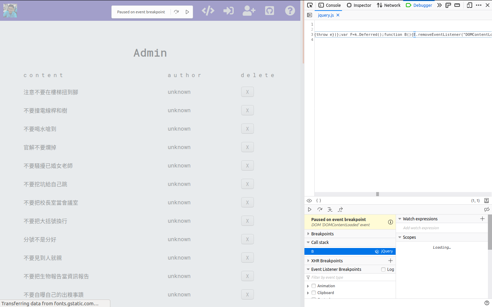
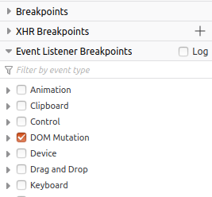

# Firefox Event Listener Breakpoint

## 問題

最近在用 jquery 但是不知道為什麼每次 debugger 都會跳出一個通知

很煩

## 解決

後來尋線發現原來是 firefox 好心的 debugger 在 DOM 發生改變的時候通知我
在 <F12> 裡面 Debugger 頁籤左下有個拉頁叫「Event Listener Breakpoints」
把裡面的東西都點掉就好了
就是那個 DOM Mutation

## 心得

我原本還以為是 jquery 的問題
原來是好心的 firefox 啊
