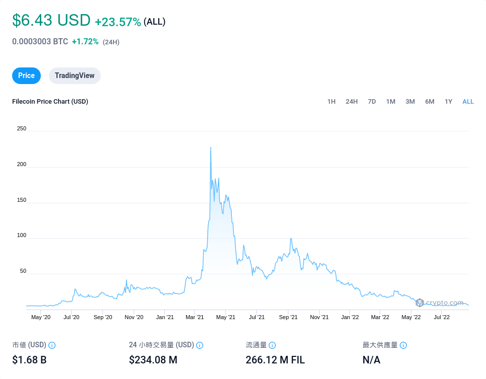

# IPFS

ipfs（**I**nter**P**lanetary **F**ile **S**ystem）是一個去中心化的檔案儲存方案，為什麼說是方案，因為他包括了通訊協議、軟體、檔案系統、名稱系統、閘道器。這個概念其實不新鮮但是 ipfs 整合過去去中心化方案的優點，而且他整合很很棒，可以開箱即用（out of box）。在 [ipfs 的 GitHub README.md 中](https://github.com/ipfs/kubo/#what-is-ipfs) 中的介紹：「It is like a single BitTorrent swarm, exchanging git objects」。他傳檔案的方式就像 BT 一樣是透過 p2p，定位檔案的方式像 Git，將檔案內容雜湊。

---

## 安裝

截稿當下，ipfs 還沒有被 Ubuntu 收錄，所以你沒辦法用 `apt install` 安裝。ipfs 的執行擋是用 Go 寫的，因此可以輕易跨平台執行，去 [ipfs 在 GitHub 的 Release 頁面](https://github.com/ipfs/kubo/releases/latest) 下載對應的版本，然後解壓縮，你可以把 `ipfs` 這個檔案自己搬到你的 `$PATH` 下，或是用 `$ ./install.sh` 讓他的安裝腳本幫你選擇目錄

## Android

在 Google play 可以找到一堆號稱是 ipfs 的 App，但功能都不齊全，如果你想在在 Android 手機上執行 ipfs，最好的方式是用 [termux](https://termux.dev/en/) 這套終端機模擬器，現在 Google Play 上已經沒有更新，要最新版的要去 [F-Droid](https://github.com/termux/termux-app#f-droid) 或是 [GitHub Release](https://github.com/termux/termux-app/releases/latest) 下載。安裝後一樣按照上面的步驟，檔案選 `linux-arm64` 那個就可以了。經過測試所有功能都和電腦一樣，包括 webui。

## 基本功能

## ipfs 上傳檔案

在節點 A 上執行 `$ ipfs add <file>`、`$ cat <file> | ipfs add`，這個命令會回傳一串 hash，稱為 `CID`，通常是 `Qm` 開頭，所以也被稱為 Qm hash

## 下載檔案

如果另一個節點有任何方式可以連線到節點 A（不論是直接的 peer 或是透過全球、區域的網路連接）都可以用 `$ ipfs cat <CID>` 將內容印到 stdout。如果要直接存起來，也可以用 `$ ipfs get [-o file] <CID>`，如果不指定 `-o` 檔名會是 CID

## 查看自己的 id

`$ ipfs id | jq .ID`

## 查看 peers

這個指令會列出所有直接連線節點的 id，如果找不到不代表拿不到檔案，透過間接的方式還是拿得到，只是第一次要找比較久
`$ ipfs swarm peers`

## wrap

如果一次有多個檔案要分享，例如一個網站，可以用 `-w` **保留目錄結構**，例如以下目錄

```
.
├── favicon.ico
├── index.html
└── script.js
```

用指令 `$ ipfs add -w *`，可以將這些檔案包在一個 CID 下（當然每個檔案也都有各自的 CID），以下是執行後的輸出

```
added QmTkhTu5EmX4qzPX4epFZr99WuWfPf8KTcCqySqf7tyH3z favicon.ico
added QmeBWHaefLwKkn7TgGdzyxgtaTTRkPeM3X4RbUY4xr736c index.html
added QmchNhX1C1SgWJK4eZHar1v92ck4BsoVmVriBHN1r4KWRs script.js
added QmS1byYBM16thyGbJtjnMYz32E9eMxfXdzbA4VAKR8nTch
```

最下面那個就是包起來的 CID。原本要取得 `index.html` 需要用 `ipfs cat QmeBWHaefLwKkn7TgGdzyxgtaTTRkPeM3X4RbUY4xr736c`，但如果用 wrap 就可以改成 `ipfs cat QmS1byYBM16thyGbJtjnMYz32E9eMxfXdzbA4VAKR8nTch/index.html`。這樣做的好處是即使有多個檔案，也只需要記一個 CID，像是我們可以用同一個 CID 取得 `script.js` `ipfs cat QmS1byYBM16thyGbJtjnMYz32E9eMxfXdzbA4VAKR8nTch/script.js`

> **Notice**  
> `QmS1byYBM16thyGbJtjnMYz32E9eMxfXdzbA4VAKR8nTch` 這個 CID 代表的是一個「目錄」，所以他不能用 `$ ipfs cat <CID>`，這時候要改用 `$ ipfs ls <CID>`

> **Warning**  
> 這個範例都是檔案，如果有目錄的話要加上選項 `-r`

> **Warning**  
> 因為目錄也是根據內容雜湊，所以你不能修改目錄內的檔案而不變動目錄的 CID，就和檔案一樣

## 可變位址

## IPNS

ipfs 有個介紹到這裡，有個小問題，一個檔案只要一更改，位址（CID）就會改變，這對於網路存取很不友善，誰知道那一大串 hash 要去哪裡找？因此 ipfs 提供了一個方案：IPNS

### publish

首先，我們先準備一個 CID `QmZLRFWaz9Kypt2ACNMDzA5uzACDRiCqwdkNSP1UZsu56D`，他的內容就一個字「hi」。一樣 add 之後，就要來使用 ipns 了

```
$ ipfs name publish QmZLRFWaz9Kypt2ACNMDzA5uzACDRiCqwdkNSP1UZsu56D
```

等個大概 30 秒之後，他會回傳類似這個

```
Published to k51qzi5uqu5djj5l4icq7jgwc06bzhxjxpwo0ghpyf9h5pah5hr5i4se7sosnm: /ipfs/QmZLRFWaz9Kypt2ACNMDzA5uzACDRiCqwdkNSP1
```

第一個 hash `k51......snm` 那個我們稱之為 `key`，現在就可以用 `/ipns/k51qzi5uqu5djj5l4icq7jgwc06bzhxjxpwo0ghpyf9h5pah5hr5i4se7sosnm` 來存取原本的 `/ipfs/QmZLRFWaz9Kypt2ACNMDzA5uzACDRiCqwdkNSP1` 了

> **Notice**  
> `/ipfs/CID` 或是 `/ipns/<key>` 都可以想成 path，放在 `$ ipfs cat`、`$ ipfs ls` 後面當參數。或是可以透過公開的閘道器，例如 [ipfs.io](ipfs.io) 存取。`https://ipfs.io/ipfs/<CID>`、`https://ipfs.io/ipns/<key>`

### republish

我們還沒示範到 ipns 的重要功能：可變位址。現在準備另一個 CID `QmermPSVVcmcutmQ1woTAtUcByUvoS2F3ZcKdkdbuAdEi5`，內容是「hihi」

```
$ ipfs name publish -k k51qzi5uqu5djj5l4icq7jgwc06bzhxjxpwo0ghpyf9h5pah5hr5i4se7sosnm QmermPSVVcmcutmQ1woTAtUcByUvoS2F3ZcKdkdbuAdEi5
Published to k51qzi5uqu5djj5l4icq7jgwc06bzhxjxpwo0ghpyf9h5pah5hr5i4se7sosnm: /ipfs/QmermPSVVcmcutmQ1woTAtUcByUvoS2F3ZcKdkdbuAdEi5
```

一樣等個 30 秒左右，原本 key 就指向新的內容「hihi」了

> **Notice**  
> 你不用擔心有其他人會擅自幫你更新 key 的指向，因為那個 key 其實是一對非對稱金鑰的公鑰，私鑰存在你的電腦，只有有私鑰的人才能更新。

## DNSLink

如果你覺得用非對稱金鑰產生的 key 很醜，還是記不住，你可以透過傳統的 DNS 來當作 key（意味著這部份其實是中心化的，要付錢）  
DNSLink 的用法很簡單，假設你想要把 ipfs.simbafs.cc 當作 key 指向 CID `QmZLRFWaz9Kypt2ACNMDzA5uzACDRiCqwdkNSP1UZsu56D`，那就在 `_dnslink.ipfs.simbafs.cc` 新增一條 TXT DNS 紀錄 `dnslink=/ipfs/QmZLRFWaz9Kypt2ACNMDzA5uzACDRiCqwdkNSP1UZsu56D`，這時候你就可以用 `/ipns/ipfs.simbafs.cc` 來代替 `/ipfs/QmZLRFWaz9Kypt2ACNMDzA5uzACDRiCqwdkNSP1UZsu56D` 了  
這時候你可以查 DNS 紀錄，如果正常就代表設定完成了

```
$ dig +short TXT _dnslink.ipfs.simbafs.cc
"dnslink=dnslink=/ipfs/QmZLRFWaz9Kypt2ACNMDzA5uzACDRiCqwdkNSP1UZsu56D"
```

### ipns in DNSLink

如果你查看 ipfs.io 的 DNSLink 紀錄，你會發現他的內容是 `dnslink=/ipns/website.ipfs.io`，也就是說 `/ipns/ipfs.io` 和 `/ipns/website.ipfs.io` 是一樣的，從瀏覽器看起來也的確如此。再查 website 的 DNSLink 紀錄 `dnslink=/ipfs/QmQoprt2cVNJKrDUTg2QYHmaqw7T1E36sSg9bPiWgoLY48`，看來 ipfs.io 真正指向的 CID 其實是 `Qm....Y48`  
這個案例告訴我們，DNSLink 不一定只能放 CID，放 ipns 的 key 也是可以的，例如指向 `/ipns/k51qzi5uqu5djj5l4icq7jgwc06bzhxjxpwo0ghpyf9h5pah5hr5i4se7sosnm` 的話，只要更新 `k51qzi5uqu5djj5l4icq7jgwc06bzhxjxpwo0ghpyf9h5pah5hr5i4se7sosnm` 的指向內容就可以更新網站，不需要動 DNS 紀錄

> **Notice**  
> 我測試有成功，至少更新 ipns 比更新 DNS 快，而且只需要在 CLI 操作

---

## 瀏覽器

目前為止，所有的操作都在 CLI 中透過 `ipfs` 命令進行，但我們的目標應該是透過瀏覽器可以看到掛在 ipfs 上的網頁吧！這個部份只能說都還不甚理想，要嘛是回歸中心化的解決方案，不然就是網址會長很醜。

## Gateway 閘道器

之所以需要閘道器，就是因為瀏覽器還無法直接讀取 ipfs 的內容，所以需要閘道器幫忙做轉發，他的功能是把 location-based 的 http 轉換成 content-addressing 的 ipfs，再將資訊返回瀏覽器，例如將 ipfs.io 透過 ipns 解析成 `/ipfs/QmQoprt2cVNJKrDUTg2QYHmaqw7T1E36sSg9bPiWgoLY48`，取得內容後再將資料丟回給瀏覽器

```
                                                               ┌───────────┐
                                                               │           │
                                                      ┌──────► │ ipfs node │
                                                      │        │           │
                                                      │        └───────────┘
                                                      │
┌─────────────────┐            ┌──────────────┐       │        ┌───────────┐
│                 │            │              │  ipfs │ peers  │           │
│ Browser         │    http    │ ipfs gateway │ ◄─────┼──────► │ ipfs node │
│ https://ipfs.io │ ◄────────► │              │       │        │           │
│                 │            │              │       │        └───────────┘
└─────────────────┘            └──────────────┘       │
                                                      │        ┌───────────┐
                                                      │        │           │
                                                      └──────► │ ipfs node │
                                                               │           │
                                                               └───────────┘
```

## 使用閘道器

先整理一下我們現在有的東西
| key | value |
| :---: | :--- |
| CID | `/ipfs/QmermPSVVcmcutmQ1woTAtUcByUvoS2F3ZcKdkdbuAdEi5` |
| ipns key | `/ipns/k51qzi5uqu5djj5l4icq7jgwc06bzhxjxpwo0ghpyf9h5pah5hr5i4se7sosnm` |
| DNSLink | `ipfs.simbafs.cc` |
| 閘道器 | ipfs.io |

> **Notice**  
> 閘道器有很多，我們用 ipfs 官方提供的來做示範，這裡有 [公共閘道器列表](https://ipfs.github.io/public-gateway-checker/)，下面會示範在本機架閘道器

以下三個方式，都可以在瀏覽器中取得我們的檔案

-   ipfs.io/ipfs/QmermPSVVcmcutmQ1woTAtUcByUvoS2F3ZcKdkdbuAdEi5
-   ipfs.io/ipns/k51qzi5uqu5djj5l4icq7jgwc06bzhxjxpwo0ghpyf9h5pah5hr5i4se7sosnm
-   ipfs.io/ipns/ipfs.simbafs.cc

## 本機閘道器

已經有公共閘道器了，為什麼還需要本機閘道器呢？因為公共閘道器，說到底還是一個中心化的設施，如果我們希望整個過程都是去中心化，那就要用本機的閘道器。而且如果你的檔案是放在本機，那用本機閘道器會最快找到，因為距離最近嘛，而且用本機閘道器還有加速網頁載入的效果，類似 cache。  
使用本機閘道器很簡單，開啟 ipfs daemon 時就已經預設開一個本機閘道器了，位址在 localhost:8080，接著來看看怎樣可以連上我們的檔案

首先是和公共閘道器一樣的功能

-   localhost:8080/ipfs/QmermPSVVcmcutmQ1woTAtUcByUvoS2F3ZcKdkdbuAdEi5
-   localhost:8080/ipns/k51qzi5uqu5djj5l4icq7jgwc06bzhxjxpwo0ghpyf9h5pah5hr5i4se7sosnm
-   localhost:8080/ipfs.io/ipns/ipfs.simbafs.cc

然後是某些公共閘道器沒有開放的功能

-   ipfs.simbafs.cc.ipns.localhost:8080
-   k51qzi5uqu5djj5l4icq7jgwc06bzhxjxpwo0ghpyf9h5pah5hr5i4se7sosnm.ipns.localhost:8080

> ### CID in subdomain
>
> 插播一下，看到這裡，你會發現 DNSLink、ipns key 都可以放在閘道器的 subdomain，那為什麼 CID 不行呢？其實不是不行，但是需要小修改一下，因為我們的 CID 是區分大小寫的（case-sensitive），但是 domain name 是不區分大小寫的（case-insensitive，也就是說 google.com = Google.com = GoOglE.cOm），所以我們需要換一個 case-insensitive 的雜湊。  
> `--cid-version 1` 這個選項會預設的 CIDv0 改成 CIDv1，CIDv1 會產生 case-insensitive 的雜湊。
>
> ```
> $ ipfs add --cid-version 1 hihi
> added bafkreihkkkuu4u6n6tpxz7zpveva2toxahi5jprgxwvthvcoeefh36bcxy hihi
> ```

回到閘道器，慎選閘道器大概是比你的檔案怎麼丟上 ipfs 還重要的事，不只是因為閘道器的選擇會影響載入速度，更是因為閘道器代理了你的網頁，所以他可以修改、或是監控網頁的活動，再加上瀏覽器同源政策的影響，如果閘道器上有人要做壞事，那網站的資安可能就會受到威脅。但這方面我沒有研究，我知道可以避免的方式是不要用閘道器預設的網址，可以用 CNAME 改成自己的 domain，再來是選擇信任的閘道器，像是 ipfs.io、cf-ipfs.com 等等。當然如果是用自己的閘道器或是本機閘道器就更好了（但可能就要犧牲效能或是網址會變醜）。

## 架一個看起來很像正常但其實是放在 ipfs 的網頁

研究中...https 搞不定  
gateway timeout...

---

## 心得

ipfs 是真的有潛力改變網路生態的，但是他還有兩大問題要解決，一是如何獎勵/強迫做種（借用 BT 的名詞 XD），也就是節點中心化問題，二是閘道器中心化問題，兩個都解決了或許 ipfs 就可以真正的實現

## 如何獎勵/強迫做種（節點中心化問題）

這個問題和 BT 一樣，假設今天我一個無名小卒想要在 ipfs 發布一個檔案，很顯然我自己開一個節點最簡單方便，但是如果我的檔案瀏覽人數不多，就會變成只有我自己和少數的節點存資料，那存取速度會慢到靠北。要解決這個問題，就會產生出像是 cloudflare 這種 CDN 幫忙「快取」（以 ipfs 的術語來說應該就是「做種」）的服務，甚至是要付費的。最後就變成要發布檔案就要找這些 CDN 付費，不然他們的伺服器就不會存你的檔案，每次都要滿世界找到你的節點，才能要到資料。  
當然，因為 ipfs 的天生設計關係，這個問題比傳統的 http 來說容易解決，畢竟總是會有其他小節點幫忙做種，但這還是一個值得關心的問題。  
開發 ipfs 的 protocal lab 曾經提出一個方案來把做種的成本轉移，那就是發行 [FileCoin](https://en.wikipedia.org/wiki/Filecoin)，但是以目前的市場來看，任何加密貨幣都會被拿去炒作，然後高機率爆掉，看下圖的 FileCoin 走勢就知道他被炒過一遍了

>  > [source: https://crypto.com/price/zh-TW/filecoin](https://crypto.com/price/zh-TW/filecoin)

這樣的機制能不能讓更多人願意做種？很難說

## 閘道器中心化問題

如果節點中心化無法解決，至少我覺得閘道器中心化是容易解決的，只要瀏覽器內嵌 ipfs 就好了，或是像當年 Adobe Flash 一樣要裝外掛（也就是類似現在的本地閘道器作法），而且當這東西變成標配之後做種的問題也順帶解決

## 參考資料

[ipfs docs](https://docs.ipfs.tech)
