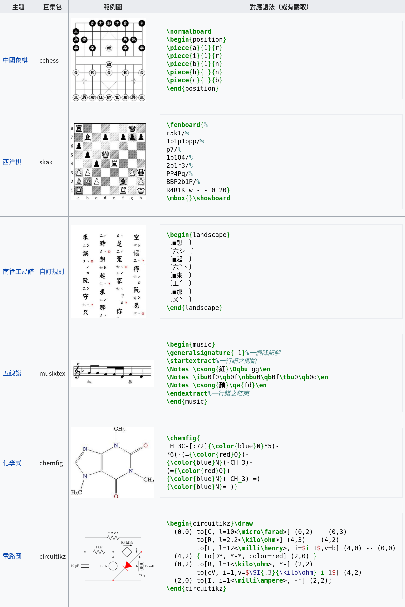

# LaTeX Stater

LaTeX 是一老牌的排版系統，基本的概念是內容與呈現分離，在撰寫內容時不用管排版（所以你就不會擔心移動圖片一咪咪整份文件就跑版了）。除了排版，LaTeX 還很擅長輸出各種莫名其妙的東西，像是超複雜的數學式、象棋棋譜、化學結構......

|                       |
| :-------------------------------------------------------------------------------: |
| credit:[https://zh.wikipedia.org/wiki/LaTeX](https://zh.wikipedia.org/wiki/LaTeX) |

在使用 LaTeX 一段時間之後，對它的印象就是加強版的 Markdown（或是說 Markdown 是簡化版的 LaTeX），而且他還有巨集，可以擴展原版沒有提供的功能（就是上面那些奇奇怪怪的東西）。

## 幾個重點

## 中文

使用 LaTeX 對大部分人最重要的就是「怎麼打中文」，總不可能打全英文報告吧！要用中文，渲染引擎要用 XLaTeX，然後加上以下設定  
（`.ttf` 可以指向你自己喜歡的中文字型檔）

```latex
\usepackage[CJKmath=true,AutoFakeBold=3,AutoFakeSlant=.2]{xeCJK}
\newCJKfontfamily\Kai{[jf-openhuninn-1.1.ttf]}
\newCJKfontfamily\Hei{[jf-openhuninn-1.1.ttf]}
\newCJKfontfamily\NewMing{[jf-openhuninn-1.1.ttf]}

\usepackage{fontspec}
\setmainfont{[jf-openhuninn-1.1.ttf]}
\setmonofont{[jf-openhuninn-1.1.ttf]}
\XeTeXlinebreaklocale "zh"
```

## 換行

LaTeX 在換行這個設計和 Markdown 一樣，因為內容與呈現分離，所以你的換行不是真的換行。Markdown 用 ` `（兩個空白），在 LaTeX 是 `\\`（兩個反斜線）

## 巨集與 Package

LaTeX 一個核心概念是巨集，就是函數啦，巨集的開頭是 `\`（反斜線），巨集可以自己定義，也可以用 `\usepackage{}` 載入別人寫好的

## overleaf

overleaf 是一個線上編輯 LaTeX 的網站，預裝了幾乎所有寫報告用得到的 packages，而且可以上傳自己的字型、圖片，而且右邊可以顯示產生的 PDF（非即時，按 CTRL-Enter 編譯）。這個網站整體使用體驗還算不錯，該有的功能都有了。

## 表格

### 切版

畫 LaTeX 表格最簡單的方式是用 Google Sheet + [latexkit](https://workspace.google.com/marketplace/app/latexkit/716178627426?hl=zh_tw)，這個外掛可以幫你把跨行、跨欄表格通通弄好，你只需要再調整格線和格式就行了（latexkit 只負責切版）

### 格線

#### 直線

如果直線你需要兩條，在 `\begin{tabular}{|L|L|}` 這裡多加幾條 `|` 就可以了。直線如果遇到跨列的格子會自動跳過，所以你不需要處理

#### 橫線

只需要用 `\hline` 就可以畫一條橫線。  
但是因為橫線遇到跨行的格子不會自動跳過，所以需要特殊處理。可以用 `hhline` 這個 package，用法很簡單，`\hhline{|~|-|=|}`。  
`~` 是不劃線，`-` 是畫一條線，`=`是畫兩條線，而這裡的 `|` 是在畫兩條線時要畫線中間的直線（你畫兩條線時試試看就知道了）

## 數學表格

做報告的時候一定會遇到表格裡有數學符號，如果你懶得前後都加 `$` 的話，可以用以下的方式

```latex
\newcolumntype{L}{>{$}l<{$}} % math-mode version of "l" column type

\begin{tabular}{|L|L|}
\pi & \tau
\end{tabular}
```

## 其他

其他零碎的使用方法建議參考 [Saintan 的 LaTeX 小教室](https://www.overleaf.com/read/hpscgpsbxnjf)，裡面寫的非常詳細

## 符號表

在 LaTeX 打數學式的時候，一定會遇到一些莫名其妙的符號，可以參考下面兩個網站，可以依序找，第二個因為東西太多了所以會比較難找一點

[https://www.overleaf.com/learn/latex/List_of_Greek_letters_and_math_symbols](https://www.overleaf.com/learn/latex/List_of_Greek_letters_and_math_symbols)  
[https://www.caam.rice.edu/~heinken/latex/symbols.pdf](https://www.caam.rice.edu/~heinken/latex/symbols.pdf)

## 我的 LaTeX 範本

這是我寫物理實驗結報的範本

```latex
\documentclass[12pt,a4paper]{article}

\title{物理實驗結報範本}
\author{學號：X12345678 \\
姓名：XXX \\
第 17 組}
\date{2021-10-08}

\usepackage{amsmath}
\usepackage{mathtools}
\usepackage{graphicx}
\usepackage{array}   % for \newcolumntype macro
\newcolumntype{L}{>{$}l<{$}} % math-mode version of "l" column type
\usepackage[utf8]{inputenc}
\usepackage[T1]{fontenc}
\usepackage{textcomp}
\usepackage{gensymb}
\usepackage{multirow}
\usepackage{hhline}
\usepackage{indentfirst}

\usepackage[CJKmath=true,AutoFakeBold=3,AutoFakeSlant=.2]{xeCJK}
\newCJKfontfamily\Kai{[jf-openhuninn-1.1.ttf]}
\newCJKfontfamily\Hei{[jf-openhuninn-1.1.ttf]}
\newCJKfontfamily\NewMing{[jf-openhuninn-1.1.ttf]}

\usepackage{fontspec}
\setmainfont{[jf-openhuninn-1.1.ttf]}
\setmonofont{[jf-openhuninn-1.1.ttf]}
\XeTeXlinebreaklocale "zh"

\begin{document}
\maketitle

\section{簡介}

\section{原始數據}

\section{數據分析}

\section{誤差分析}
\subsection{百分誤差}

\subsection{誤差原因}

\section{結果與討論}
\end{document}
```
