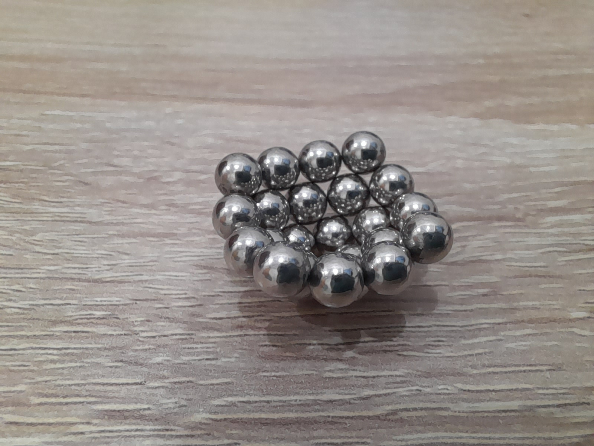
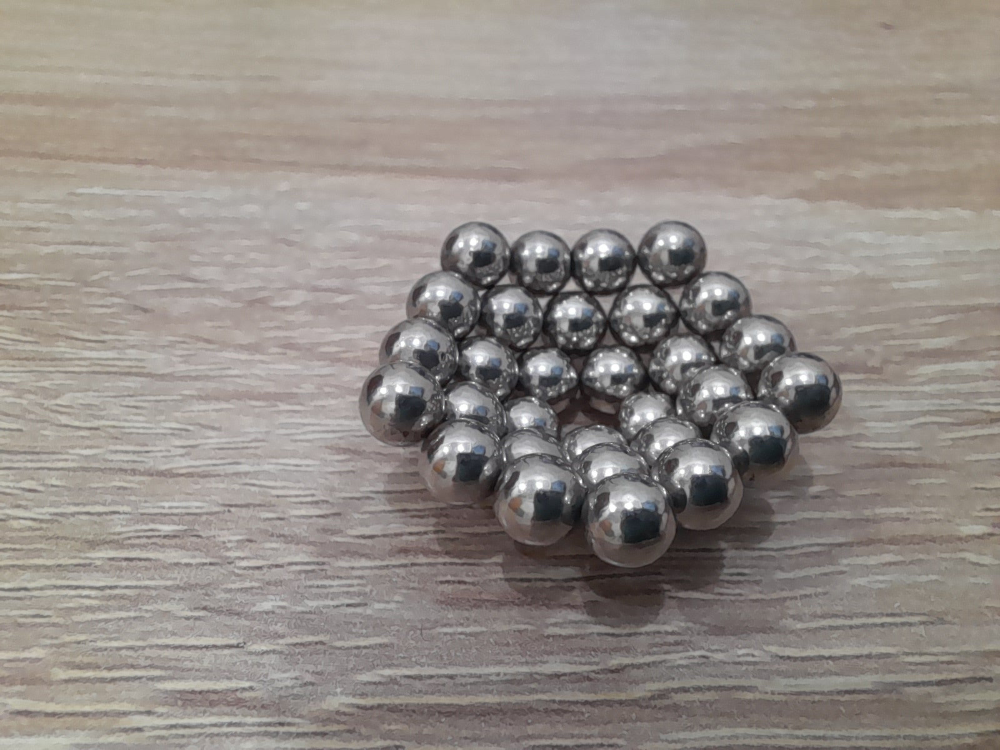
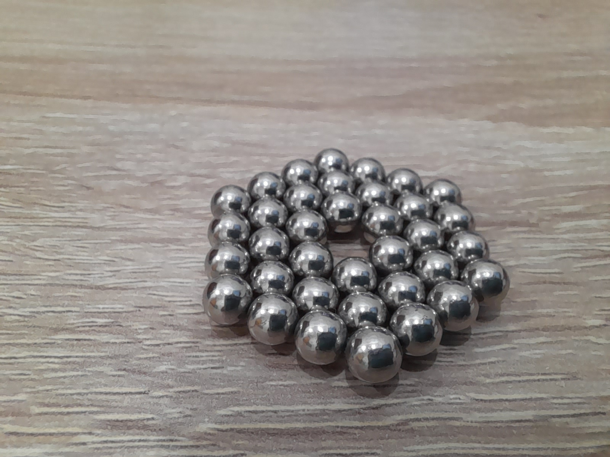
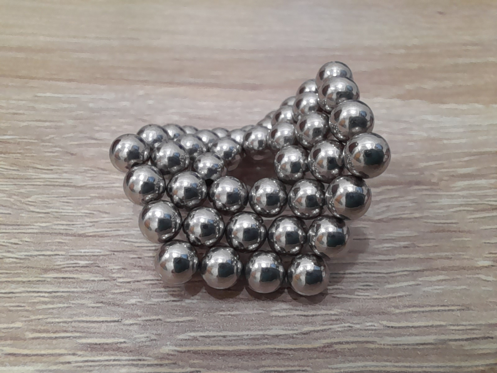
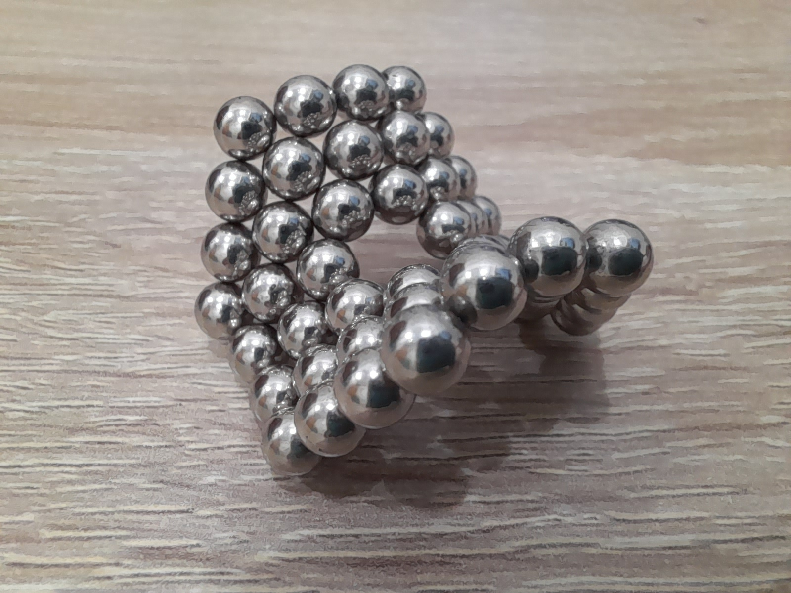
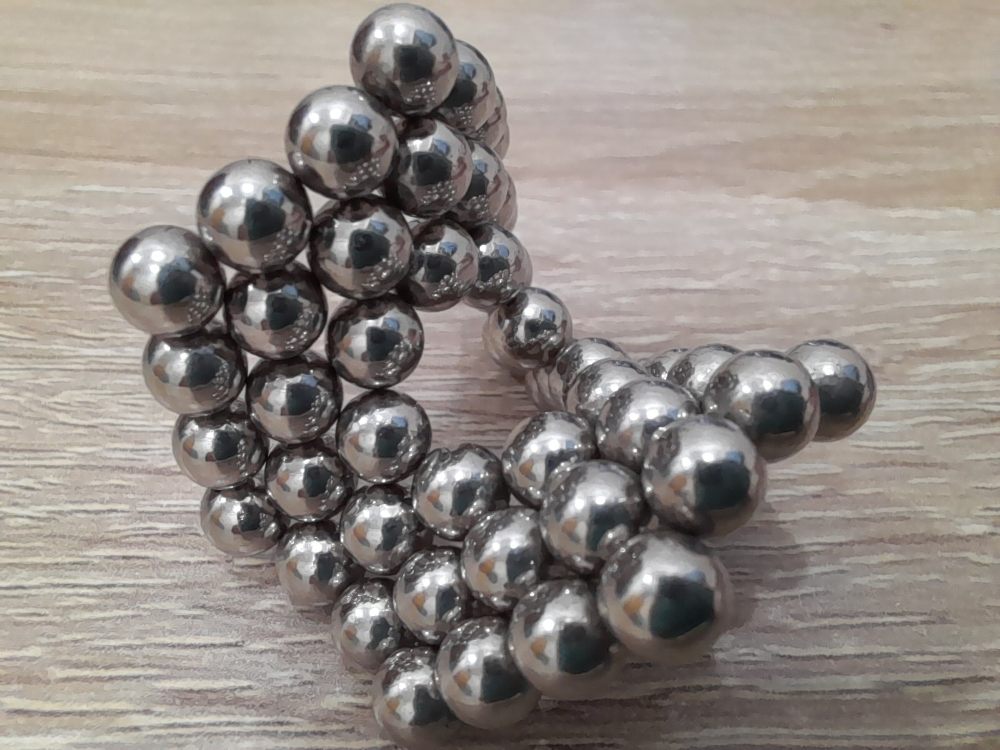
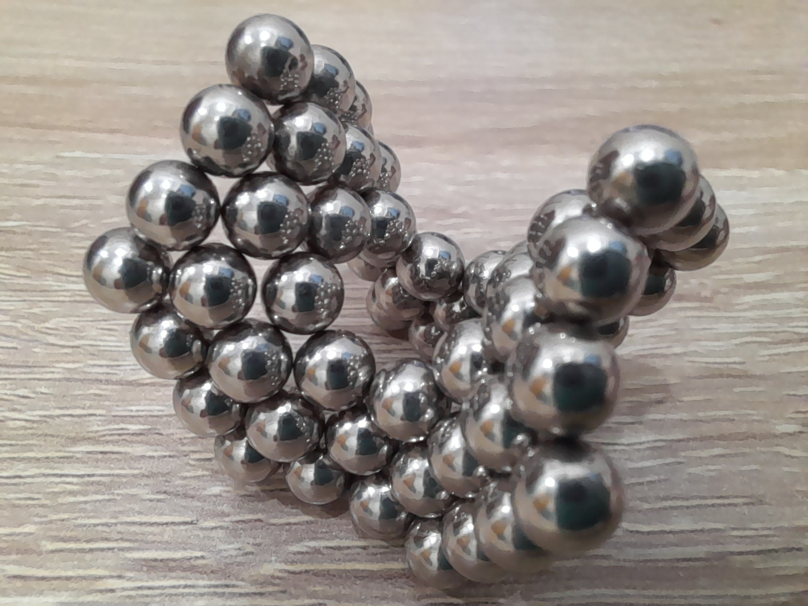
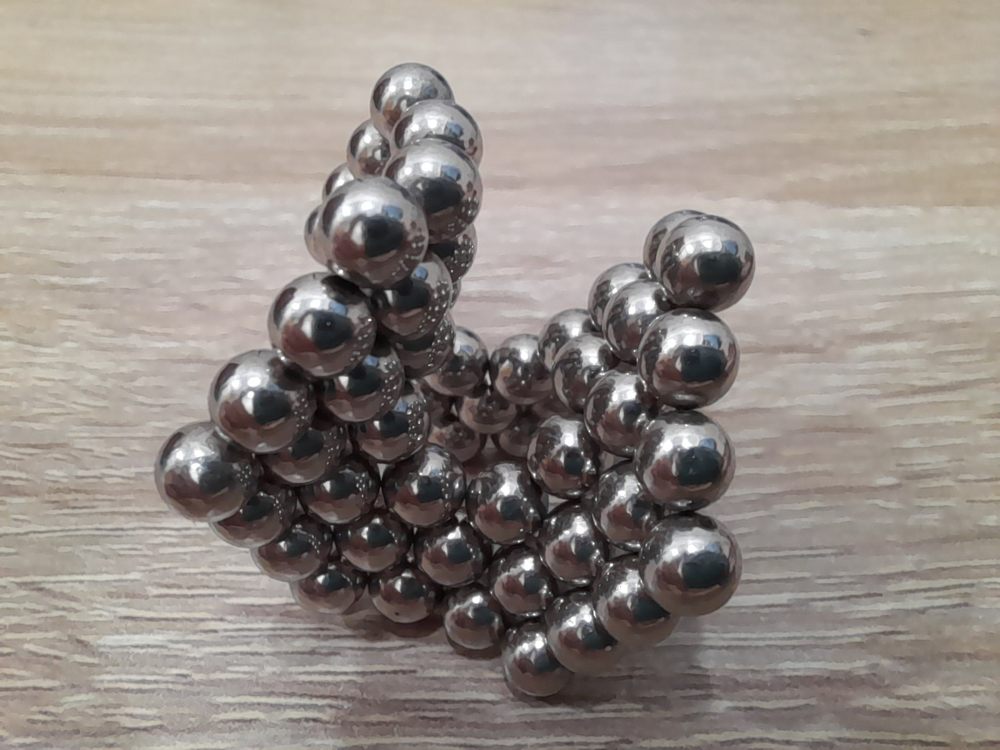
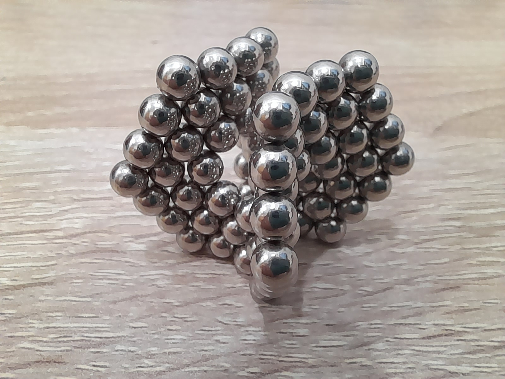
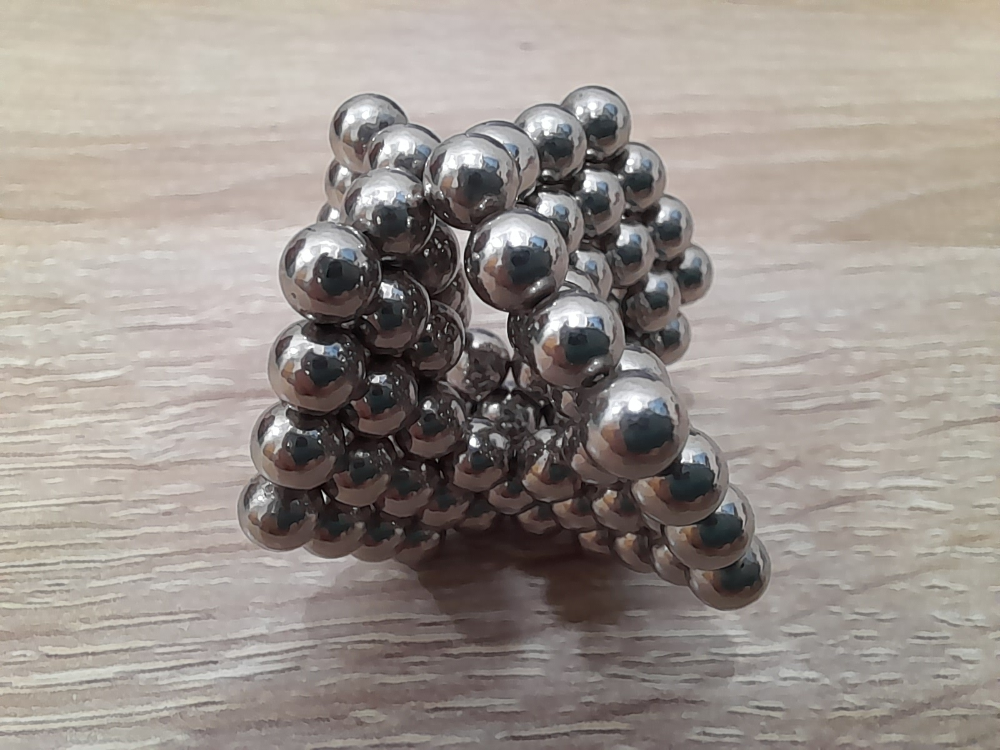

# 同「邊數」的平面

## 圖

先上圖，每個都是推到邊長為 4

## 3

## 4

## 5

## 6

## 7

## 8

## 9

## 10

## 11

## 12

## 13

## 共通性質

## 堆積

相鄰三個球球都是最密堆積

## 球球數

<!--MathJsx-->

`球球數=邊數*Σn`

## 特殊性質

## 平面

只有 `n=3,6` 會形成完全平面

## 凹陷

當 `n=4,5`，會形成下凹的漏斗狀

## 多層

只有 `n=3,5,6` 可以多層堆疊，其中 `n=4,6` 因為都是平面，可以形成一樣的堆積形式。`n=5` 會以類似立方最密堆積的方式形成立體形狀

## 鞍形

從 `n=7` 開始，堆積時會自然地形成鞍形，且角度越來越小

## 堆積技巧

首先取出「邊長」顆球球繞成環形，然後自然的繞成第二圈，整理角角形成最密堆積，然後在邊長大於 3 的邊上丟一顆球球，從最遠、最長的邊開始，邊長為三的邊會最穩定，盡量每次丟球球都要整理乾淨。堆積的時候要注意中心球球數是否跑掉。另外 11 顆前都還算好堆，12 開始會黏起來，但最後是可以穩定的分開的，13 就是完成也無法穩定分開，超過 13 還沒嘗試過。
