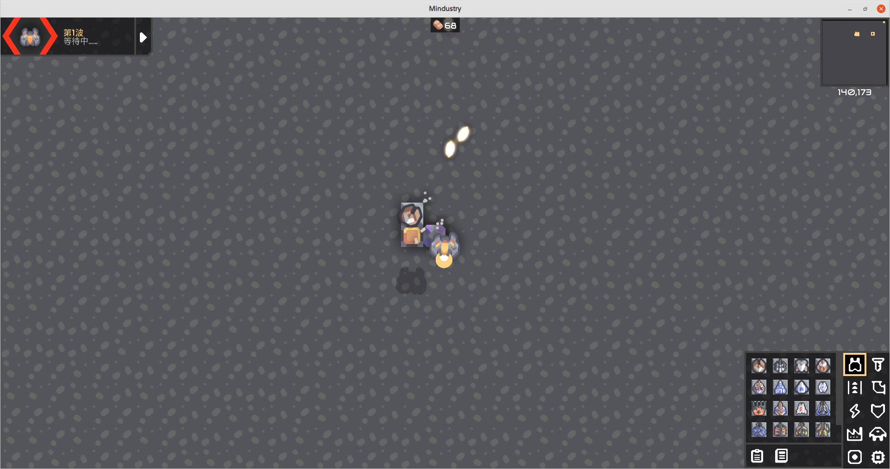
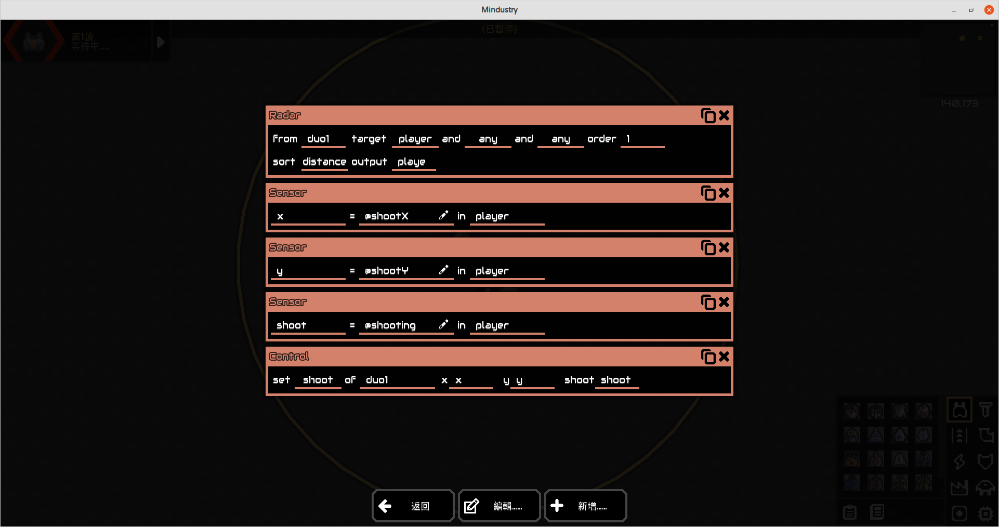
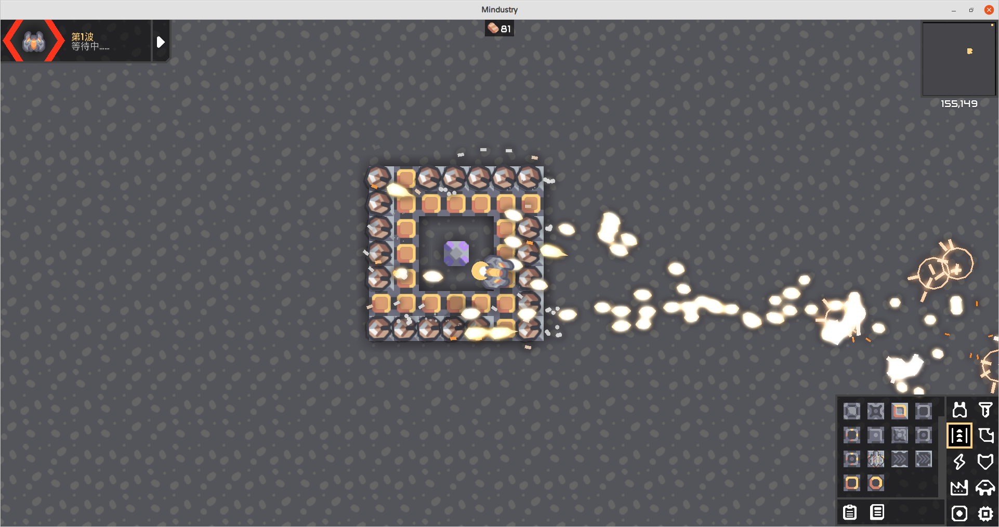
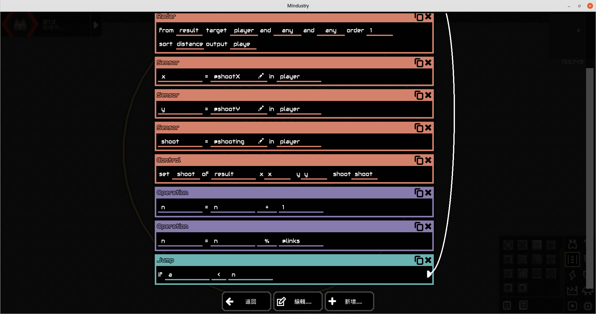

# 砲台自動瞄準

用處理器可以控制砲台們打的方向和什麼時候打，這樣只要有一群受控的砲台，就可以在射程範圍內指哪打哪

## 單一砲台



如圖所示，砲台跟著玩家瞄準的方向打  
以下是程式碼

```
radar player any any distance duo1 1 player
sensor x player @shootX
sensor y player @shootY
sensor shoot player @shooting
control shoot duo1 x y shoot 0
```

| command | description                                                                |
| :------ | :------------------------------------------------------------------------- |
| radar   | 取得玩家物件                                                               |
| sensor  | 抽出玩家物件的 `shootX`、`shootY`（瞄準的點）和 `shooting`（是否正在開火） |
| control | 控制 `duo1` 砲台                                                           |

| variable | description   |
| :------- | :------------ |
| player   | 玩家物件      |
| x        | 瞄準的 X 座標 |
| y        | 瞄準的 Y 座標 |
| shooting | 是否開火      |



## 多個砲台

上面的指令只能控制一個砲台，那麼要怎麼控制多個砲台呢？答案是 loop，但是 Mindustry 沒有提供 loop，我們只能用 `jump`，那麼就來看看程式吧！

```
set n 0
getlink result n
radar player any any distance result 1 player
sensor x player @shootX
sensor y player @shootY
sensor shoot player @shooting
control shoot result x y shoot 0
op add n n 1
op mod n n @links
jump 1 always x false
```

> 以下重複的就不會再多講了

| command | description                                                                                                                                                         |
| :------ | :------------------------------------------------------------------------------------------------------------------------------------------------------------------ |
| set     | 初始化一個變數 `n` 值為 `0`                                                                                                                                         |
| getlink | 取得連結的第 `n` 個建築，存到 `result`                                                                                                                              |
| op      | 執行數學運算，舉例 `add n N 1` => `n = N + 1`                                                                                                                       |
| jump    | 根據規則跳躍到某條指令，這裡的 `1` 是指跳到第一調指令（從 0 開始數，也就是跳到 `radar`），因為我們調建設成 `always`，因此後面兩個就不必要，你在編輯畫面應該也看不到 |

| variable | description          |
| :------- | :------------------- |
| n        | 迭代的變數           |
| @links   | 總共有幾個連結的建築 |

  


## 參考資料

https://www.youtube.com/watch?v=UFK5m6qKT6U  
https://www.youtube.com/watch?v=YMxU0jcS11I
