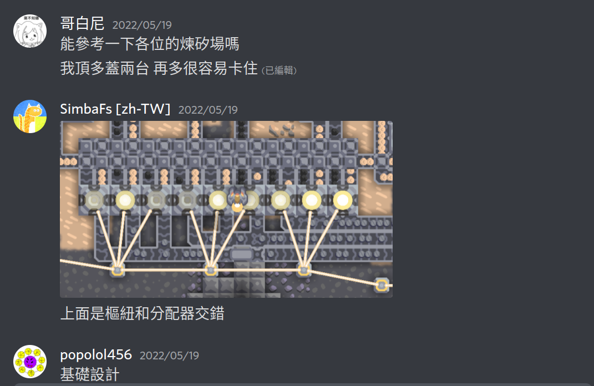
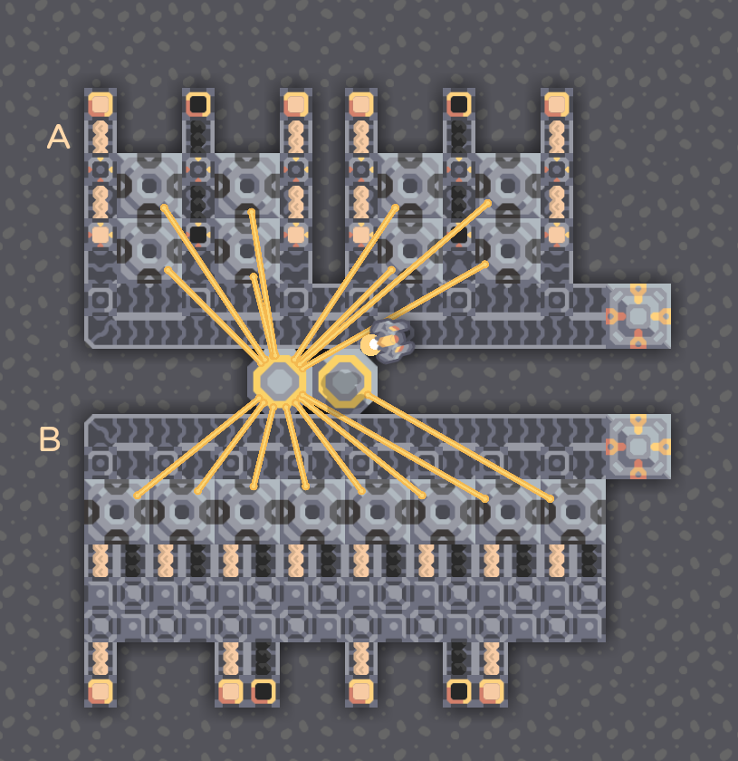
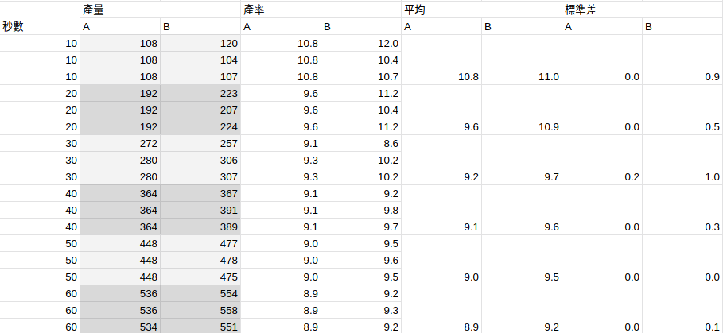
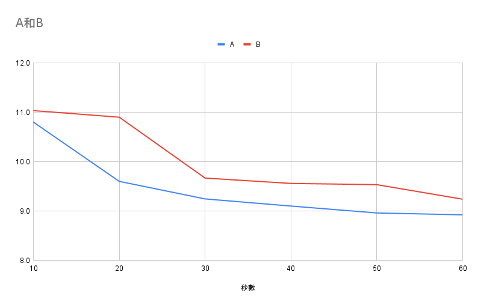

# 目的

1. 驗證不同設計的生產效率差異
2. 用科學的方式檢驗下面這些毫無根據、隨意編造的偏見
   
   
   
   

## 實驗方法

相同的物品源、相同的生產建築數量、相同的輸出軌數和時間，以不同的輸入方法配置，計算每秒生產量。

-   相同物品源：就一樣數量的物品源，本次實驗用兩組實驗，所以是四個沙、兩個煤
-   相同生產建築：八個煉矽廠
-   相同輸出軌數：各兩條
-   相同輸出時間：連接到同一個能量源，計時一段時間後拆除能量源，計算雙方生產數量

> 因為輸送帶用的是最低階，可能會補給不足或是消化不夠快，但是因為兩個都是相同的限制（輸出軌數），要卡一定是兩個一起卡，頂多被卡成平手。這個時候如果還輸，那就不知道是誰的問題了喔！

## 原始數據和計算結果

| 秒數 | A    | B    |
| :--: | :--- | :--- |
|  10  | 10.8 | 11.0 |
|  20  | 9.6  | 10.9 |
|  30  | 9.2  | 9.7  |
|  40  | 9.1  | 9.6  |
|  50  | 9.0  | 9.5  |
|  60  | 8.9  | 9.2  |
| 平均 | 9.4  | 10.0 |

## 結果與討論

在時間拉長後，因為被卡住的東西被平均掉，因此兩個都生產效率都下降，這個很正常  
根據結果，即便都被限制，生產效率都還是 B 配置比較高，無論時間拉多長。  
根據我個人的猜測，B 因為輸入和輸出沒有混雜在一起，因此不會造成堵塞（仔細觀察 A，最後在反向分類器那邊常常會堵住，這就是輸入輸出混雜的後果），導致即使輸入比例不對，效率依舊比較高。  
A 的穩定性高了那麼一點點，不重要

## 結果比較

根據可擴張性而言，B 的設計是可以橫向無限擴張，不像 A，縱向擴張受到輸送帶效率影響、橫向擴張受到輸入比須滿管影響（不滿管比例就不對，這個設計也就跟垃圾一樣毫無意義，因此必須滿管）。另外，一套 B 可以有比 A 更彈性的輸入和輸出輸送帶數量，因此可以適應更多的狀況。  
B 唯一的缺點是佔體積大了一點點，但我個人認為，沒有任何事物是完美的，因此用一點點小缺點換取最多的優點，這個是比追求無謂的小體積來的更重要。  
更重要的是，B 的設計更為簡單，建造成本低、可以無限擴張

## 後續實驗

根據 `Magicaltank` 和 `a0000778` 的建議，換成溢流器的確會增加效率，但即使沒換，但還是比 A 設計效率高。

<!--
## 結論
`哥白尼#3565` 可憐問錯人
`a0000778#4614` 不錯的建議，受教了
`(Magicaltank)魔缸#2487` 不錯的建議，受教了
`(Silicon God)D號香蕉#5904` 追求精簡設計，很有想法
`acopika#3895` 看不清現實，連個簡單的實驗都沒做，喜新厭舊
`popolol456#7199` 不求甚解，看起來會動、比例對就不研究了，還算 ok
`(我叫美鳳 姑且就叫我美麗吧)酥炸牡蠣#4962` 燥鬱症+不會看空氣，給它台階還不會下，硬要吵
-->
